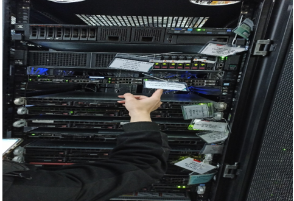

## Báo Cáo Theo Dõi Và Quan Sát Lắp Đặt Server Cho Khác Hàng
### Thực Tập Sinh Hoàng Văn Khánh
- Nội Dụng Báo Cáo
    + Lắp Đặt 2 server cho khách hàng.
- Các Bước Thực Hiện
- Bước 1 : Lắp Thanh rack vào tủ.
    + Cứ 3U sẽ bỏ trống 1U để thông gió

- Bước 2 : Để server vào 

-Bước 3 : Cắm dây nguồn PDU và dây mạng cho server.
    + Ở đầu và cuối dây có đánh số để phân biệt

- Bước 4 : Cắm máy tính và thực hiện ping kết nối
 
    + Thực hiện câu lệnh Ping 8.8.8.8 để kiểm tra đã kết nối được với mạng chưa.

- Bước 5 : Ngắn ID cho server vừa thực hiện  
    + Để phân biết các server với nhau

- Kết quả
    + Đã hoàn thành việc lắp đặt server cho khách hàng.
