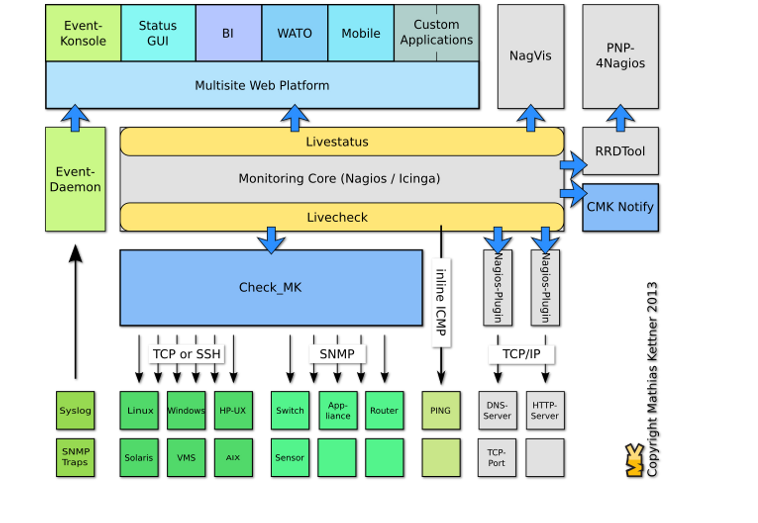

## 1. Khái niệm về Checkmk 
- Là một giải pháp giám sát dựa trên mã nguồn mở. Có lõi là nagios core.
- Check_mk được tạo ra với mục đích giải bài toán hiệu năng cho nagios . Giúp cho việc mở rộng hệ thống giám sát dễ dàng hơn với tính được tích hợp với nhiều sản phẩm thì check-mk được cấu hình đơn giản hơn nhiều so với lõi nagios trước kia. Check-mk bổ sung thêm một số chức năng như :
    + Thời gian check tiêu chuẩn được giảm từ 5 phút xuống 1 phút.
    + Có thể cấu hình bằng giao diện web.
    + Có chức năng giám sát phân tán
    + Có bảng điều khiển
    + Có biểu đồ hiện thị
    

## II. Các khái niệm trong chech-mk

### 1. Livestatus
- Là một phần quan trọng trong check_mk. Nó giúp cho check_mk truy xuất dữ liệu một cách nhanh chóng
- Livestatus sẽ sử dụng socket để lấy dữ liệu để trả lời truy vấn do đó tốc độ truy vấn của nó không còn phụ thuộc vào tốc độ I/O như lưu dữ liệu trong file.

- Khi truy xuất dữ liệu bằng command line thì livestatus sẽ phân biệt chữ hoa và chữ thường
- Livestatus sẽ sử dụng socket để check dữ liệu do đó công việc được phân đều cho các CPU.

### 2. Multisite - Giao diện Web
- Multisite là một giao diện web được check-mk áp dụng để thay thế cho nagios web.
- Nó được sử dụng để xem thông tin và kiêm soát hệ thống giám sát.
- Kết hợp Wato để có thể hỗ trợ việc cấu hình bằng website
- Wato là tập hợp nhiều modules được sử dụng để cấu hình cho check_mk server.
- Mỗi khi có thay đổi cần chọn cập nhật thay đổi.
- Có sẵn các agent giám sát được lưu trừ và hiện thị sẵn trên web.
- Nó nó phiên bản tối ưu hóa cho điện thoại.

### 3. Event Console 
- Ngoài việc giám sát theo khoảng thời gian check bình thường còn có một loại giám sát theo sự kiện
- Event console là hệ thống tích hợp theo dõi sự kiện từ các nguồn như syslog, SNMP traps, Windows event logs ...
- Những sự kiện xảy ra không được xử lý bằng lõi của check_mk mà được xử lý bằng một dịch vụ riêng biệt.

### 4. Round Robin Database(RRD)
- Đây là một dạng DB mặc địch mà check_mk dùng để lưu trữ thông tin.

- Thông tin của DB được lưu trữ dưới dạng bảng và cột để lưu trữ dữ liệu.
- Có thể hợp nhất được dữ liệu của một khoảng thời gian lại vào làm một.
- Có thể truy vấn được dữ liệu trong RRD bằng live status language.
- Lưu ý ngôn ngữ truy vấn này phân biệt chữ hoa và chữ thường
- Có thể sử dụng các headers để lọc thông tin hiện thị từ các truy vấn được sử dụng
- Khi muốn truy vấn thống kê thì có các giá trị và các toán tủ được định nghĩa sẵn để sử dụng
- Khi dữ liệu được lưu đầy thì nó sẽ ghi đè lên dữ liệu cữ

### 5. Site
- Để có thể thực hiện việc giám sát thì cần tạo ra một site để có thể sử dụng.
- Một server có thể tạo ra được nhiều site.
- Để đăng nhập được vào site thì cần có user để đăng nhập vào user được phân thành 3 loại user : Administrator, Guest, Normal monitoring.
- Có 2 User mặc định có quyền Administrator và omdadmin và cmkadmin
- Site là các gọi các sản phẩm được tạo ra từ multisite

## III. Cấu trực của Check_mk

- Các lõi sẽ gọi xuống check_mk để thực hiện chức năng kiểm tra của nó.
- Sau khi checkl livestatus sẽ hiện thị thông tin của mk lên website
- PNP4nagios : được sử dụng để xử lý dữ liệu để chuyện sang dạng biểu đồ.
- Nagvis : được sử dụng để vẽ lại mô hình giám sát giúp người dùng có thể nhìn một cách dễ dàng hiểu hơn.
- Dữ liệu sẽ được lưu vào trong RRD.

