## Bước 1: Tải Wordpress từ trang chủ wordpress.org
- Đầu tiên, bạn truy cập vào địa chỉ : https://wordpress.org/download/  để thực hiện tải Wordpress bản mới nhất  
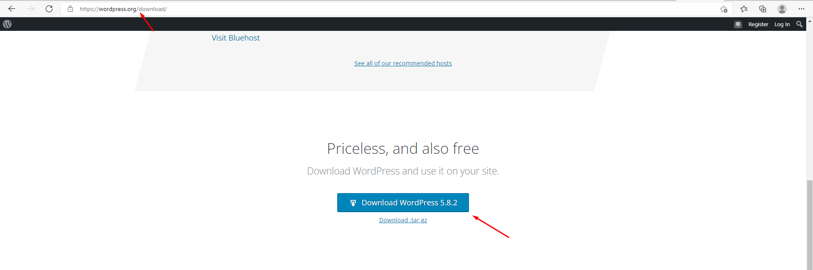

## Bước 2: Tạo Account
- Điền tên miền, Usernaem và password
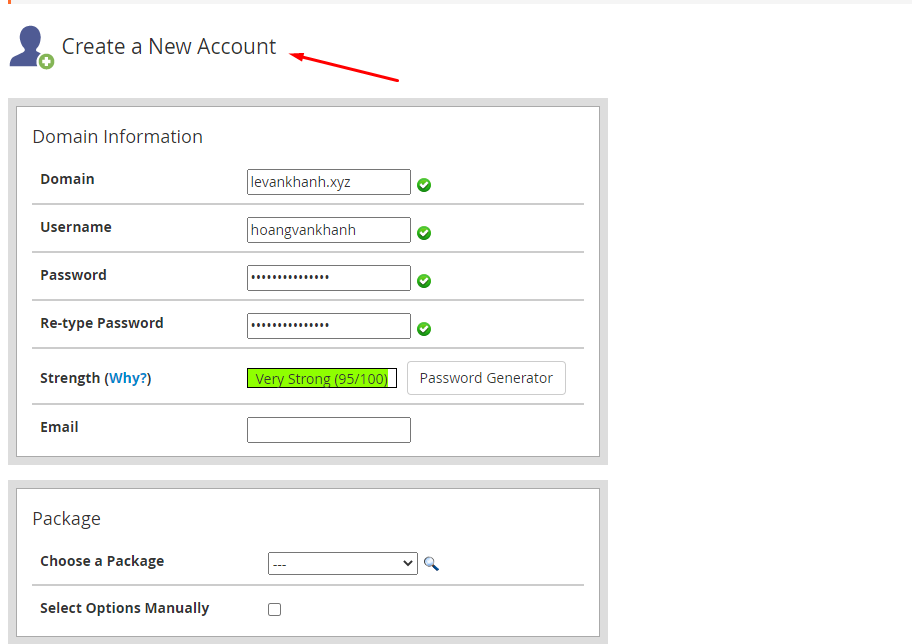

## Bước 3: Vào files => File Manager 
- Sau khi đã tạo Acount thì bạn tiến hành đăng nhập
- Vào mục "File Manager" trong phần "File" để truy cập trình quản lý tập tin trên Hosting.

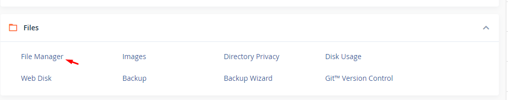

## Bước 4: Thực hiện upload Wordpress lên hosting
- Bạn mở thư mục public_html trong tất cả các folder vừa mới hiện thị trong hosting. Hãy click vào nút Select All rồi chọn Delete để xóa toàn bộ những tập tin mặc định không cần thiết.

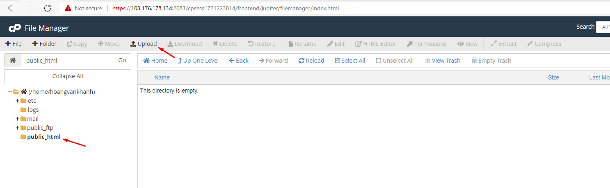

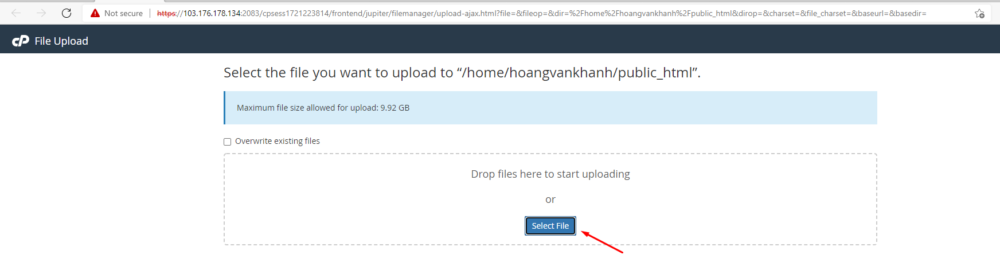

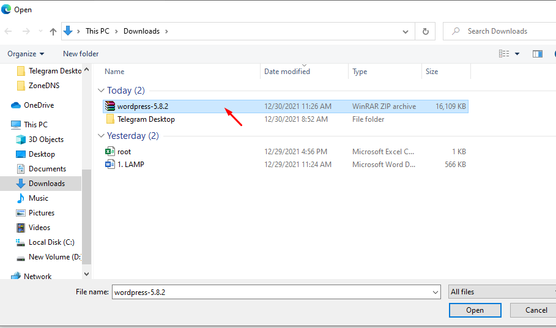
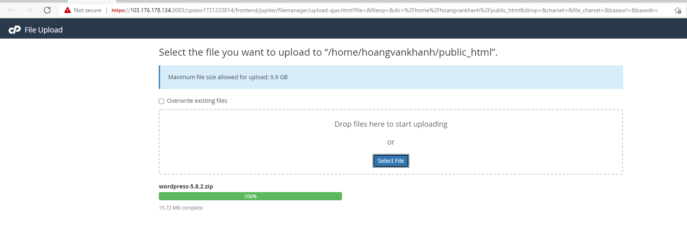

## Bước 4: thực hiển giải nén 
- click vào Extract để tiến hành giải nén.

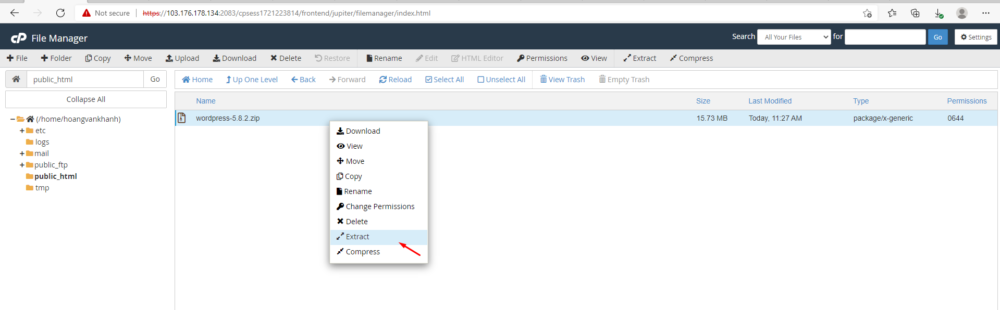

## Bước 5: thực hiện tạo database
- Sau khi upload mã nguồn Wordpress lên hosting thì ta cần tạo một database mới.
- Quay trở lại Cpanel và chọn mục MySQL Database trong phần Databases.
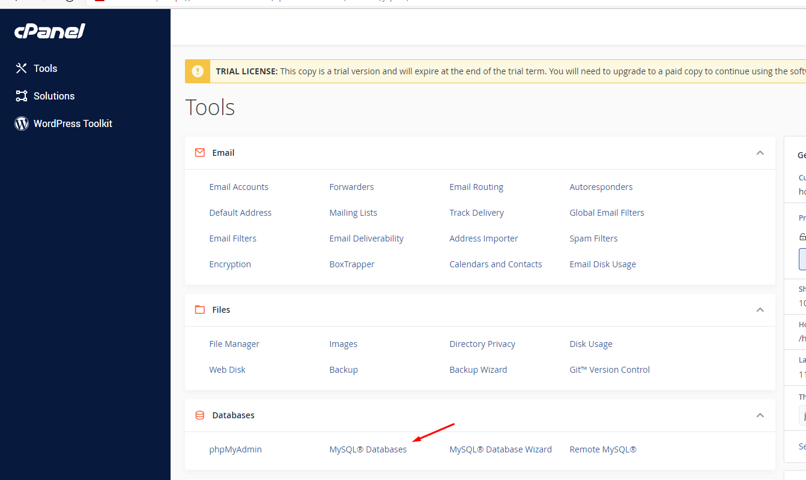

- Thực hiện tạo Database
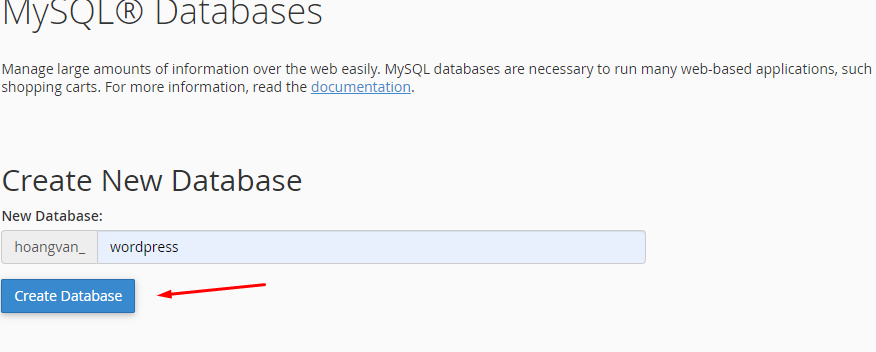
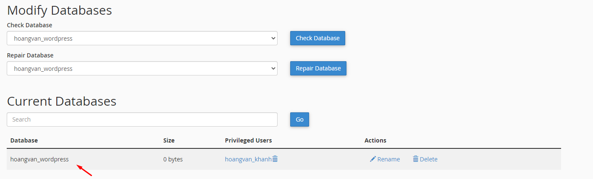

- Thực hiện tạo User và password
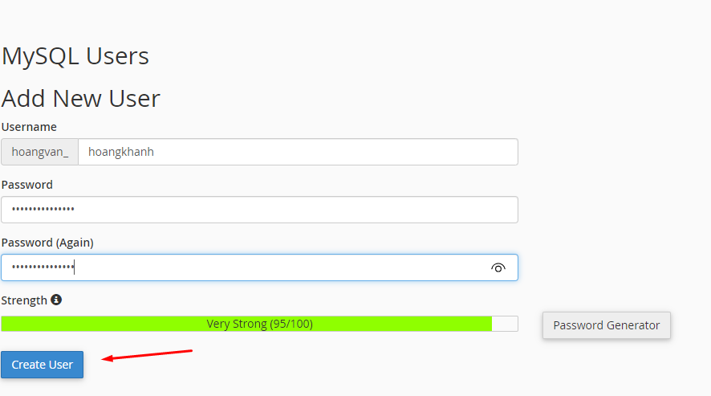
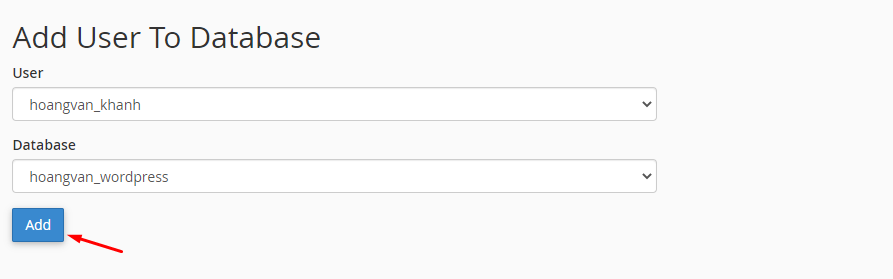

- Sau khi thực hiện Add New User ròi nhập đầy đủ thông tin gồm username, password.
- Tại mục Add User To Database hãy nhấn chọn Database và User vừa tạo rồi nhấn Add để hoàn thành.
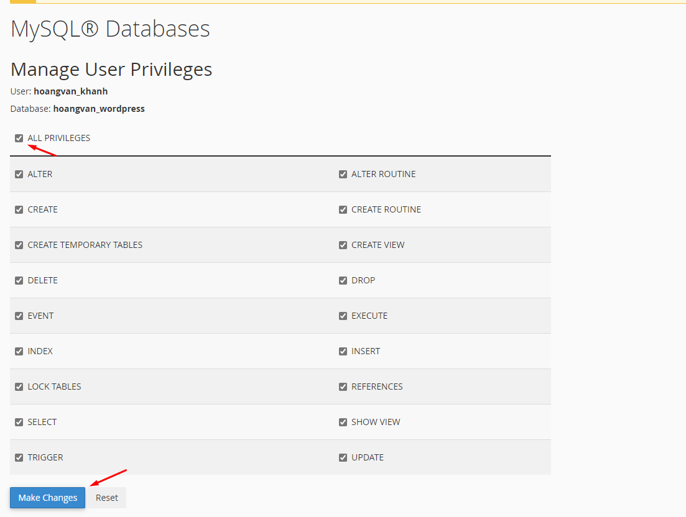

## Bước 6: Thực hiện chạy Wordpress bằng domain
- Truy cập trang web bằng URL trang web
- Chọn ngôn ngữ
    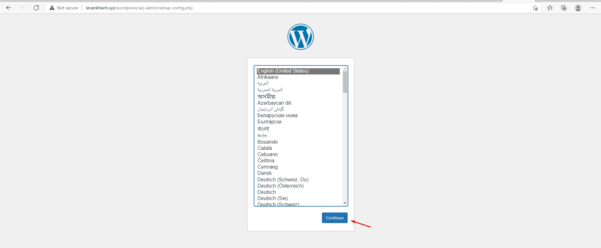
    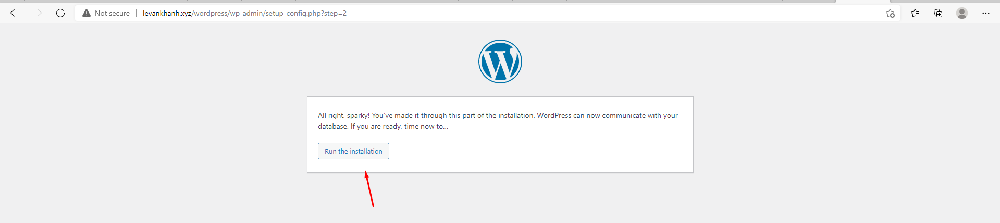
- Tạo Usernaem và Password cho word
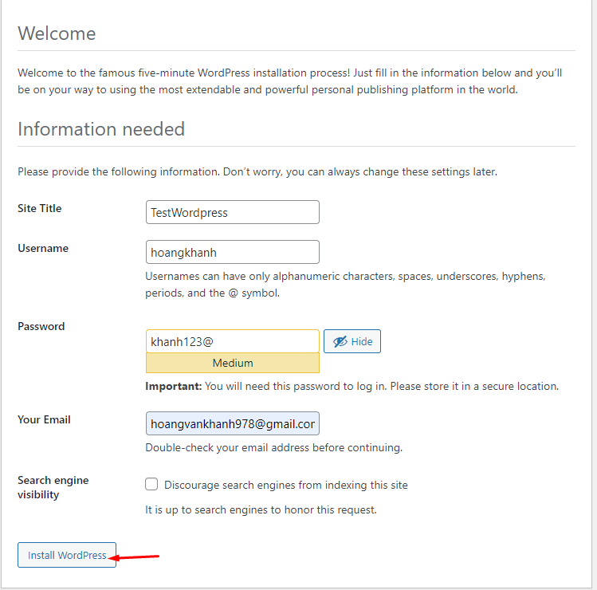
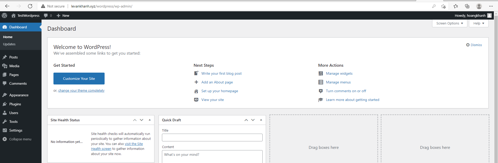
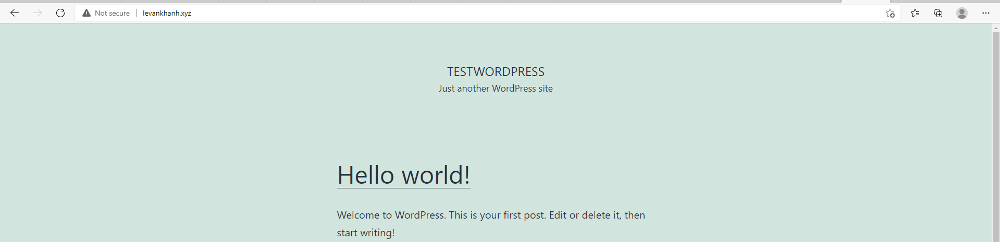

