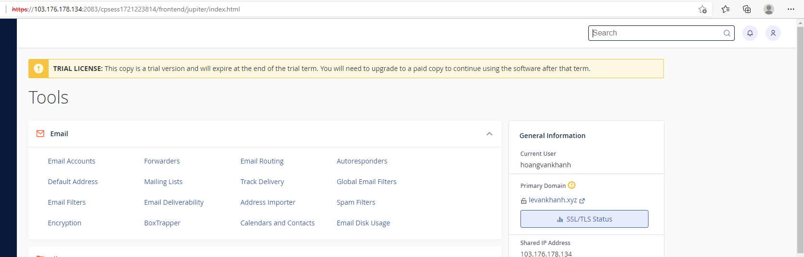
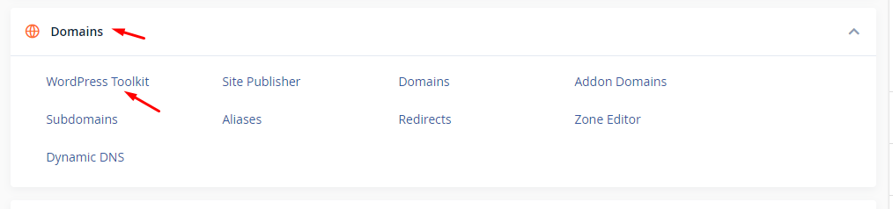
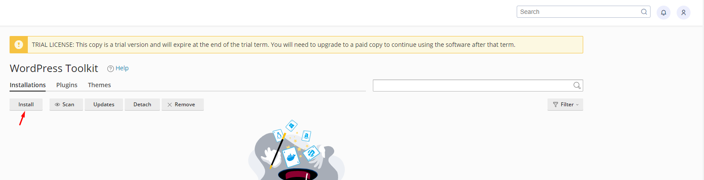
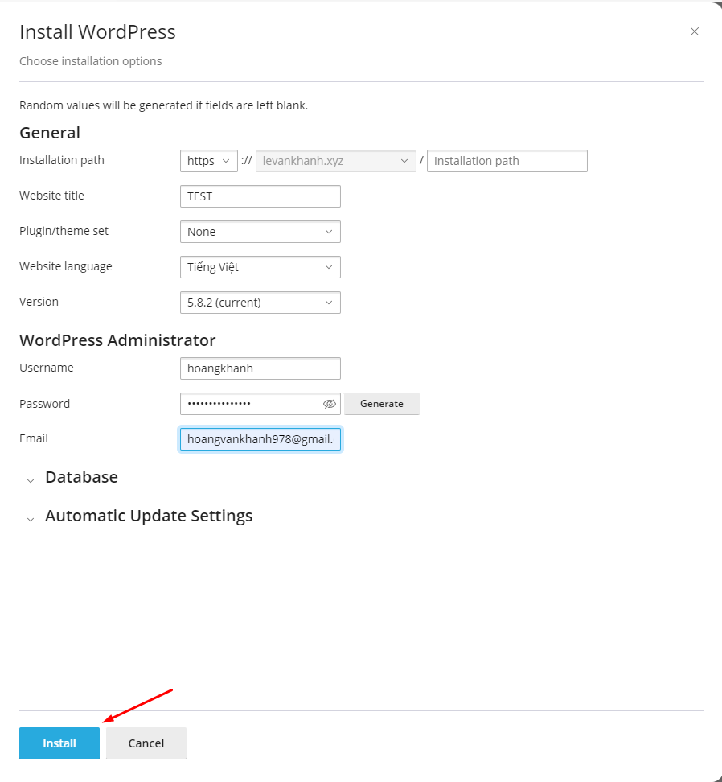
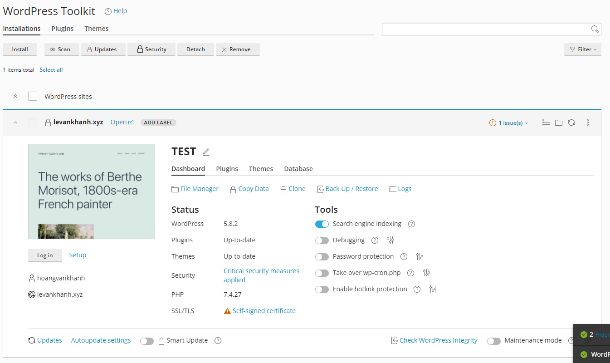
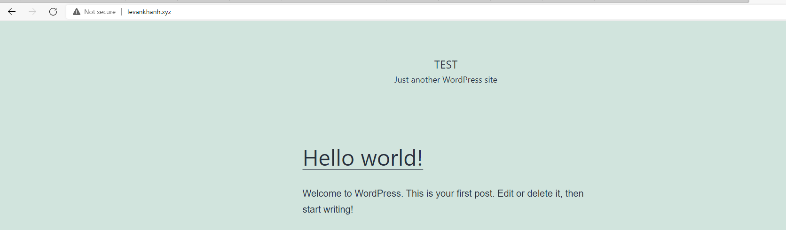

## Bước 1 Thực hiện đăng nhập vào cPanel

- 

## Bước 2: Domains => WordPress 

## Bước 3: chọn Install để thực hiện cài đặt WordPress

## Bước 4: Điền thông tin 
- Title của Web
- Ngôn ngữ 
- Phiên bảo 
- tạo user và password

## Bước 5: Hoàn thành cài đặt 

