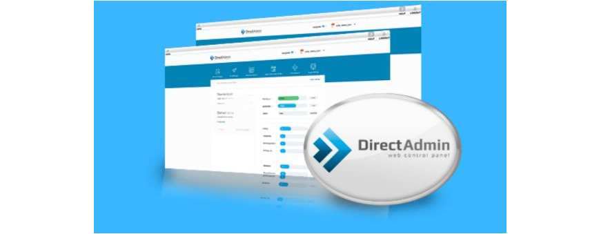

## I. Khái Niệm WHM

- WHM hay Web Hosting Manager là hệ thống cho phép quản lý đơn giản tất cả những gì trên Web Server. Giao diện dễ dùng, cung cấp cho bạn những tiện ích để kiểm soát tất cả chức năng Web Server.
- WHM quản lý tất cả từ việc quản lý Hosting, quản lý DNS tên miền, quản lý khách hàng, quản lý đơn hàng... Hơn hết, hệ thông này cũng giúp bạn cập nhật thường xuyên. Những phiên bản mới nhất càng nâng cao hệ thông quản lý giúp bạn kiểm soát chặt chẽ hơn.

## II. So Sánh Giao diện của Plesk , cPanel và DirectAdmin
### 1.CPanel

- CPanel chạy độc quyền trên hệ điều hành Linux và chính thức hỗ trợ ba phiên bản là CentOS, CloudLinux, RedHat. Dù bị hạn chế về số lượng hệ điều hành tương thích nhưng cPanel hoạt động rất hiệu quả và là sự lựa chọn hàng đầu trên máy chủ Linux. 

- cPanel đã phát hành một sản phẩm có tên Enkompass có thể chạy trên hệ điều hành Windows. Tuy nhiên, thật không may, nó không nhận được nhiều sự chú ý cần thiết để đi đến thành công. Và vì Enkompass được cung cấp miễn phí nên nó không tạo ra doanh thu và cũng không được cập nhật thường xuyên. Cuối cùng, sản phẩm đã đạt đến giai đoạn End-of-life vào đầu năm 2014.
#### Khả năng tương tích : 
- cPanel chỉ hoạt động trên hệ điều hành Linux và một số hệ điều hành như:
    + CentOS
    + RedHat
    + Cloud Linux

#### Giao diện người dùng
- Giao diện cPanel rất trực quan, trình bày khoa học và tài liệu hướng dẫn rất đầy đủ ngay trong màn hình cPanel. Tuy nhiên lại khó quản lý hơn so với Plesk và Directadmin.

#### Tính năng hỗ trợ : 
- cPanel cung cấp hệ thống API đầy đủ và ổn định, bạn có thể tự động hóa chức năng phổ biến của WHM và cPanel như tạo, chỉnh sửa tài khoản hosting, nâng cấp và hạ cấp hosting,... Ngoài ra, bạn sẽ được hỗ trợ toàn cầu và trực tiếp từ cPanel.

- Thời gian load so với những phần mềm quản trị Hosting khác là khá nhanh.

- cPanel được tích hợp công cụ đại lý Hosting WHM có khả năng giúp người dùng tận dụng tối đa tài nguyên của VPS/Dedicated Server và chia sẻ hay bán nó cho những người khác.

- Với cPanel khi thêm tên miền bạn phải có quyền root hoặc đề nghị root để thay đổi thiết lập này.
#### Bảo mật 
- Với công nghệ bảo mật mới nhất, cPanel giúp cho máy chủ luôn an toàn, bảo vệ chống virus, phát hiện rootkit, shell và và cho phép bạn khóa máy chủ khi bị xâm nhập cũng như setup thêm các Plugin như Firewall, Mod-Security để bảo vệ server của mình.
#### Cấu hình tối thiệu 
- Cấu hình tối thiểu của cPanel là 512MB
#### Chi phí cao

### 2. Plesk

- Không giống như cPanel, Plesk cung cấp hỗ trợ cho nhiều hệ điều hành khác nhau, bao gồm cả các biến thể của Linux. Ngoài ba hệ điều hành Linux được hỗ trợ bởi cPanel, Plesk còn có thể chạy trên Ubuntu, Debian và openSUSE.

- Đặc biệt, Plesk hoạt động rất mạnh mẽ trên Windows. Hiện nay, Plesk được khuyến nghị sử dụng cho Windows Server 2012 R2. Trong số ba control panel cPanel, Plesk và Directadmin thì Plesk là sản phẩm duy nhất có khả năng tương thích cao trên Windows.
- Plesk là chương trình đa nền tảng và chạy trên nhiều hệ điều hành:
    + Máy chủ Linux
        + Cloud Linux
        + Debian
        + Ubuntu
        + CentOS
        + RedHat
    + Máy chủ Windows
        + Hệ điều hành Linux nhanh và ổn định vẫn là lựa chọn ưu tiên hàng đầu cho hệ thống máy chủ.
#### Giao diện người dùng
- Plesk cung cấp UX / UI được thiết kế lại với công nghệ JavaScript hiện đại, bảng điều khiển tương tự như bảng quản trị WordPress. Vì thế, giao diện rất dễ sử dụng cho người mới bắt đầu.
#### Tính năng hỗ trợ
- Plesk là phần mềm quản trị Hosting duy nhất hiện nay có chức năng thiết kế Website, phân hệ Hóa đơn điện tử và Thanh toán (Billing), giao diện Storefront SaaS.

- Quản lý nhanh chóng, tiết kiệm hơn nhờ vào khả năng tự động hóa như từ HTTP sang HTTPS.

- Hỗ trợ chuyên biệt cho Wordpress với Wordpress ToolKit.

- Plesk không ngừng đổi mới các tính năng nổi bật như hỗ trợ Users, Hosters, Developers, cải tiến SSL management, new PHP-related functionality...
#### Tính bảo mật 
- Plesk cung cấp khả năng bảo mật tốt nhất cho hệ điều hành và các ứng dụng mở rộng nhờ vào hệ thống bảo mật Mod-Security & Fail2ban và SSL. Ngoài ra, nó còn đảm bảo độ riêng tư cho dịch vụ mail nhờ giao thức SNI.
#### Cấu hình tối thiểu 
- Cấu hình tối thiểu của Plesk là 512MB
#### Chi phí cao

### 3. Directadmin

- Tương tự như cPanel, Directadmin cũng chỉ chạy trên các phiên bản của Linux, cụ thể là RedHat, CentOS, FreeBSD và Debian.

- Điều này có nghĩa là nếu sử dụng hệ điều hành Linux, bạn sẽ có được nhiều sự lựa chọn về chương trình control panel hơn (có thể chọn Directadmin hoặc cPanel). Trong khi đó, nếu sử dụng Windows, bạn chỉ có thể dùng Plesk.

- Directadmin cũng chỉ hoạt động trên hệ điều hành Linux và một số hệ điều hành như:
    + CentOS
    + RedHat
    + FreeBSD
    + Debian
- Hệ điều hành Linux nhanh và ổn định vẫn là lựa chọn ưu tiên hàng đầu cho hệ thống máy chủ.

#### Giao diện người dùng 
- Giao diện của Directadmin được đánh giá là đơn giản nhất, tuy nhiên vẫn đảm bảo đủ các tính năng cần thiết và hữu ích cho người dùng.
- Phân cấp bậc quản trị rõ ràng giữa các quyền Admin / Reseller / User

#### Tính năng hỗ trợ
- Với Directadmin bạn có thể thêm nhiều tên miền ngay cả khi nó sử dụng DNS trung gian.

- User được chủ động thay đổi tên miền mà không cần phải có quyền Root như cPanel.

- Ngoài ra, cơ chế Directadmin giúp việc hồi phục dữ liệu tương đối nhanh chóng so với cPanel và dữ liệu ít bị hỏng crashed.
#### Bảo mật 
- DirectAdmin hỗ trợ tính năng và plugin đi kèm theo đơn giản hơn nên cũng ít bị khai thác về lỗ hổng bảo mật so với cPanel & Plesk.
#### Cấu hình tối thiệu
- Cấu hình tối thiểu của DirectAdmin là 128MB
#### Chi phí thấp
