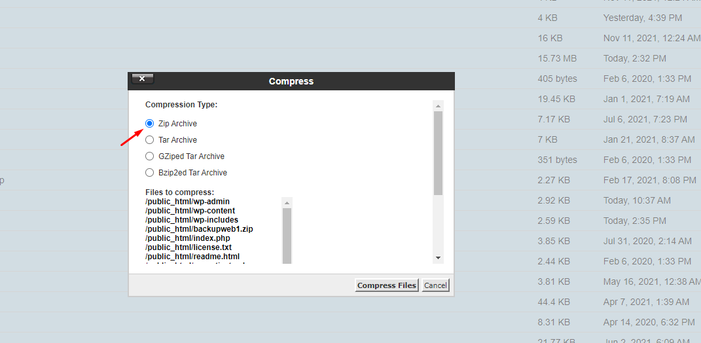
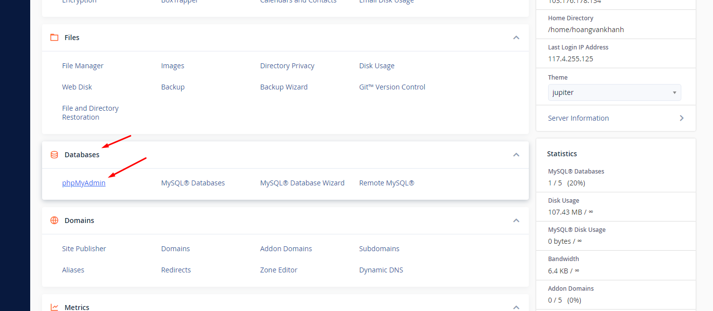

## I. Tiến hành Backup mã nguồn và database
### Bước 1: tiến hành Backup mã nguồn
- Chọn file maneger 

- Chọn Pulic-html

- Chọn Select All -> chọn Compress chọn nén bằng .zip

- Thực hiện tải xuống file vừa backup

### Bước 2: Tiến hành Backup Database

- Chọn phpmysql 

- chọn database của website

- chọn Export -> chọn Go để tiến hành tải dữ liệu về máy.

## II. Thực hiện Upload lên Hosting Cpanel mới

### Bước 3 : Chọn File Maneger

- Chọn Pulic_html 

- Chọn Upload -> Tải file mã nguồn vừa backup lên

- Chọn ExTract để tiền hành giải nén

### Bước 4: Tạo database và user
- Tạo database

- Tạo user

- Add Database

### Bước 5: Upload data lên
- Chọn phpmysql -> chọn database vừa tạo

- Chọn Import để tải data lên

- Chọn Choose File -> chọn file data đã backup -> chọn Go 

### Bược 6: chỉnh sửa file cấu hình 
- Chọn wp-config.php 

- điều tên database , user và passwd

### Lưu ý 
- Nếu chưa chuyển DNS sang hosting mới thì phải thực hiện chuyển đổi 
- Chờ đợi quá trình cập nhật là quá trình xong.

