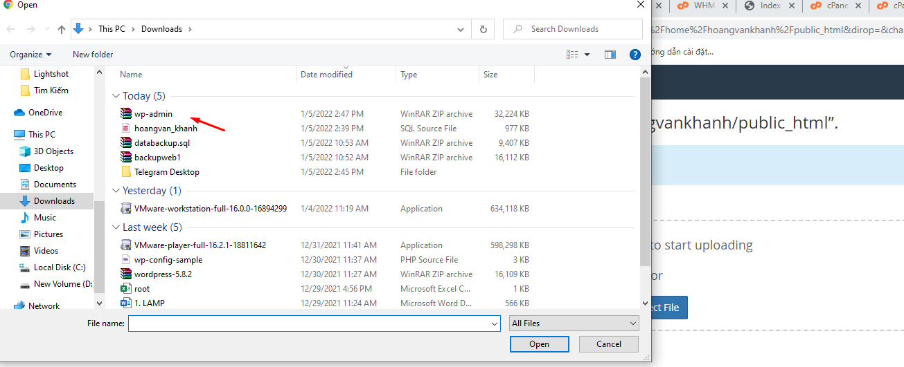

## I. Tiến hành Backup mã nguồn và database
### Bước 1: tiến hành Backup mã nguồn
- Chọn file maneger 

- Chọn Public-html

- Chọn Compress chọn nén bằng .zip

### Bước 2: Tiến hành Backup Database

- Chọn phpmysql 

- chọn Database của website cần backup

- chọn Export -> chọn Go để tiến hành tải dữ liệu về máy.

- Sau khi hoàn thanh việc backup sẽ có 2 file như sau:

## II. Thực hiện Upload lên Hosting Cpanel mới

### Bước 3 : Chọn File Maneger

- Chọn Pulic_html 

- Chọn Upload -> Tải file mã nguồn vừa backup lên

- Chọn ExTract để tiền hành giải nén

### Bước 4: Tạo database và user
- Chọn Mysql database

- Tạo Database

- Tạo User 

- Add user to database

### Bước 5: Upload data lên
- Chọn phpmysql -> chọn database vừa tạo

- Chọn Import để tải data lên

- Chọn Choose File -> chọn file data đã backup -> chọn Go 

### Bược 6: chỉnh sửa file cấu hình 
- Chọn wp-config.php 

- Chỉnh sửa tên database , user và passwd

### Kiểm tra 

