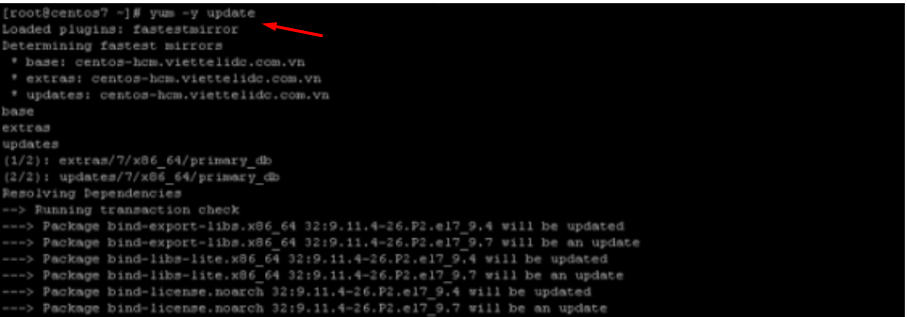

## I. Khái niệm về cPanel 
### 1. cPanel 

- cPanel là control panel nền Linux phổ biến nhất cho tài khoản web hositng. Nó giúp bạn quản lý tất cả dịch vụ web trong một chỗ. Hiện nay, cPanel là chuẩn của ngành công nghiệp này và hầu hết các web developer đều đã quen thuộc với nó.

- Dễ sử dụng và tiện lợi, cPanel giúp tăng sức mạnh quản lý tài khoản web hosting với hiệu suất tối ưu. Bất kể bạn muốn tạo tài khoản FTP mới và email address hoặc giám sát tài nguyên, tạo subdomain hay cài đặt software đều có thể làm được với cPanel.

#### Ưu điểm :
- Dễ tìm hiểu
- Dễ sử dụng
- Tiết kiệm thời gian và tiền bạn
- Đã được thử nghiệm kỹ càng
- Có trình cài đặt tự động
- Nhiều hướng dẫn/bài viết trên mạng

#### Nhược điểm:
- Có nhiều tính năng không cần thiết
- Dễ vô tình thay đổi các thông số quan trọng mà
- Một số host chạy bản cPanel cũ
- Tốn kém hơn vì thường cPanel không đính kèm trong các gói hosting miễn phí

## II. Hướng dẫn cài đặt cPanel trên CentOs 7 
### Yêu cầu : 
- Yêu cầu phần cứng tối thiệu : CPU 1GB, Ram 768MB, Disk 20GB.
- Môi trường máy ảo 64bit.
- CentOs 7 chưa cài dịch vụ gì.

### Bước 1: Tắt Selinux
- `echo SELINUX=disabled >> /etc/selinux/config`

### Bước 2 : Vô hiệu hóa tường lửa
- `` 
    systemctl stop firewalld
    systemctl disable firewalld

### Bước 3: update hệ thống 
- `yum -y update`

### Bước 4: Tắt network Manager
- ``
    systemctl stop NetworkManager.service
    systemctl disable NetworkManager.service
    systemctl enable network.service
    systemctl start network.service

### Bước 5: tiến hành Downloand cPanel
- `cd /home && curl -o latest -L https://securedownloads.cpanel.net/latest && sh latest`

## Bước 6: Hoàn thành cài đặt 