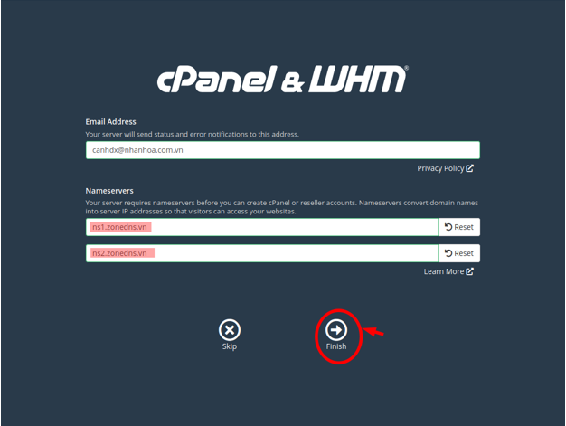

## I. Khái niệm về cPanel 
### 1. cPanel 


- cPanel là control panel nền Linux phổ biến nhất cho tài khoản web hositng. Nó giúp bạn quản lý tất cả dịch vụ web trong một chỗ. Hiện nay, cPanel là chuẩn của ngành công nghiệp này và hầu hết các web developer đều đã quen thuộc với nó.

- Dễ sử dụng và tiện lợi, cPanel giúp tăng sức mạnh quản lý tài khoản web hosting với hiệu suất tối ưu. Bất kể bạn muốn tạo tài khoản FTP mới và email address hoặc giám sát tài nguyên, tạo subdomain hay cài đặt software đều có thể làm được với cPanel.

#### Ưu điểm :
- Dễ tìm hiểu
- Dễ sử dụng
- Tiết kiệm thời gian và tiền bạn
- Đã được thử nghiệm kỹ càng
- Có trình cài đặt tự động
- Nhiều hướng dẫn/bài viết trên mạng

#### Nhược điểm:
- Có nhiều tính năng không cần thiết
- Dễ vô tình thay đổi các thông số quan trọng mà
- Một số host chạy bản cPanel cũ
- Tốn kém hơn vì thường cPanel không đính kèm trong các gói hosting miễn phí

## II. Hướng dẫn cài đặt cPanel trên CentOs 7 
### Yêu cầu : 
- Yêu cầu phần cứng tối thiệu : CPU 1GB, Ram 768MB, Disk 20GB.
- Môi trường máy ảo 64bit.
- CentOs 7 chưa cài dịch vụ gì.

### Bước 1: Cài đặt chuẩn bị OS

- Kiểm tra phiên bản, Cài đặt hostname, update
- `Setup hostname hostnamectl set-hostname cpanel.thanhbaba.xyz`
- Update
    + `yum install epel-release -y && yum update -y `


- Cài đặt thêm package hỗ trợ :
    + ` yum install wget vim curl byobu -y`

### Bước 2: Cài đặt firewall tắt networkmanager và khởi động lại network
- ```
      systemctl disable firewalld
      systemctl stop firewalld
      sudo systemctl disable NetworkManager
      sudo systemctl stop NetworkManager
      sudo systemctl enable network
      sudo systemctl start network


- SElinux
    + ``` 
          sed -i 's/SELINUX=enforcing/SELINUX=disabled/g' /etc/sysconfig/selinux
          sed -i 's/SELINUX=permissive/SELINUX=disabled/g' /etc/sysconfig/selinux
          sed -i 's/SELINUX=enforcing/SELINUX=disabled/g' /etc/selinux/config
          sed -i 's/SELINUX=permissive/SELINUX=disabled/g' /etc/selinux/config


### Bước 3: Cài đặt NTPD: (Network Time Protocol daemon)
- Với Chrony là một dịch vụ hỗ trợ một cách đầy đủ, thuận tiện việc quản lý đồng bộ thời gian trên Network Time Protocol.
- ```
        yum install chrony -y 
        sed -i 's|server 1.centos.pool.ntp.org iburst|server 103.101.161.201 iburst|g' /etc/chrony.conf
        systemctl enable --now chronyd 
        hwclock --systohc

### Bước 4: Cài đặt Cpanel 
- Mở byobu lên để giữ phiên cài đặt 
    + `byobu`
- `cd /home && curl -o latest -L https://securedownloads.cpanel.net/latest && sh latest`


### Bước 5: Tiến hành đăng nhập
- tiến hành đặt nhập SSH


- Điền Gửi gửi thông báo và DNS trỏ về


- Màn hình chính 

