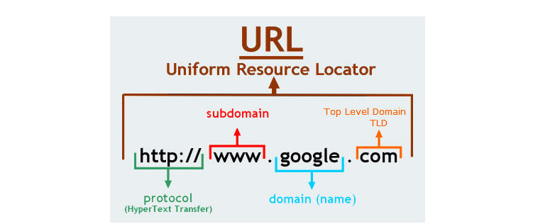
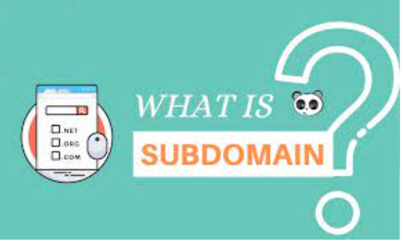
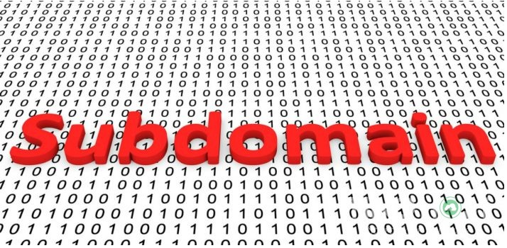

## I. Sự Khác biệt Domain và Subdomain

- Domain (tên miền) chủ yếu được sử dụng làm tên cho trang web. Nói tóm lại, thay vì phải gõ địa chỉ IP của mỗi trang web vào các trình duyệt, tên miền mang lại cho các trang web tên riêng của đẹp mắt, có thể dễ dàng ghi nhớ và sử dụng bởi tất cả mọi người. Ví dụ: để truy cập trang web của chúng tôi, tất cả những gì bạn cần vào trình duyệt của bạn là hostinger.vn, thay vì một chuỗi số ngẫu nhiên như 31.220.23.1. Tên miền có thể có nhiều phần mở rộng khác nhau, chẳng hạn như .com, .net, .org. Đăng ký tên miền thường tốn phí và nó cũng cần phí để duy trì.

- Subdomain (tên miền phụ) phụ thuộc vào các tên miền chuẩn. Chúng giống như một mức bổ sung cho một tên miền. Ví dụ bạn sở hữu tên miền semtek.com.vn. Bạn có thể tạo thêm tên miền phụ cho tên miền của bạn như forums.semtek.com.vn. Vì bạn đã sở hữu tên miền semtek.com.vn nên tên miền phụ cho tên miền này không yêu cầu bất kỳ khoản phí bổ sung nào và bạn thường có thể đặt chúng dễ dàng.

## II. Mục đích sử dụng Subdomain
- Sự ra đời của subdomain là chìa khóa vô cùng hữu ích cho các nhu cầu của doanh nghiệp nói chung và quản trị viên nói riêng. Nếu không có subdomain, ta sẽ gặp rất nhiều khó khăn khi thực hiện các mục đích sau :

### 1. Tạo website riêng dành cho một nhóm đối tượng nhất định

- Mục đích chính của subdomain xuất hiện chính là để tạo ra một website mới mà vẫn sử dụng Domain chính. Bạn sẽ không mất thêm bất kỳ chi phí nào để đăng ký một tên miền mới, trong khi, website được tạo ra từ subdomain lại có thể hoạt động như website chính.
- Subdomain đăc biệt hữu ích khi doanh nghiệp của bạn muốn tạo ra một nơi chứa đầy đủ thông tin để phục vụ cho một nhóm khách hàng riêng, với ngôn ngữ và content phù hợp. Chẳng hạn như công ty bạn muốn tạo ra một số website riêng bán nhóm đồ trẻ em, một website riêng bán đồ bà bầu vì chúng có quá nhiều sản phẩm trên một website, khiến khách hàng có lòng có thể xem hết. Viêc này thật đơn giản với subdomain. Dĩ nhiên, các hình ảnh, ngôn ngữ của website cũng được chi tiết hóa đến với khách hàng.

### 2. Chia blog hoặc trang thương mai điển tử tách khỏi website chính
- Dùng subdomain để chia các Module vốn dĩ ở website chính ra các trang web độc lập không phải là hiếm thấy. Với một doanh nghiệp đa ngành nghề thì việc tách chúng ra có lợi cho việc phát triển quy mô.

- Chẳng hạn công ty bạn kinh doanh nhiều mặt hàng như giày dép, đồng hồ, túi xách, nước hoa, ví tiền…. Bạn muốn phát triển kênh blog cho từng nhóm sản phẩm nhưng lại rất khó để phân chia chúng chỉ trong một module. Do đó, bạn có thể tách riêng chúng ra một website khác sử dụng subdomain. Đôi khi, việc quản lý nhiều website độc lập còn dễ hơn nhiều so với duy trì một trang web đa năng.

### 3. Tạo trang web dành riêng cho giao diện mobile
- Sử dụng subdomain để dành riêng cho giao diện mobile tuy không mới lạ nhưng giờ đây không còn sử dụng phổ biến. Bởi, các website hiện nay đều được thiết kế chuẩn Responsive, chuẩn di động. Bởi vậy, tạo subdomain thiết kế website cho thiết bị di động thường được sử dụng cho các trang web chưa chuẩn di động. Khi người dùng truy cập vào website, trang web sẽ xác định kích thước của thiết bị và cung cấp bố cục phù hợp với kích thước đó. domain và subdomain là gì

    + Ví dụ người dùng truy cập vào trang web bằng PC sẽ trả về địa chỉ abc.com nhưng điện thoại truy cập cùng địa chỉ đó sẽ dẫn đến subdomain với tên miền x.abc.com.

### 4. Tiết kiệm chi phí

- Subdomain là một công cụ miễn phí. Bạn có thể tạo ra nhiều website mới dưới dạng subdomain mà không cần phải đăng ký tên miền cho chúng. Hình thức này rất tiết kiệm lại mang lại hiệu quả cao. Hơn nữa, bạn có thể sử dụng trực tiếp các thiết kế của trang web do subdomain quản lý giống với các thiết kế của website chính mà không lo chúng trùng lặp do có tính nhất thống. Điều này giúp cho bạn tiết kiệm được một  khoản để chi cho bên thiết kế website.

