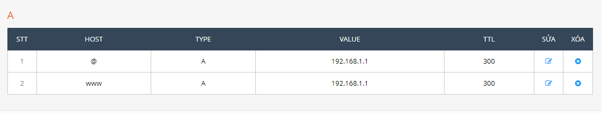
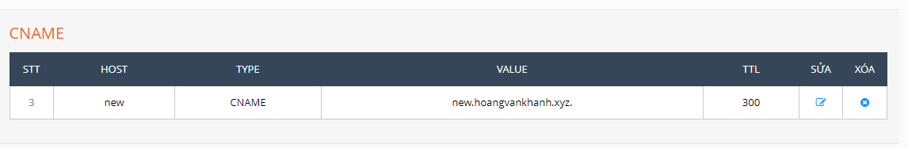
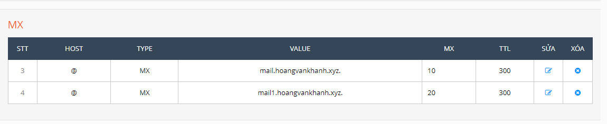
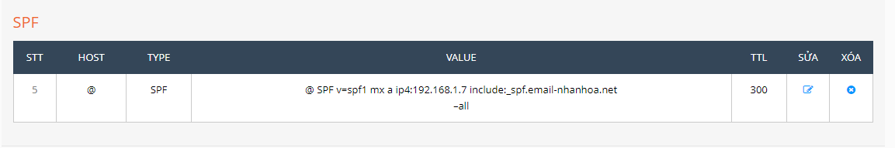
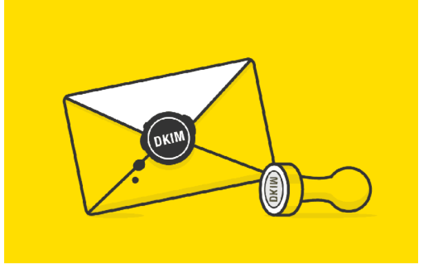
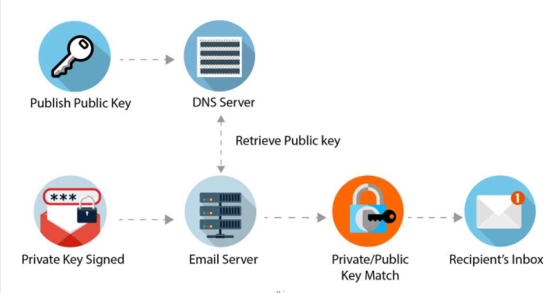

## 1. Bản ghi A (Address record)
- Là DNS record cơ bản và quan trọng nhất dùng để truy cập web. Nó giúp trỏ tên miền (domain) của website tới một địa chỉ IP cụ thể.

- Hầu hết các website chỉ có một bản ghi A, nhưng một số trang web sẽ có một vài bản ghi A không giống nhau. Điều này có nghĩa là một tên miền có thể được trỏ đến nhiều địa chỉ IP khác nhau… A record được dùng để chuyển tên miền sang địa chỉ IPv4, còn với IPv6 thì AAAA record sẽ được sử dụng. Cấu trúc của bản ghi AAAA cũng tương tự như bản ghi A.

- Record A có dang như sau :
    + `Domain A <địa chỉ IPv4 của máy>`
    + VD :  
            

## 2. Bản ghi Cname (Canonical Name)
- là một bản ghi bí danh. Bản ghi Cname là một loại bản ghi tài nguyên trong DNS. Nó cho phép gắn nhiều Domain vào cùng một máy chủ, nói cách khác thì Cname là một địa chỉ IP có thể có nhiều Domain cùng trỏ về. Bản ghi Cname thường được sử dụng khi người ta muốn tạo một bản ghi theo giá trị sẵn có. Bên cạnh đó, bản ghi Cname còn được dùng khi dữ liệu cũ thay đổi thì dữ liệu mới cũng chuyển đổi theo. Cname cũng được dùng để xác thực các dịch vụ cung cấp của Google như xác minh tên miền và một số dịch vụ trực tuyến khác.

- Cách sử dụng Cname
    + Bắt buộc phải có bản ghi kiểu A khi muốn khai báo bản ghi Cname. Khi đó, Domain đã được khai báo trong Cname trỏ đến địa chỉ IP của máy được gọi là Canonical Domain, các Domain khác muốn trỏ về cùng máy chỉ này được gọi là Alias Domain của tên máy và cũng cần được khai báo.

- Record Cname có dang như sau :
    + `alias-domain IN CNAME canonical domain`
    + VD :
        
    

## 3. Txt Record (Text)

- Bản ghi txt là một loại DNS record giúp tổ chức các thông tin dạng text (văn bản) của tên miền. Người dùng có thể đẩy tất cả các văn bản không mất phí mà người dùng muốn lên một bản ghi TXT.
- Một tên miền có thể có nhiều bản ghi TXT và chúng chủ yếu được dùng cho các SPF (Sender Policy Framework) codes, có tác dụng giúp máy chủ email xác định tính an toàn và nguồn gửi của các thư. Ngoài ra, bản ghi text trên DNS này còn dùng để xác thực máy chủ của một tên miền, xác minh SSL...

## 4. Bản ghi Mx (Mail Exchange)
- Bản ghi MX (Mail Exchange Record) là một phần của DNS dùng để xác định máy chủ mail cho một tên miền. Nó có ảnh hưởng đến các tin nhắn phản hồi lại khi bạn sử dụng email theo tên miền riêng. Vì máy chủ thư khác muốn liên lạc lại với email server của bạn thì nó cần tìm bản ghi MX. 

- Một tên miền có thể gán nhiều bản ghi MX, nên bạn có ngưng hoạt động email thì các dữ liệu trong đó vẫn được đảm bảo và lưu trữ 

- Bản ghi MX không nhất thiết phải trỏ đến VPS, hosting, máy chủ của doanh nghiệp. Khi bạn dùng dịch vụ mail của bên thứ 3 thì bạn sẽ sử dụng bản ghi MX do họ cung cấp. 

- Bản ghi MX có dang như sau :
    + `[domain_name] IN MX [priority] [mail-server]`
    + Độ ưu tiên càng cao thì số càng thấp
    + VD : 
        

## 5. Bản ghi SPF (Sender polyci framework)
- SPF record là một loại bản ghi của hệ thống phân giải tên miền DNS. Bản ghi này được dùng để xác định mail server có quyền gửi mail đại diện cho tên miền của bạn. SPF record ra đời với mục đích ngăn chặn tin nhắn mạo danh từ địa chỉ tên miền. Khi đó, người nhận có thể xác định nội dung tin nhắn đến từ tên miền của bạn đã được máy chủ mail cho phép hay chưa.
- Tầm quan trong SPF : 
    + Hạn chế các mail spam đến từ các trang web độc hại
    + Hạn chế email mạo danh
    + Loại bỏ những kênh thông tin tiềm ẩn rủi ro và không mang lại giá trị
- Bản ghi SPF có dang như sau:
    + 
    + VD : 
        

## 6. Bản ghi DKIM (Domain keys identified mail)

- DKIM là viết tắt của từ Domain Keys Identified Mail, được biết đến như phương thức xác nhận email dựa trên chữ ký số nằm trong miền gửi thư. Điều này giúp người dùng tránh được các email giả mạo. 
- Ngoài việc xác nhận, DKIM còn hỗ trợ ngăn chặn các email giả, lừa đảo, chứa mã độc hoặc spam email,… dựa trên các tính năng của cặp khóa private/public. Ở đây, khóa private dùng để ký email, khóa public được hiển thị trên DNS của tên miền dưới dạng TXT record.

### Phương thức hoạt động của DKIM 

- Tuy sở hữu các chức năng phòng ngừa, ngăn chặn email giả, chứa mã độc, lừa đảo,... song bản chất của DKIM không phải chống spam mà là xác thực. Phần mềm này hoạt động theo phương thức đặc biệt với 2 phần riêng là chữ ký và xác minh. 

- Thông thường, quy trình hoạt động của DKIM được tiến hành qua lại giữa hai phía là bên gửi và bên nhận. Cụ thể: 

    + Bên gửi: Tạo cặp khóa private/public dưới sự hỗ trợ của phần mềm OpenSSL -> Chuyển khóa công khai lên TXT records của DNS tương ứng với tên miền khi gửi email -> Mail server ký vảo email bằng khóa private trước khi gửi đi.
    + Bên nhận: Nhận và kiểm tra các email có thông điệp đã được mã hóa bởi DKIM -> Query DNS lấy khóa Public của tên miền -> giải mã. Nếu đúng thì tiến hành xác nhận nguồn và email đã đảm bảo; không đúng sẽ từ chối hoặc nhận email tùy theo chính sách cụ thể. 

## 7. Bản ghi DMARC (Domain based message authentication & Reporting conformance)
- DMARC ( tên tiếng anh là Domain-based Message Authentication, Reporting & Conformance) là một giao thức xác thực email để giảm thiểu việc lạm dụng email.

- Nó được thiết kế để cung cấp cho chủ sở hữu tên miền email khả năng bảo vệ tên miền của họ khỏi việc sử dụng trái phép, thường được gọi là giả mạo email . Mục đích và kết quả chính của việc triển khai DMARC là để bảo vệ một tên miền khỏi bị sử dụng trong các cuộc tấn công thỏa hiệp email, email lừa đảo , lừa đảo qua email và các hoạt động đe dọa mạng khác

- Khi mục nhập DNS DMARC được xuất bản, bất kỳ máy chủ email nhận nào cũng có thể xác thực email đến dựa trên hướng dẫn được chủ sở hữu tên miền xuất bản trong mục nhập DNS. Nếu email vượt qua xác thực, nó sẽ được gửi và có thể tin cậy được. Nếu email không kiểm tra, tùy thuộc vào hướng dẫn được lưu trong hồ sơ DMARC, email có thể được gửi, cách ly hoặc từ chối.

- Giao thức này sử dụng nằm trong khuôn khổ cơ chế để xác định những miền email DKIM và chính sách người gửi SPF. Những nhà cung cấp hộp thư đều sử dụng cả DKIM và SPF khi tìm cách giải quyết những email có chứa những mã virus/ mã độc. Khi gặp phải những email chứa virus hay mã độc này emai của bạn xuất hiện những tin nhắn rác, tin nhắn lừa đảo hay thậm chí khi người dùng bấm vào những email này thì những virus có thể lây lan ra cả máy tính và hệ thống. 

- Các chính sách của DMARC được xuất bản trong DNS dưới dạng bản ghi TXT văn bản.

### Lợi ích của sử dụng DMARC 
- Xuất bản DMARC record để bảo vệ thương hiệu của bạn bằng cách ngăn chặn từ bên trong không được xác thực gửi thư từ tên miền của bạn. Trong một số trường hợp, bạn chỉ cần xuất bản một bản ghi DMARC có thể mang lại hiệu quả tích cực.
- Việc sử dụng những kết quả DMARC có thể làm tăng khả năng hiển thị vào chương trình email của bạn bằng cách chọn cho bạn biết ai đang gửi thư từ tên miền bạn.
- DMARC giúp cộng đồng email thiết lập một số chính sách nhất quán để xử lý những email không xác thực. Việc này sẽ giúp toàn bộ hệ thống email trở nên an toàn và đáng tin cậy hơn.

### Cách DMARC Hoạt động 
- Xuất bản DMARC record để bảo vệ thương hiệu của bạn bằng cách ngăn chặn từ bên trong không được xác thực gửi thư từ tên miền của bạn. Trong một số trường hợp, bạn chỉ cần xuất bản một bản ghi DMARC có thể mang lại hiệu quả tích cực.
- Việc sử dụng những kết quả DMARC có thể làm tăng khả năng hiển thị vào chương trình email của bạn bằng cách chọn cho bạn biết ai đang gửi thư từ tên miền bạn.
- DMARC giúp cộng đồng email thiết lập một số chính sách nhất quán để xử lý những email không xác thực. Việc này sẽ giúp toàn bộ hệ thống email trở nên an toàn và đáng tin cậy hơn.