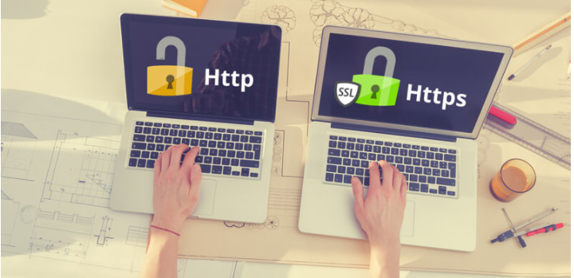

## I. SLL (Secure Sockets Layer)
### 1. Khái niệm về SSL

- SSL (Secure Sockets Layer) – Tiêu chuẩn an ninh công nghệ toàn cầu tạo ra một liên kết được  mã hóa giữa máy chủ web và trình duyệt. Liên kết này đảm bảo tất cả các dữ liệu trao đổi giữa  máy chủ web và trình duyệt luôn được bảo mật và an toàn. 

- Website có bảo mật bằng chứng thư số (SSL) sẽ có biểu tượng https:// giúp khách hàng khi truy  cập có thể xác minh được tính xác thực, tin cậy của website, đảm bảo dữ liệu, thông tin trao đổi  giữa website và khách hàng được mã hóa, tránh nguy cơ bị can thiệp. 

### 2. Lợi ích khi sử dụng SSL
-  Đưa website bạn lên thứ hạng cao hơn trên Google

- Sự bảo mật cao cho trình duyệt

- Nâng cao uy tín cho website

- Cải thiện lưu lượng truy cập

- Thúc đẩy chuyển đổi cao

### 3. Cách thức hoạt động của chứng chỉ SSL

- Cách thức hoạt động của chứng chỉ SSL đó là: áp dụng cách tích hợp key mã hóa vào thông tin định danh của một công ty bất kỳ khi sử dụng. Điều này sẽ giúp mọi thông tin khi trao đổi sẽ không bị đơn vị thứ ba can thiệp vào.

- SSL sử dụng hình thức Public và Private key và đồng thời cũng là các khóa duy nhất của mỗi phiên giao dịch. Tất cả các khách hàng khi truy cập vào website đều sẽ được bảo mật thông tin dưới sự thiết lập kết nối của hệ thống.
- Ban đầu khi kết nối thì Public và Private key sẽ được dùng để tạo các Session key ( thường dùng để mã hóa và giải mã dữ liệu khi truyền tải ). Các session key sẽ chỉ được sử dụng trong một khoảng thời gian nhất định và chỉ có thể áp dụng cho phiên giao dịch đó.

## II. Một số chứng chỉnh miễn phí của SSL
### 1. Chứng chỉ Let’s Encrypt 

- Let’s Encrypt là chứng chỉ tiêu chuẩn an ninh công nghệ toàn cầu miễn phí. Được quản lý bởi  Internet Security Research Group (ISRG) - tập đoàn phi lợi nhuận của California. Với sứ mệnh nâng cao bảo mật trên môi trường internet, phá bỏ các rào cản về tài chính, công nghệ,....hướng tới mục đích an toàn chung.  

#### Nguyên tắc của Let's Encrypt
- Let’s Encrypt hoạt động dựa trên 6 nguyên tắc Miễn phí - Tự động - An toàn - Minh bạch - Mở - Hợp tác. Cụ thể:

- Let’s Encrypt  cung cấp chứng chỉ an ninh mạng hoàn toàn miễn phí cho các website sau khi yêu cầu thông tin xác minh. Chứng chỉ này có giá trị như SSL tính phí, đảm bảo trang web này chính chủ và an toàn với người dùng. 

- Các phần mềm chạy trên máy chủ web sở hữu Let’s Encrypt có thể tự động tương tác để lấy chứng chỉ một cách dễ dàng, tự động gia hạn.

- Let’s Encrypt  cung cấp chứng chỉ cho các trang web an toàn dựa trên những tiêu chuẩn bảo mật TLS và qua bên xét duyệt thứ ba - CA. 

- Các chứng chỉ Let’s Encrypt sau khi cấp phát và thu hồi đều được ghi lại công khai với tất cả người sử dụng. Giúp bạn có thể dễ dàng kiểm tra về độ an toàn của website trong những khoảng thời gian trước đây. 

- Let’s Encrypt là chứng chỉ cung cấp cho tất cả các website có nhu cầu. giao thức phát hành và gia hạn tự động sẽ được công bố như một tiêu chuẩn công khai 

- Let’s Encrypt  là sản phẩm phi lợi nhuận hướng tới mục đích an toàn chung trên không gian mạng, được sự quan tâm và hợp tác cùng phát triển của các tập đoàn lớn như facebook, mozilla, Cisco,... nỗ lực đem lại lợi ích cho cộng đồng. 

### 2. Chứng chỉ OpenSSl

- OpenSSL là một thư viện phần mềm có mã nguồn mở được sử dụng để mã hóa dữ liệu và triển khai các giao thức mạng. Công cụ này dùng cho toàn bộ các ứng dụng bảo mật truyền thông qua mạng máy tính để phòng chống nghe trộm hoặc cần phải xác định phe truyền thống ở phía đầu bên kia.

- OpenSSL ra mắt vào năm 1998 và có sẵn trong các hệ thống Linux, Windows, macOS và BSD. Với OpenSSL, người dùng có thể thực hiện các tác vụ liên quan đến SSL khác nhau như CSR (Yêu cầu ký chứng chỉ), tạo khóa riêng và cài đặt chứng chỉ SSL. Vì vậy, khi nhắc tới chứng chỉ SSL/TLS và cách thức triển khai chúng thì đây chính là công cụ thích hợp nhất.

- Hiện nay, chúng đang được ứng dụng rộng rãi trong các máy chủ web Internet nhằm phục vụ cho hầu hết các trang web.

#### OpenSSL được sử dụng để:

- Tạo các tham số chính RSA, DH và DSA
- Tạo chứng chỉ X.509, CSR và CRL
- Mã hóa và giải mã bằng mật mã
- Kiểm tra máy khách và máy chủ SSL/TLS
- Xử lý email đã ký hoặc mã hóa S/MIME

### 3. Chứng chỉ CloudFlare

- Cloudflare là dịch vụ DNS trung gian, giúp điều phối lượng truy cập giữa máy chủ và các client qua lớp bảo vệ CloudFlare. Hay nói một cách dễ hiểu thì thay vì bạn truy cập trực tiếp vào Website thông qua máy chủ phân giải tên miền DNS (Domain Name Server) thì bạn sẽ sử dụng máy chủ phân giải tên miền của CloudFlare. Các truy cập sẽ phải đi qua máy chủ của CloudFlare để xem dữ liệu website thay vì truy cập trực tiếp.

#### Mục đích của CloudFlare 
- Dừng các cuộc tấn công nhắm vào trang web.
- Tự động sửa đổi nội dung để cải thiện hiệu suất.
- Chèn ứng dụng vào các trang web.
- Cung cấp phân tích phong phú về tất cả các yêu cầu cho trang web của bạn.
- Tự động xác định đối tượng nào là tĩnh và có thể lưu vào bộ nhớ cache ở cạnh của mạng mà không có bất kỳ cấu hình người dùng nào.
- Cung cấp cổng mạng giữa các giao thức như IPv6 \ IPv4.
- Giúp cài đặt SSL linh hoạt và dễ dàng nhấp một lần.
- Và nhiều thứ khác mà CDN truyền thống không thể cung cấp …
