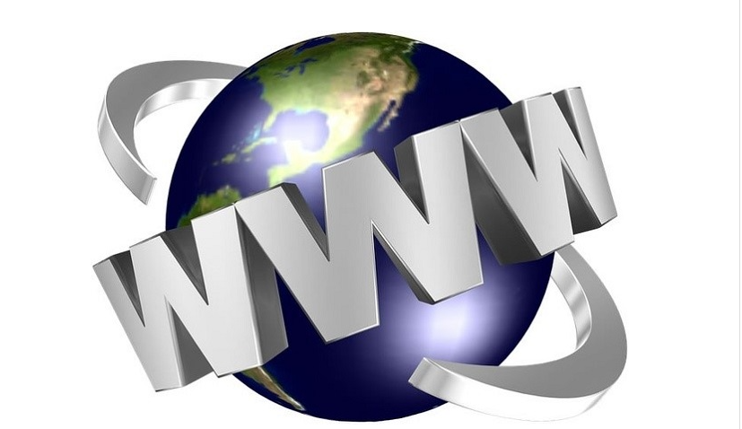
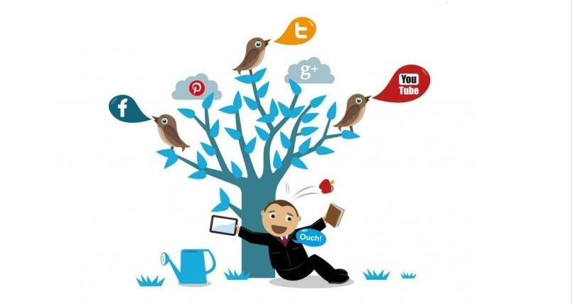
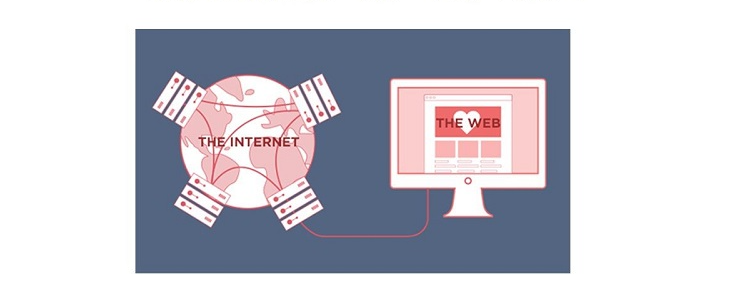

### 1. Khái niệm về WWW (World wide Web)

- Www viết tắt của cụm từ World Wide Web là không gian nơi chứa thông tin, tài liệu và tài nguyên của mọi website trên toàn cầu. Www được xác định bởi các siêu liên kết URL và truy cập thông qua Internet. 

- WWW được liên kết bởi các siêu liên kết và truy cập thông qua internet và được xác định bằng URL. Như vậy, có thể hiểu đơn giản www đề cập tới các trang HTML kết nối với nhau thông qua internet.  

### 2. Vai trò của WWW (World wide web)

-  World Wide Web là mạng lưới thông tin toàn cầu giúp mọi người dễ dàng cập nhật, chia sẻ thông tin và kết nối với nhau dù đang ở bất cứ đâu, bất cứ lúc nào. 
-  WWW cho phép người dùng dễ dàng chia sẻ cảm nghĩ, công việc, tình cảm dù khoảng cách địa lý xa như thế nào. 
- Đáp ứng nhu cầu sử dụng ngày càng nhiều trên thiết bị di động của mọi người, các trang web hiện đại đều điều chỉnh giao diện website thân thiện với màn hình điện thoại bên cạnh màn hình máy tính. 

- World Wide Web đóng vai trò khá quan trọng trong cuộc sống và sự phát triển của nền kinh tế. Cụ thể:

- WWW như một “bách khoa toàn thư” giúp mang đến thông tin hữu ích cho người dùng internet. Nó phục vụ nhiều mục đích khác nhau của người sử dụng như học tập, nghiên cứu, tìm kiếm tài liệu…
- WWW giúp kết nối nhiều vùng quốc gia trên thế giới, nơi mà mọi người có thể nhận, chia sẻ thông tin và giao tiếp một cách dễ dàng.
- WWW mang đến cho con người một không gian ảo thú vị thông qua các mạng xã hội, blog. Từ đó, họ có thể chia sẻ về suy nghĩ, quan điểm sống, công việc với bạn bè và mọi người.
- WWW góp phần tích cực trong việc thúc đẩy nền kinh tế, đặc biệt là ngành kinh doanh thương mại điện tử thông qua ảnh hưởng của nó đến SEO.

### 3. Sự khác biệt giữa WWW và Internet

- Internet là mạng máy tính lớn nhất thế giới, giúp kết nối hàng triệu máy tính toàn cầu với nhau tạo nên một hệ thống trao đổi thông tin. Trong khi đó, www là tập con của internet bao gồm các trang web. 

- Để truy cập vào web cần sử dụng các trình duyệt web thông qua internet. Một số trình duyệt web thông dụng hiện nay là Internet Explorer, Cốc Cốc, Google Chrome, Flock, Safari, Opera...

- Internet có khả năng kết nối tất cả các máy tính trên toàn thế giới, để tạo thành hệ thống trao đổi thông tin xuyên suốt. Còn WWW là tập hợp những website trên internet. Đồng thời, trình duyệt web phải sử dụng internet để có thể truy cập vào WWW.

- Các thông tin sử dụng giao thức Protocol để truyền đi trên internet. Còn WWW thực hiện truy xuất thông tin trên môi trường internet bằng giao thức HTTP và HTTPS lại là một ngôn ngữ lập trình được dùng trên internet.

### 4. Tầm quan trọng của World Wide Web
- Tầm quan trọng của WWW được thể hiện qua các yếu tố sau:

    + Www đã mang Internet, thông tin đến tất cả mọi người. Không chỉ dành cho các nhà khoa học như mục đích nghiên cứu ban đầu.
    + Www kết nối thế giới theo cách không thể thực hiện được trước đây và giúp mọi người dễ dàng nhận thông tin, chia sẻ thông tin và giao tiếp với nhau.
    + Www cho phép mọi người chia sẻ công việc, suy nghĩ của họ thông qua các trang mạng xã hội, blog và video như hiện nay.

### 5. Phân Biệt có www và không có www
- không có www là khi truy cập vào website bạn bỏ qua gõ phần đầu “www” vào trước địa chỉ trang web. Mạng Internet vẫn sẽ dẫn bạn về đúng website.
#### Sự khác biệt giữa có www và không có www
- Khi bạn nhập không có www hay có www thì internet vẫn dẫn bạn tới website, tuy nhiên có sự khác biệt lớn giữa không có www và có www là:
    + Khi sử dụng địa chỉ không có www, sẽ không có vấn đề gì về kĩ thuật. Về mặt hình thức, khách hàng và người dùng vốn vẫn quen thuộc và đánh giá cao đối với các trang web có www. Vì vậy dùng www sẽ thể hiện sự đầy đủ và toàn vẹn hơn.
    + www sẽ có ích cho bạn khi bạn có nhu cầu mở rộng quy mô kinh doanh bằng các trang con. www còn giúp phân loại, phân vùng nội dung. Nội dung trang www sẽ khác biệt so với không có www.
    