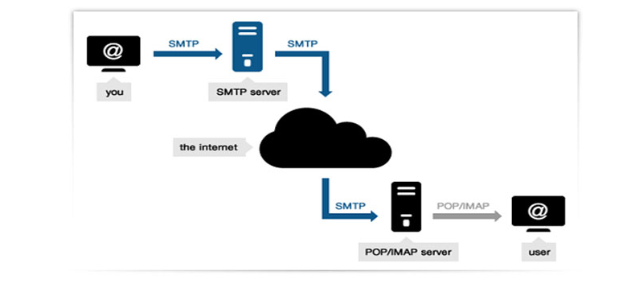
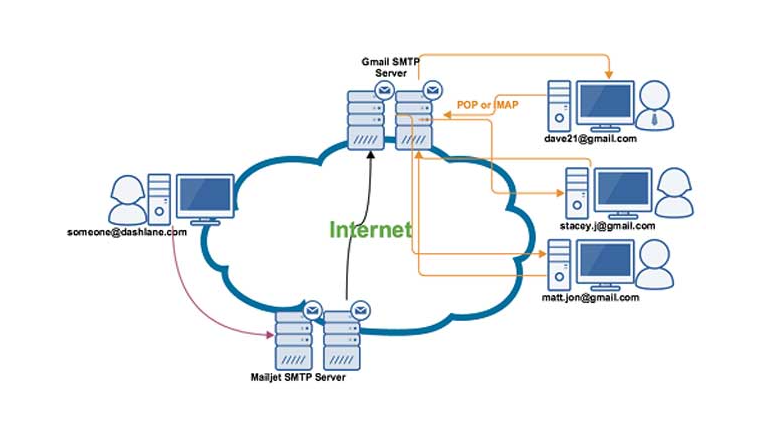
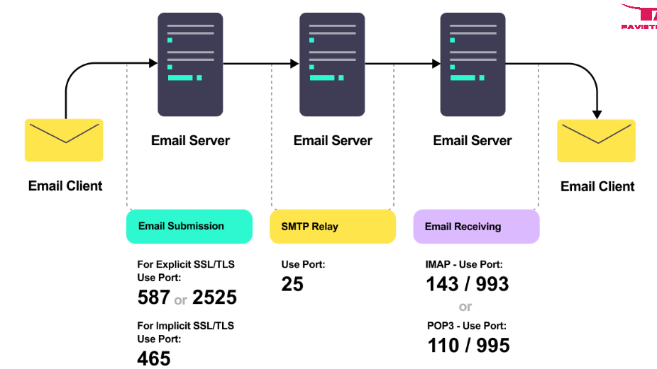

## 1. Khái niệm về SMTP

- SMTP là viết tắt của Simple Mail Transfer Protocol dịch ra có nghĩa là giao thức truyền tải thư tín đơn giản hóa. Và giao thức này thực hiện nhiệm vụ chính là gửi mail còn việc nhận mail hay truy xuất dữ liệu mail server sẽ có giao thức IMAP hay POP3 đảm nhiệm.

- SMTP Server (server dùng để gửi mail) là một dịch vụ cho phép gửi email với số lượng lớn, tốc độ nhanh mà không bị giới hạn như các hòm mail miễn phí của Gmail hoặc mail đi kèm hosting. Nói cách khác các máy chỉ chủ giúp bạn thao tác gửi thư người ta thường gọi là SMTP server chúng thực hiện gửi thư qua giao thức TCP hoặc IP.

- Thường thì SMTP thực hiện để hoạt động qua cổng Internet 25 (TCP) nhưng tại châu âu có một phương thức thay thế cho SMTP của gmail được sử dụng rộng rãi gọi là X.400. Song Song với đó có nhiều máy chủ thư điện tử giờ đây đã hỗ trợ giao thức chuyển thư đơn giản mở rộng còn gọi là (ESMTP), giao thức này cho phép các tệp đa phương tiện được gửi dưới dạng e-mail.

- Hệ thống mail hay đơn giản chỉ là một Email muốn chuyên nghiệp thì cần phải tìm hiểu về các giao thức mà nó sẽ hỗ trợ vì khi làm việc lâu dài nó sẽ giúp nâng cao hiệu suất công việc nhờ khả năng gửi nhận thư nhanh chóng, nhưng bạn cũng cần phải lưu ý là khả năng đính kèm tập tin và lưu trữ với dung lượng cao sẽ giúp bạn có thêm nhiều lợi thế trong việc sử dụng lâu dài, tiết kiệm thời gian chuyển đổi doanh nghiệp,…

- Ngoài giao thức SMTP trong thư điện tử thì những giao thức khác cũng rất quan trọng như IMAP hay POP3 cgiúp bạn có một hệ thống gói email doanh nghiệp toàn diện nhất, chuyên nghiệp tính năng cao.

## 2. Cách thức hoạt động của SMTP

- Khi muốn gửi một email, hệ thống SMTP sẽ xác định địa chỉ của email đó và chuyển thông báo tới SMTP Server.

- Sau đó, SMTP Server sẽ dựa vào tên miền của địa chỉ email mà bạn nhận để bắt đầu thực hiện việc trao đổi liên lạc với một DNS Server. Mục đích của thao tác này là để tìm ra tên miền gốc tại Hostname trong SMTP Server đích.

- Kế tiếp, SMTP Server đầu tiên sẽ trao đổi thông tin trực tiếp với SMTP Server đích thông qua cổng 25 của TCP/IP.

- Tiếp theo, máy chủ sẽ kiểm tra xem thông tin của người dùng có giống với thông tin trong email hay không. Nếu như giống, doanh nghiệp của bạn sẽ có thể nhận hoặc gửi dữ liệu có dung lượng lớn qua email. Người nhận chỉ việc đợi thấy thông báo của email như thông thường.

## 3. Danh sách Port Mail thông dụng
- SMTP/POP/IMAP Cổng mặc định
- Đây là một số cổng SMTP / IMAP / POP3 thông dụng :
    + SMTP AUTH: Port 25

    + SMTP SSL: Port 465

    + SMTP StartTLS: Port 587

    + POP3 : Port 110

    + POP3 SSL Port: 995

    + IMAP Port: 143

    + IMAP SSL Port: 993

