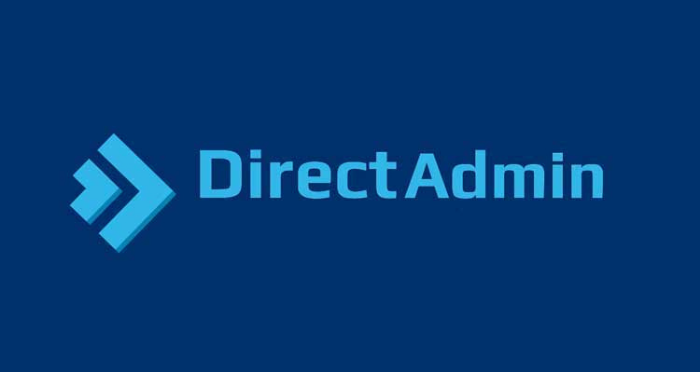

## I. Giới thiệu về DirectAdmin

- DirectAdmin (viết tắt: DA) là một phần mềm hệ thống xây dựng trên nền hệ điều hành Linux nhằm phục vụ cho mục đích quản trị máy chủ lưu trữ Share hosting. Hiện tại, có rất nhiều phần mềm quản lý hosting như Cpanel, Kloxo, virtualmin… Trong đó DirectAdmin khá nhẹ, phù hợp nhiều cấu hình, ít chiếm tài nguyên, chức năng ít hơn Cpanel nên dễ sử dụng.

- DirectAdmin được đánh giá là một trong những sự lựa chọn tốt nhất trong các bảng điều khiển hosting mà bạn sẽ tìm thấy. Đa số các công ty hosting đều cung cấp một bảng điều khiển. Tuy nhiên, bảng điều khiển miễn phí rất đơn giản (thậm chí sơ sài) nên một bảng điều khiển có phí là sự lựa chọn đúng đắn để đảm bảo sự an toàn và các tính năng cần thiết cho các dự án.

## Bước 1. Đăng ký tài khoản DirectAdmin
#### vào trang chủ DirectAdmin để đăng ký tài khoản và license dùng thử https://www.directadmin.com/

#### Sau khi đăng ký ở trang chủ thì quay lại Gamil để lấy tài khoản và mật khẩu để đăng nhập

#### Đăng Nhập

#### Tạo để lấy key

## Bước 2: Cài đặt DirectAdmin
#### update 

#### Tải tập tin setup.sh

#### Thay đổi quyền trên file setup.sh

#### Chạy tập lệnh cài đặt DirectAdmin

#### file tài khoản và mk `/usr/local/directadmin/scripts/setup.txt`

## Bước 3 : tiến hành đăng nhập

