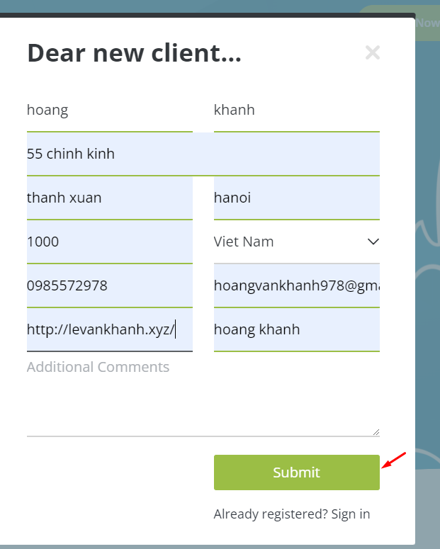
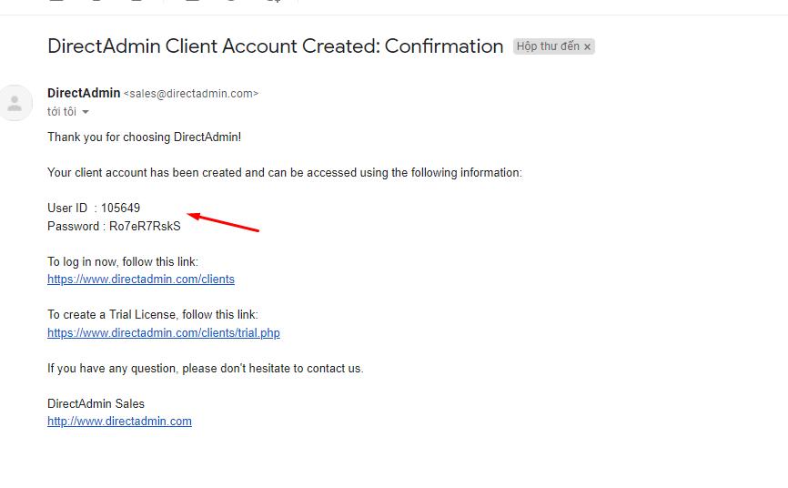
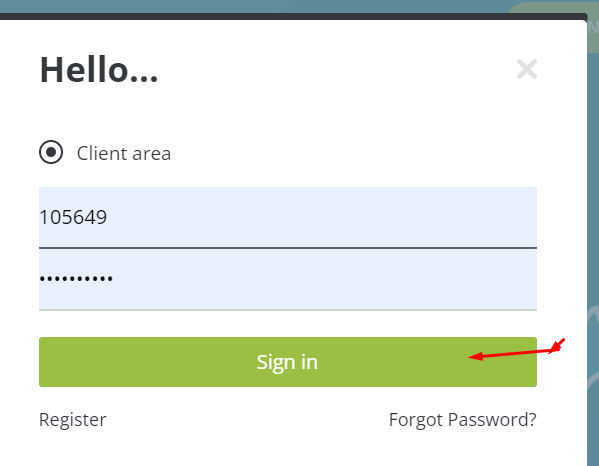
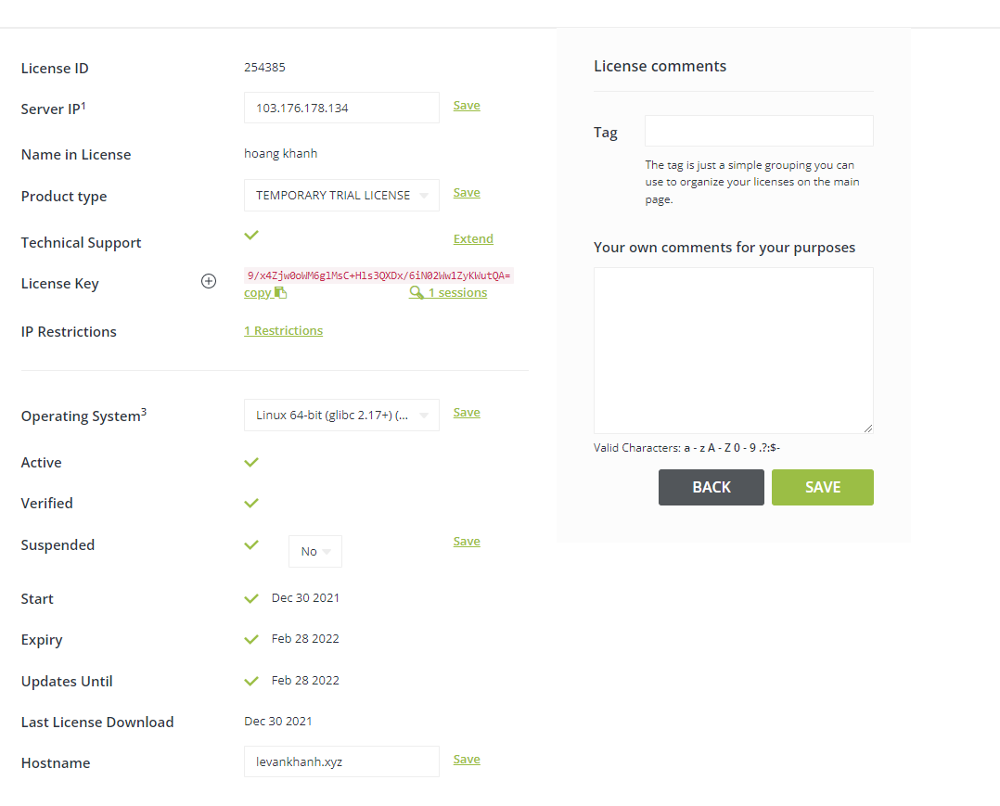
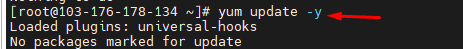
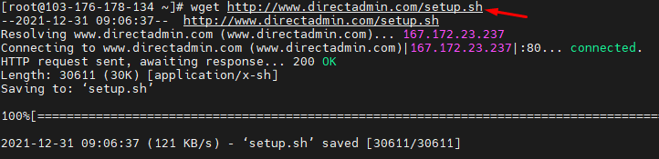
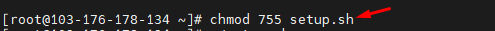
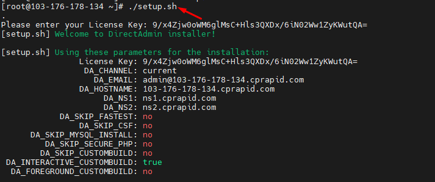
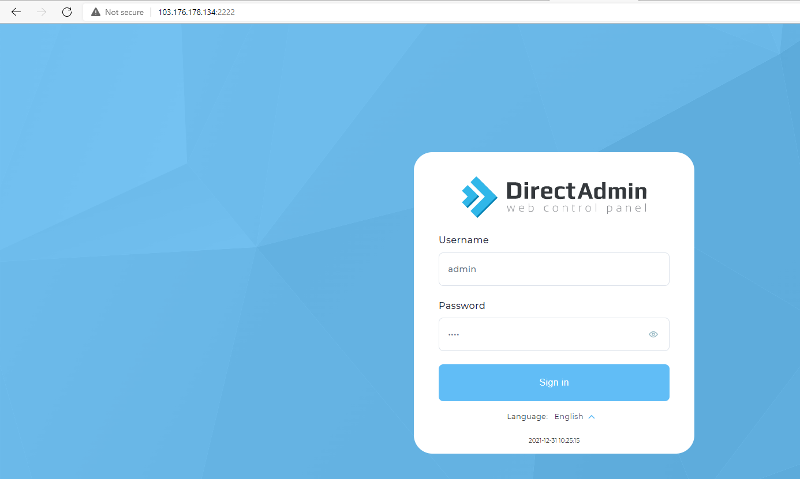

## Bước 1. Đăng ký tài khoản DirectAdmin
- vào trang chủ DirectAdmin để đăng ký tài khoản và license dùng thử https://www.directadmin.com/

- Sau khi đăng ký ở trang chủ thì quay lại Gamil để lấy tài khoản và mật khẩu để đăng nhập

- Đăng Nhập

- Tạo để lấy key

## Bước 2: Cài đặt DirectAdmin
- update 

- Tải tập tin setup.sh

- Thay đổi quyền trên file setup.sh

- Chạy tập lệnh cài đặt DirectAdmin

## Bước 3 : tiến hành đăng nhập

