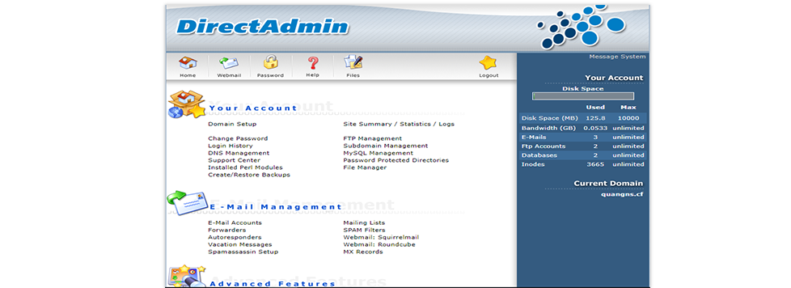

## I. Tìm hiểu về DirectAdmin

- DirectAdmin là trình quản lý File có giao diện đồ họa chủ yếu quản lý và vận hành website bằng bảng điều khiển được thiết kế để làm cho việc quản lý các trang web dễ dàng hơn. DirectAdmin thường được gọi là DA cho ngắn.

- DirectAdmin xây dựng trên nền tảng hệ điều hành Linux phục vụ cho mục đích quản trị máy chủ lưu trữ website chia sẻ (shared hosting). Website của công ty cung cấp DA là www.directadmin.com. Hệ thống quản lý này không chỉ tạo hosting cho người dùng cuối mà còn hỗ trợ cả các tài khoản đại lý (reseller). Sản phẩm sử dụng giao diện web và cung cấp các tính năng quản trị tốt cho những nhà cung cấp dịch vụ lưu trữ web (hosting provider), đại lý và người dùng cuối. DirectAdmin là một hệ thống ổn định đối với các dịch vụ lưu trữ web. Một ưu điểm nữa là DirectAdmin rất dễ dàng quản lý và sử dụng. Đặc biệt bố cục quản lý File của DA dễ dàng, rành mạch hơn cPanel rất nhiều.

### 1. Ưu và nhược điểm của DirectAdmin

#### Ưu điểm DirectAdmin 
- Phương thức sử dụng đơn giản
    + Giao diện sử dụng của DirectAdmin mặc dù tương đối đơn giản nhưng vẫn đầy đủ những tính năng cần thiết. Phần mềm này đươc phân cấp thành 3 loại tài khoản, thứ tự từ cấp quyền cao đến thấp là Administrator, Reseller, và User. Đặc biệt hơn cả, chỉ trong một lần đăng nhập với phần mềm này, người dùng có thể dễ dàng chuyển đổi giữa 3 loại tài khoản một cách dễ dàng.

- Tốc độ xử lý cực nhanh, ít tiêu tốn ít tài nguyên
    + Ưu điểm của DirectAdmin là tốc độ xử lý cực kỳ nhanh chóng và khả năng thích ứng cao. Bên cạnh đó, giao diện của phần mềm này cũng được thiết kế theo hướng tối giản, dễ sử dụng và ít tiêu tốn tài nguyên hệ thống.
- Ổn định
    + Đặc biệt, tính ổn định của DirectAdmin rất cao. Nó có thể hoạt động trong thời gian dài mà không mắc phải lỗi hệ thống như các phần mềm quản trị hosting khác. Thêm vào đó, DirectAdmin còn có khả năng tự phục hồi trong trường hợp xảy ra lỗi bằng cách khởi động lại hệ thống.

- Giá bản quyền thấp
    + Dù có nhiều tính năng vượt trội nhưng giá bản quyền của DirectAdmin khá thấp, chỉ với 89$ có thể sử dụng trọn đời.

#### Nhược điểm DirectAdmin
- Các tính năng chưa được hoàn thiện đầy đủ như cPanel hay một số phần mềm quản trị khác.
- DirectAdmin không tương thích với dòng font unicode nên rất khó để để sửa khi file sử dụng các ngôn ngữ không phải là tiếng Anh.

## II. So sánh cPanel và DirectAdmin

- Cấu hình sử dụng của DirectAdmin nhẹ hơn nhiều so với cPanel, bạn chỉ cần dung lượng RAM 128Mb là đủ. Trong khi đó với cPanel, để chạy trên nền máy chủ ảo VPS, máy tính cần phải có cấu hình ít nhất là 512Mb.
- Khi tiếp cận với máy chủ, DirectAdmin được cấp quyền quản trị root và end-user, nên độ tin cậy của nó được đảm bảo hơn so với cPanel.
- DirectAdmin có khả năng tự động khôi phục dữ liệu khi xảy ra lỗi. Nên tốc độ xử lý và tính ổn định của phần mềm này được đánh giá tương đối cao.
Và ưu điểm lớn nhất của DirectAdmin là giá bản quyền rẻ nhất so với các hệ thống quản trị khác, trong đó có cPanel.

