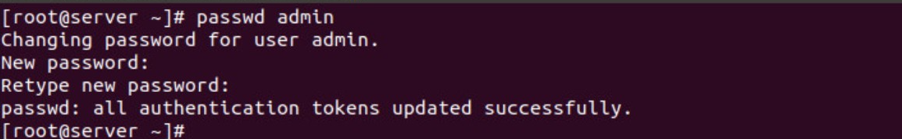
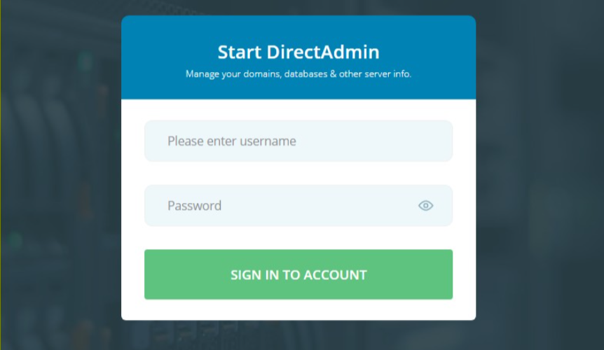

## I.Kiểm tra mật khẩu 
- Vì trong quá trình cài đặt DA thì các mật khẩu được lưu tự động trong file có tên là setup.text
- `/usr/local/directadmin/scripts/setup.txt`

## II. Thay đổi mật khẩu Admin của directAdmin 
- Sau khi đăng nhập với tài khoản root của VPS, gõ lệnh :
    + `passwd admin`
- Nhập lại mật khẩu theo yêu cầu
    + Nhập mật khẩu mới 
    + Nhập lại mật khẩu mới

## III. Vào trang quản trị và đăng nhập lại mật khẩu mới 

