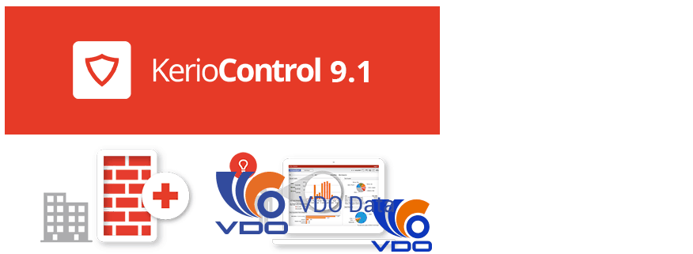

## I.Khái niệm về Mail Kerio

- Kerio MailServer là một mail server mới được thiết kế cho các mạng công ty.Để đẩy lui các mối đe dọa bảo mật đang gia tăng, Kerio MailServer cung cấp hàng loạt các tính năng để bảo vệ email khỏi sự ngăn chặn và lây nhiễm do virus máy tính hoặc gởi email rác. Kerio MailServer là một email server an toàn hiện đại cho phép các công ty cộng tác với nhau qua email, các địa chỉ liên lạc, các lịch biểu và công 
việc chia sẻ.

## II. Tính năng cơ bản của Kerio Connect
### 1. Chức năng Email trên điện thoại di động:
- Kerio MailServer hợp nhất truy cập vào email, lịch biểu và thông tin liên lạc bằng cách đồng bộ hóa không dây với 
những chiếc điện thoại thông minh. Hỗ trợ các nền di động bao gồm Treo với Palm OS, Windows Mobile ®, Symbian và BlackBerry… 

### 2. Công cụ chuyển đổi cho Microsoft Exchange
- Để giúp các công ty chuyển dời từ Microsoft Exchange 5.5/2000/2003 sang Kerio MailServer, Kerio cung cấp công cụ Kerio Exchange Migration Tool. Nó chuyển dời các người sử dụng, cấu trúc thư mục, email, tất cả các attachment, lịch, sổ liên lạc và công việc. 
### 3. Dịch vụ thư mục 
- CSDL nội trú hoặc ngoại trú, tích hợp với Active Directory 
trên Windows Server hoặc Apple Open Directory trên Mac OS X Server. 
### 4. Khả năng mở rộng
- Kerio MailServer có thể mở rộng server gởi tin hỗ trợ
20 người sử dụng tại bất kỳ nơi nào, trong mạng nội bộ nhỏ, cho đến hàng ngàn người sử dụng hoạt động chỉ với một server. Một server dễ dàng hỗ trợ cùng lúc 500 người sử dụng IMAP với các bộ lọc chống thư rác và chống virus mà không ảnh hưởng đến hiệu quả hoạt động của nó. 
### 5.Các hệ điều hành hỗ trợ
- Kerio MailServer chạy trên nền Windows 
2000/XP/2003/Vista, các phiên bản dành cho máy chủ và không có máy chủ, Red Hat Linux, SUSE Linux và Mac OS X. Kerio Outlook Connector cho Microsoft Outlook chạy trên nền Windows 2000/XP/2003/Vista.
### 6. Chức năng chống thư rác
- Kerio MailServer được tích hợp với phần mềm 
SpamAssassin dựa vào nội dung và các công cụ chống spam dựa vào người gửi, do đó Kerio MailServer giúp giảm đáng kể số lượng thư rác. Kerio Mail Server cung cấp các chức năng phát hiện và cô lập các thư rác toàn diện. Một loạt các công cụ
chống thư rác tiên tiến và mạnh mẽ như Caller ID, bảo vệ khỏi sự tấn công các thư mục và giới hạn băng thông giúp các công ty giảm đáng kể những nguy cơ bảo mật và pháp lý được liên kết với các thư rác.  
### 7. Email, lịch làm việc và cộng tác 
- Nhằm thay thế cho Microsoft Exchange, Kerio MailServer cung cấp cách truy cập đến các lịch biểu, các địa chỉ liên lạc và các công việc đã được chia sẻ từ Microsoft Outlook, Microsoft Entourage, và Kerio WebMail, trong khi đó làm giảm chi phí của chủ sở hữu (TCO – Total Cost of Ownership) và mang lại kinh nghiệm sử dụng tốt hơn cho các doanh nghiệp vừa và nhỏ (SMEs – Small to Medium-sized Enterprises).
### 8: Đồng bộ mọi dữ liệu
- Đồng bộ với email push trực tiếp. Tự động đồng bộ
email, lịch, và danh sách liên hệ với thiết bị di động của bạn. Thay đổi trên điện thoại, máy tính hoặc web của bạn trong thời gian thực.Dễ dàng quản lý các folder 
công cộng hoặc được chia sẻ bằng cách lựa chọn những folder bạn muốn đồng bộ với thiết bị di động.Kerio Connect kết nối trực tiếp với các thiết bị kích hoạt Exchange ActiveSync.
### 9. Kết nối mọi lúc, mọi nơi
- Tập trung hóa dữ liệu của bạn vào một địa điểm. 
Truy cập công việc tại văng phòng, trên đường đi hoặc tại nhà. Với domain đã phân chia, bạn có thể lập kế hoạch cuộc họp, sử dụng danh sách địa chỉ toàn cầu, và dễ dàng quản lý hay liên lạc với các văn phòng chi nhánh từ xa.
