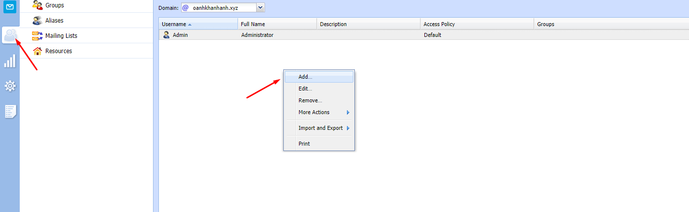
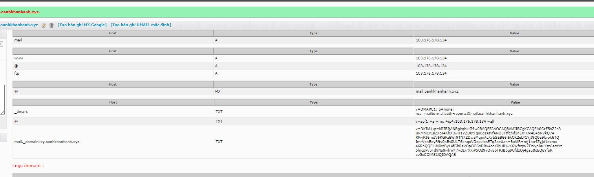

## I. Cấu hình tối thiệu
- CPU : 1 core
- Ram : 1024 MB
- HDD : 20GB

## II. Các bước cài đặt
### Bước 1. Cầu hình time-zone cho hệ thống
- `ln -sf /usr/share/zoneinfo/Asia/Ho_Chi_Minh /etc/localtime`

### Bước 2. Download source code mail Kerio-connect
- Download Source code: http://www.kerio.com/support/kerio-connect

- `wget http://cdn.kerio.com/dwn/connect/connect-9.2.12-5000/kerio-connect-9.2.12-5000-linux-x86_64.rpm`

### Bước 3. Install mail Kerio
- `yum install kerio-connect-9.2.12-5000-linux-x86_64.rpm -y`

### Bước 4. Truy cập và cài đặt.
- Truy cập theo địa chỉ ip và port 4040

## III. Tạo user 
- 

## IV. Tạo Domains
- Tạo bản ghi Dkim để gửi nhận mail
- Chọn show public key để copy Dkim

- Thêm bảo ghi cho Domain 

- Thực hiện kiểm tra gửi thư đi 

## V. Kiểm tra file log trên giao diện 

