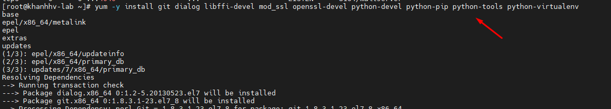
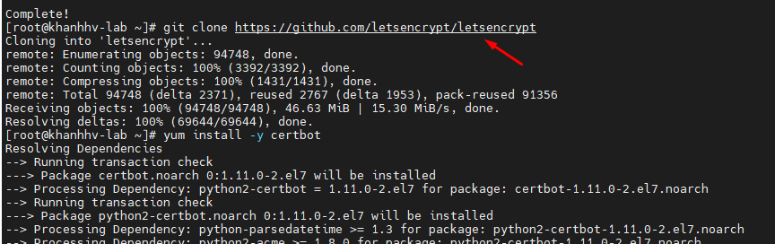
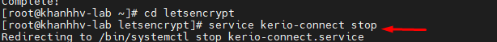
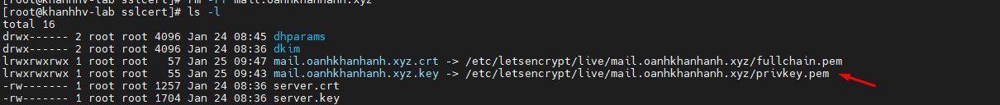
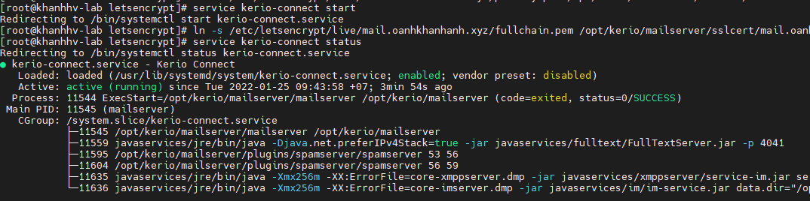
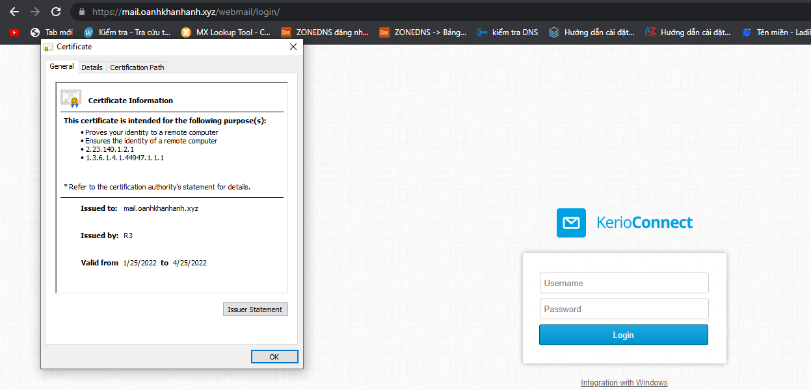

### Bước 1. Tải chứng chỉnh SSl letsencrypt
- `yum -y install git dialog libffi-devel mod_ssl openssl-devel python-devel python-pip python-tools python-virtualenv
`
- 

- ```
        git clone https://github.com/letsencrypt/letsencrypt

        yum install -y certbot



- Di chuyển đến thư mục cd letsencrypt
- `cd letsencrypt`
- `service kerio-connect stop`



- `certbot  certonly --standalone -d mail.oanhkhanhanh.xyz`\

- `ln -s /etc/letsencrypt/live/mail.oanhkhanhanh.xyz/fullchain.pem /opt/kerio/mailserver/sslcert/mail.oanhkhanhanh.xyz.crt`

- `ln -s /etc/letsencrypt/live/mail.oanhkhanhanh.xyz/privkey.pem /opt/kerio/mailserver/sslcert/mail.oanhkhanhanh.xyz.key`




- `service kerio-connect start`



## Bước 2. Tiến hành kiểm tra.




