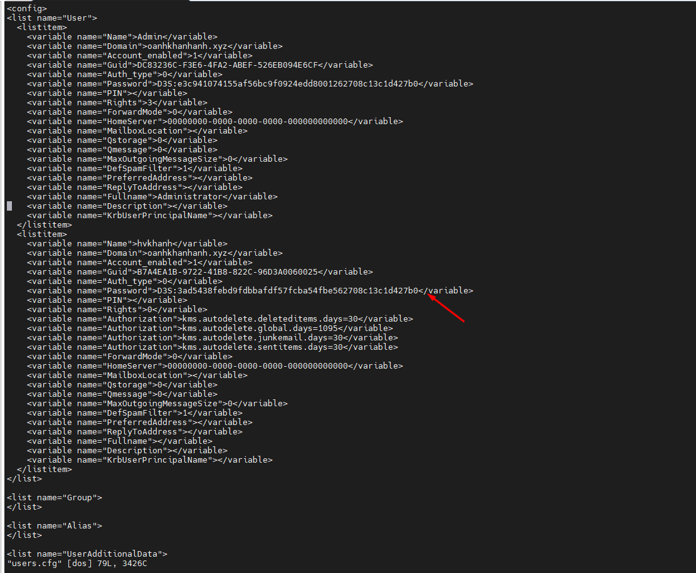
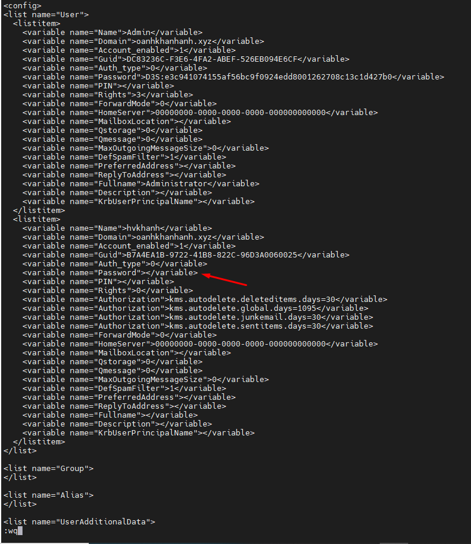
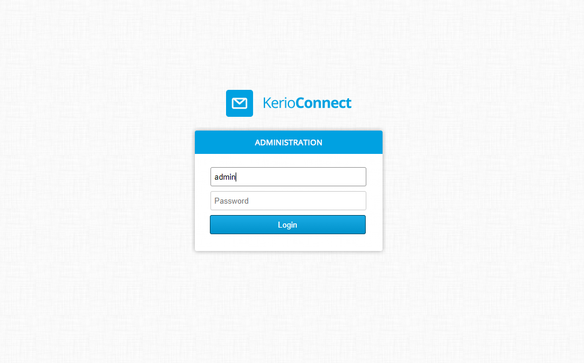
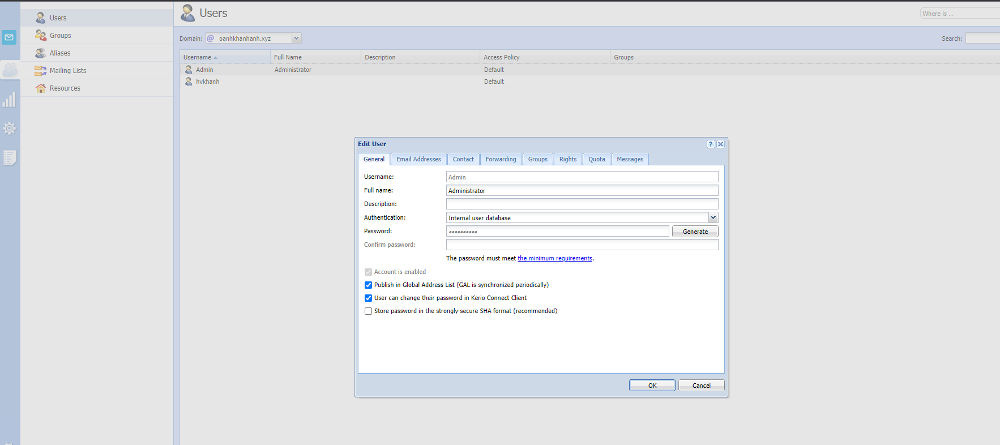

## Bược 1 Chỉnh sửa file users.cfg
- `vi /opt/kerio/mailserver/users.cfg`

- Tiến hành xóa Passwd cũ 

## Bước 2. Tiến hành đăng nhập và đổi lại passwd mới 
- Đăng nhập

- Tiến hành đổi mật khẩu mới

