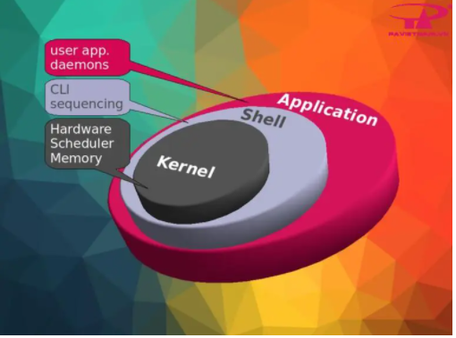
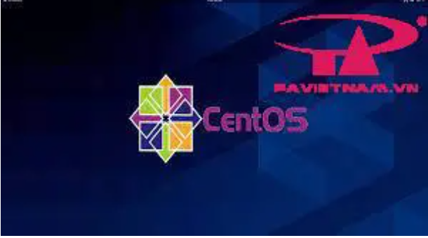
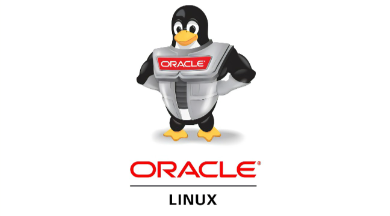

### Kiến trúc của hệ điều hành Linux
- Linux là một hệ điều hành nhân Unix, linh động và được phát hành miễn phí. Cùng với Windows, Mac OS thì Linux là một trong những hệ diều hành phổ biến nhất hiện nay.
### 1. Hệ điều hành Linux 
- Linux là một hệ điều hành phát triển dựa vào hệ điều hành Unix và được phát hành miễn phí. Hệ điều hành này được cài đặt từ máy tính cá nhân đến các server chuyên dụng.
Thành phần cơ bản của Linux là hạt nhân Linux (Linux kernel), là nhân hệ điều hành được phát triển bởi Linus Torvalds. Linux được công bố lần đầu tiên vào tháng 9 năm 1991 với phiên bản 0.01. Linux hiện có khá nhiều các bản phân phối khác nhau tất cả đều có một đặc điểm chung là có một Linux kernel bên trong.

### 2. Kiến trúc hệ điều hành Linux
- Kiến trúc cơ bản
- Kiến trúc của HĐH Linux chia làm 3 thành phần: Kernel Shell, Applications.

- Kernel: Đây là phần quan trọng và được ví như trái tim của HĐH, phần kernel chứa các module, thư viện để quản lý và giao tiếp với phần cứng và các ứng dụng.
- Shell: Shell là một chương trình có chức năng thực thi các lệnh từ người dùng hoặc từ các ứng dụng – tiện ích yêu cầu chuyển đến cho Kernel xử lý.
- Applications: Là các ứng dụng và tiện ích mà người dùng cài đặt trên Server. Ví dụ: ftp, samba, Proxy, …
##### Ưu điểm và nhược điểm của hệ điều hành Linux
- Ưu điểm:
    + Hoàn toàn miễn phí.
    + Độ an toàn cao.
    + Tính linh hoạt cao.
    + Hướng dẫn sử dụng phong phú.
    + Chạy ổn định cả trên các máy tính cấu hình yếu.
- Nhược điểm:
    + Đòi hỏi người dùng phải thành thạo, mất thời gian để làm quen.
    + Phần cứng ít được hỗ trợ.
    + Các phần mềm còn hạn chế.
    + Thiếu chuẩn hóa.
## 3. Các Phiên bản Linux phổ biến
#### 3.1 . Ubuntu
 https://ubuntu.com/
- Hệ điều hành Ubuntu là một trong những bản phân phối Linux phổ biến nhất hiện nay do Mark Shuttleworth sáng lập và công ty Canonical của ông tài trợ. Hệ điều hành này được sử dụng phổ biến và ưa chuộng vì có giao diện đẹp, thân thiện, dễ sử dụng, kho phần mềm ứng dụng rất phong phú đáp ứng được hầu hết yêu cầu của người dùng, các version được cập nhật liên tục. Ubuntu được chia làm 2 loại: Ubuntu Desktop và Ubuntu Server.

#### 3.2. CentOS
https://www.centos.org/
- CentOS là viết tắt của Community Enterprise Operating System. CentOS là một bản phân phối hệ điều hành tự do dựa trên Linux kernel. Có nguồn gốc hoàn toàn từ bản phân phối RHEL. CentOS thường được sử dụng trong các doanh nghiệp bởi tính ổn định vòng đời End-of-Life dài.

#### 3.3 Oracle
https://www.oracle.com/linux/
- Oracle Linux là một bản phân phối Linux được hỗ trợ bởi công nghệ khổng lồ Oracle. Nó có sẵn với hai hạt nhân. Một là Red Hat Compatible Kernel (RHCK). Đây là hạt nhân giống như được tìm thấy trong Red Hat Enterprise Linux (RHEL).

