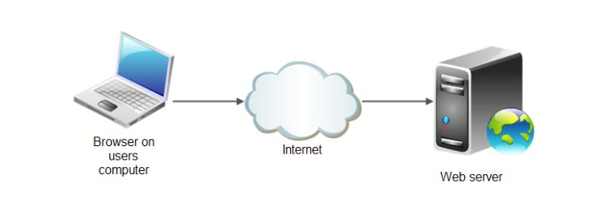
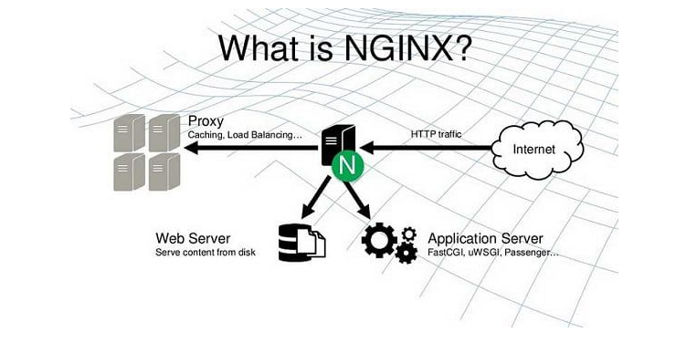
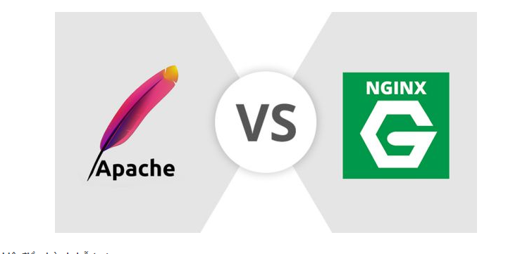

## I. Sơ lược về một số thông tin về Web Server
### 1. Web Server
- Web Server có nghĩa là máy chủ. Đây là máy tính lớn được kết nối với tập hợp mạng máy tính mở rộng. Mỗi máy chủ có một IP khác nhau và có thể đọc các ngôn ngữ như HTML, HTM, File,… Nói chung, máy chủ là kho để chứa toàn bộ dữ liệu hoạt động trên internet mà nó được giao quyền quản lý.

### 2. Các Đặc Tính của Web Server
- Máy chủ Web Server có thể xử lý dữ liệu và cung cấp thông tin đến máy khách qua môi trường Internet thông qua giao thức HTTP.
- Nếu được cài đặt một chương trình Server Software và kết nối Internet thì bất kỳ máy tính nào cũng có thể trở thành Web Server.
- Đối với doanh nghiệp nhỏ, người dùng cá nhân thường thuê các máy chủ nhỏ, máy chủ ảo VPS hoặc Hosting để lưu trữ dữ liệu cho Website của mình.
- Một Server có thể cung cấp cả nội dung static và dynamic.
## II. Apache HTTP Server
### 1. Apache là gì.

- Apache là một web server mã nguồn mở miễn phí và được sử dụng phổ biến hiện nay. Nếu sử dụng Apache, bạn chỉ cần thao tác đơn giản là nhập URL hoặc IP và nhấn Enter thì server sẽ tiếp nhận URL hay địa chỉ IP mà bạn đã nhập.
- Apache chạy được hầu hết tất cả các hệ điều hành tương tự như Unix, Windows...

### 2. Ưu và Nhược điểm của Apache.
- Ưu điểm :
    + Apache là phần mềm miễn phí mã nguồn mở, có độ ổn định và đáng tin cậy.
    + Cấu hình đơn giản và thân thiện dù bạn là những người mới bắt đàu làm quen với ứng dụng này.
    + Phần mềm được cập nhật thường xuyên , phát hiện và báo lỗi liên tục nhằm giúp người dùng ngăn chặn kịp thời, không để thông tin bị đánh cắp.
    + Các thể thức cấu trúc Module linh hoạt, Apache hoạt động hiệu quả và nhanh nhạy hơn với Wordpress sites.
    + Công đồng sự dụng Apache lớn nên có thể tương trở và giải đáp thắc mắc của bạn bất kỳ lúc nào.
- Nhược Điểm :
    + Thỉnh thoảng chậm hay gặp trục trặc trong quá trình truy vấn bởi có rất nhiều người truy cập Apache cùng một lúc.
    + Khả năng bao mật đôi khi còn chưa hiệu quả do tính miễn phí nên người dùng có thể chọn nhiều cách thiết lập khác nhau.
## III NGINX
### 1. Web Server NGINX
- NGINX là web server mã nguồn mở. NGINX ban đầu được dùng để phụ web HTTP. Những hiện nay được dùng để làm Reverse proxy, Email Proxy(IMAP, POP3, SMTP) và một trình cân bằng tải và Proxy ngược cho các máy chủ HTTP, TCP, UDP.

### 2. Những tính năng của NGINX
- Khả năng xử lý cao, cùng một lúc hơn 10.000 kết nối với bộ nhớ thấp.
- Phục vụ Static Files và lập chỉ mục cho tập tin.
- dùng bộ nhớ đệm cache để tăng tốc proxy ngược, cân bằng tải đơn giản và khả năng chịu lỗi. 
- Hỗ trợ tăng tốc với bộ nhớ đệm của WSGI, SCGI, FastCGI và các máy chủ Memcached.
- Có cấu hình linh hoạt và khả năng lưu lại nhật ký truy vấn.
- Chuyển hướng lỗi 3XX-5XX.
- Sử dụng Regular Expressions để Rewrite URL.
- Hạn chế tỷ lệ đáp ứng truy vấn.
- Giới hạn truy vấn từ một địa chỉ hoặc số kết nối đồng thời.
- Có khả năng nhúng mã PERL.
- Tương thích và hỗ trợ IPv6.
- Hỗ trợ WebSockets.
- Hỗ trợ truyền tải file MP4 và FLV.
- Rewrite URL...
## IV. So Sánh Apache và NGINX
### 1. Hệ điều hành hỗ trợ

- Hiện nay Apache hoạt động trên tất cả các loại hệ thống và hỗ trợ đầy đủ cho Microsft Windows
- Với NGINX thì nó cũng chạy trên hầu hết các hệ thống những hộ trợ Windows hiệu suất chạy thì không mạnh bằng.

### 2. Hiệu Suất
- Đối với web tĩnh 
    + NGINX chạy kết nối đồng thời nhanh hơn khoảng 2,5 lần so với Apache.
    

    + NGINX ít thiêu thụ bộ nhớ hơn Apache khoảng 4%.
- Đối với Web Động
    + Gần như cả hai đều khá giống nhau về xử lý.
### 3. Tính linh hoạt
- Apache có nhiều linh hoạt để cho phép các tùy chỉnh qua việc sử dụng các công cụ, Apache hỗ trợ hơn 60 module giúp nó có khả năng mở rộng cao.
- NGINX thì không được hỗ trợ.
### 4. Tính bảo mật 
- Cả Apache và NGINX đều rất coi trọng tính bảo mật trên trang web của mình. Không có hệ thống mạnh mẽ nào mà lại không có những biện pháp đối phó với các cuộc tấn công DDoS, phần mềm độc hại và phishing. Cả hai máy chủ này đều định kỳ phát hành báo cáo bảo mật và những tư vấn, đảm bảo rằng khía cạnh bảo mật được tăng cường ở mọi cấp độ.

