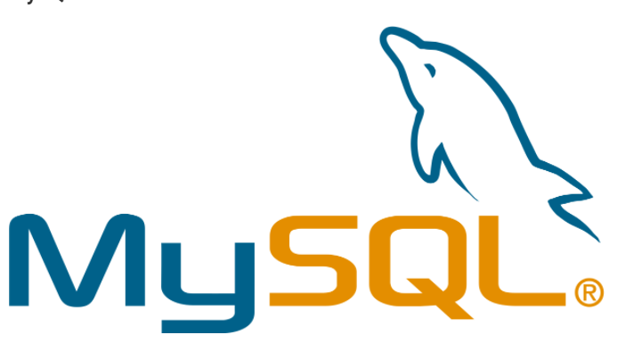

## I. MySQL
### 1. Khái Niệm về MySQL 

- MySQL là một hệ thống quản lý cơ sở dữ liệu quan hệ (RDBMS) mã nguồn mở rất phổ biến, được biết đến rộng rãi. 
- Nó được phát triển như một cơ sở dữ liệu đáng tin cậy, có tính sẵn sàng cao cho các ứng dụng dựa trên web trong những năm 1990.
### 2. Các Điểm nổi bật của MySQl
- MySQL được phát hành theo giấy phép nguồn mở. Vì vậy, bạn không phải trả tiền để sử dụng nó.
- MySQL là một chương trình rất mạnh theo đúng nghĩa của nó. Nó xử lý một tập hợp lớn các chức năng của các gói cơ sở dữ liệu mạnh mẽ và đắt tiền nhất.
- MySQL sử dụng một dạng chuẩn của ngôn ngữ dữ liệu SQL nổi tiếng.
- MySQL hoạt động trên nhiều hệ điều hành và với nhiều ngôn ngữ bao gồm PHP, PERL, C, C ++, JAVA, v.v.
- MySQL hoạt động rất nhanh và hoạt động tốt ngay cả với các tập dữ liệu lớn.
- MySQL rất thân thiện với PHP, ngôn ngữ được đánh giá cao nhất để phát triển web.
- MySQL hỗ trợ cơ sở dữ liệu lớn, lên tới 50 triệu hàng hoặc nhiều hơn trong một bảng. Giới hạn kích thước tệp mặc định cho một bảng là 4GB, nhưng bạn có thể tăng mức này (nếu hệ điều hành của bạn có thể xử lý nó) đến giới hạn lý thuyết là 8 triệu terabyte (TB).
- MySQL là tùy biến. Giấy phép GPL mã nguồn mở cho phép các lập trình viên sửa đổi phần mềm MySQL để phù hợp với môi trường cụ thể của riêng họ.

## II. MariaDB 
### 1. Khái niệm về MariaDB

- MariaDB là hệ quản trị cơ sở dữ liệu miễn phí được phát triển từ hệ quản trị cơ sở dữ liệu mã nguồn mở MySQL. MariaDB được phát triển nhằm thay thế công nghệ cơ sở dữ liệu MySQL, vì thế nó tương thích và cho một hiệu suất cao hơn so với MySQL
### 2. Đặc điểm của MariaDB
- Hoàn toàn miễn phí 
    + Là một hệ quản trị sử dụng mã nguồn mở hoàn toàn miễn phí. Do đó, người dùng không cần phải bỏ tiền mua bản quyền và vẫn có thể sử dụng đầy đủ những tính năng của phần mềm này.
- khắc phục những hạn chế của MySql 
- Bổ sung thêm nhiều Engine hơn
    + Ngoài các storage engines cơ bản như MyISAM, BLACKHOLE, CSV, MEMORY, ARCHIVE, MERGE; MariaDB còn phát triển thêm các storage engines khác bao gồm: Aria, XtraDB, FederatedX, OQGRAPH, SphinxSE, IBM DB2I, Spider, PBXT,…
- Kết nối cả Sql và NoSql
    + MariaDB là sự kết hợp của cả 2 loại cơ sở dữ liệu là SQL và NoSQL. Việc kết hợp sẽ giúp hệ thống này có thể tích hợp được tất cả ưu điểm của cả 2 cơ sở dữ liệu này là Dynamic Column và Cassandra Storage Engine.
- Hỗ trợ Tiếng Việt
    + MariaDB là đã có bản tiếng Việt. Mặc dù bản dịch chưa thật sự hoàn hảo nhưng vẫn có thể hỗ trợ nhiều cho người dùng.

## III. Khác biệt giữa MySQL và MariaDB

### 1.Storage Engines
- MariaDB hỗ trợ storage engines mới, điều mà MySql không có 
- Có ít tùy chọn Storage Engines hơn MariaDB.
### 2. Tốc độ, Sức chứa
- MrariaDB có tốc độ nhanh hơn so với MySQL và hỗ trợ hơn 200.000 kết nối.
- MySql không hỗ trợ đến 200.000 kết nối
### 3. Năm Phát hành
- MySql ra đời lần đầu vào 1995
- MariaDB ra đời năm 2009
### 4. Priority code
- MariaDB không cho phép truy cập vào nội dung riêng tư và là một nguồn đóng.
- MySQL sử dụng một số mã độc quyền trong Phiên bản doanh nghiệp của nó.
### 5 . Phiên bản
- MariaDB có hỗ trợ phiên bản tiếng việt còn MySql thì không.
### 6. Về Công cụ hỗ trợ lưu trữ
- Công cụ hỗ trợ lưu trữ của 2 ứng dụng khá giống nhau chỉ có điều là MariaDB có thể hỗ trợ nhiều phần mềm lưu trữ hơn như CSV, INNODB, MYISAM, ARCHIVE, MERGE, MyRocks, TokuDB, Aria, Sequence, Connect vì MariaDB là sự tích hợp ưu điểm của cả 2 thư viện SQL và NoSQL nên tính năng lưu trữ được mở rộng hỗ trợ người dùng nhiều hơn.