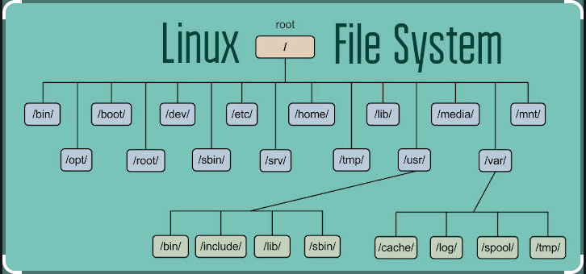
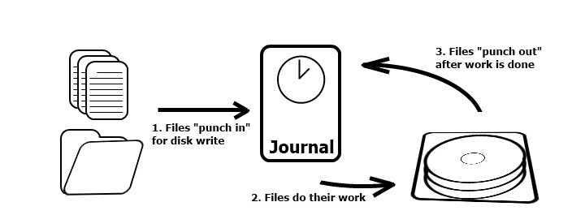
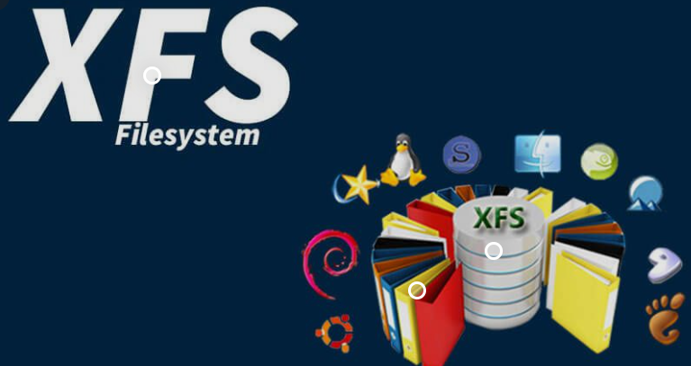
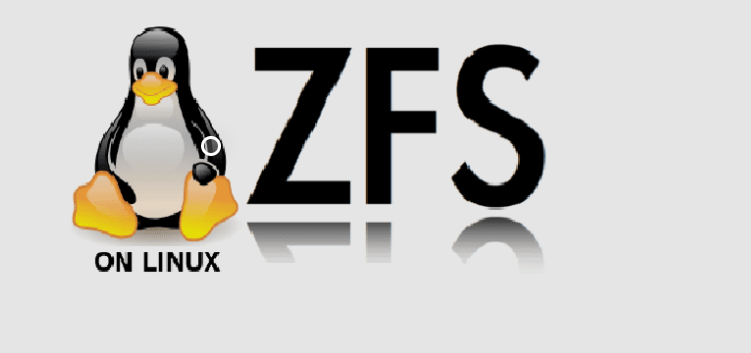

## I. File System
### 1. Khái niệm về File System

-  là thứ được hệ điều hành sử dụng để điều khiển việc đọc và ghi dữ liệu. Nếu không có file system, dữ liệu lưu trên ổ cứng, thẻ nhớ hay ổ USB của bạn sẽ là một đống hỗn độn và không có cách gì đọc nó ra được vì hệ điều hành không biết chỗ nào dữ liệu bắt đầu, chỗ nào là kết thúc, cũng chẳng phân biệt được đâu là file 1, đâu là file 2. Còn với file system, dữ liệu được chia thành nhiều "khúc" riêng biệt nhau, mỗi khúc có một cái "tên" riêng nên dễ nhận biết hơn

- là 1 trong các lớp bên dưới hệ điều hành mà nhiều lúc người sử dụng chúng ta không hề nghĩ tới, trừ trường hợp phải đối mặt với rất nhiều tùy chọn về file system trong Linux
### 2. Journaling là gì

- journaling là tất cả các loại file hệ thống ngày nay đều phải sử dụng journaling theo nhiều dạng khác nhau trên nền tảng laptop hoặc desktop với Linux.
- Quy trình của Journaling trước tiên file sẽ được ghi vào journal, đẩy vào bên trong lớp quản lý dữ liệu, sau đó journal sẽ ghi file đó vào phân vùng ổ cứng khi đã sẵn sàng. Và khi thành công, file sẽ được xóa bỏ khỏi journal, đẩy ngược ra bên ngoài và quá trình hoàn tất. Nếu xảy ra lỗi trong khi thực hiện thì file hệ thống có thể kiểm tra lại journal và tất cả các thao tác chưa được hoàn tất, đồng thời ghi nhớ lại đúng vị trí xảy ra lỗi đó.

## II. Các tùy chọn file System
### 1.Ext (Extended file system)

- là định dạng file hệ thống đầu tiên được thiết kế dành riêng cho Linux. Có tổng cộng 4 phiên bản và mỗi phiên bản lại có 1 tính năng nổi bật. Phiên bản đầu tiên của Ext là phần nâng cấp từ file hệ thống Minix được sử dụng tại thời điểm đó, nhưng lại không đáp ứng được nhiều tính năng phổ biến ngày nay. Và tại thời điểm này, chúng ta không nên sử dụng Ext vì có nhiều hạn chế, không còn được hỗ trợ trên nhiều distribution.
####  Ext2
- Ext2 là định dạng file hệ thống đầu tiên được thiết kế dành riêng cho Linux. Có tổng cộng 4 phiên bản và mỗi phiên bản lại có 1 tính năng nổi bật. Phiên bản đầu tiên của Ext là phần nâng cấp từ file hệ thống Minix được sử dụng tại thời điểm đó, nhưng lại không đáp ứng được nhiều tính năng phổ biến ngày nay. Và tại thời điểm này, chúng ta không nên sử dụng Ext vì có nhiều hạn chế, không còn được hỗ trợ trên nhiều distribution.

#### Ext3 
- về căn bản chỉ là Ext2 đi kèm với journaling. Mục đích chính của Ext3 là tương thích ngược với Ext2, và do vậy những ổ đĩa, phân vùng có thể dễ dàng được chuyển đổi giữa 2 chế độ mà không cần phải format như trước kia. Tuy nhiên, vấn đề vẫn còn tồn tại ở đây là những giới hạn của Ext2 vẫn còn nguyên trong Ext3, và ưu điểm của Ext3 là hoạt động nhanh, ổn định hơn rất nhiều. Không thực sự phù hợp để làm file hệ thống dành cho máy chủ bởi vì không hỗ trợ tính năng tạo disk snapshot và file được khôi phục sẽ rất khó để xóa bỏ sau này.
#### Ext4 
- cũng giống như Ext3, lưu giữ được những ưu điểm và tính tương thích ngược với phiên bản trước đó. Như vậy, chúng ta có thể dễ dàng kết hợp các phân vùng định dạng Ext2, Ext3 và Ext4 trong cùng 1 ổ đĩa trong Ubuntu để tăng hiệu suất hoạt động. Trên thực tế, Ext4 có thể giảm bớt hiện tượng phân mảnh dữ liệu trong ổ cứng, hỗ trợ các file và phân vùng có dung lượng lớn... Thích hợp với ổ SSD so với Ext3, tốc độ hoạt động nhanh hơn so với 2 phiên bản Ext trước đó, cũng khá phù hợp để hoạt động trên server, nhưng lại không bằng Ext3
### 2. XFS 

- XFS được phát triển bởi Silicon Graphics từ năm 1994 để hoạt động với hệ điều hành riêng biệt của họ, và sau đó chuyển sang Linux trong năm 2001. Khá tương đồng với Ext4 về một số mặt nào đó.

- chẳng hạn như hạn chế được tình trạng phân mảnh dữ liệu.
- không cho phép các snapshot tự động kết hợp với nhau, 
- Hỗ trợ nhiều file dung lượng lớn, 
- Có thể thay đổi kích thước file dữ liệu... nhưng không thể shrink – chia nhỏ phân vùng XFS. 
Với những đặc điểm như vậy thì XFS khá phù hợp với việc áp dụng vào mô hình server media vì khả năng truyền tải file video rất tốt. Tuy nhiên, nhiều phiên bản distributor yêu cầu phân vùng /boot riêng biệt, hiệu suất hoạt động với các file dung lượng nhỏ không bằng được khi so với các định dạng file hệ thống khác, do vậy sẽ không thể áp dụng với mô hình database, email và một vài loại server có nhiều file log. Nếu dùng với máy tính cá nhân, thì đây cũng không phải là sự lựa chọn tốt nên so sánh với Ext, vì hiệu suất hoạt động không khả thi, ngoài ra cũng không có gì nổi trội về hiệu năng, quản lý so với Ext3/4.
### 3. ZFS 

- ZFS (Zettabyte File System) hiện tại vẫn đang trong giai đoạn phát triển bởi Oracle với nhiều tính năng tương tự như Btrfs và ReiserFS. 
- ZFS có một số tính năng như:
    + Pooled Storage
    + Khả năng mở rộng dễ dàng với dung lượng lưu trữ cực kì lớn.
    + Toàn vẹn dữ liệu và sửa chữa tự động.
    + Snapshots.
    + RaidZ.
    + Nén dữ liệu hiệu quả.
