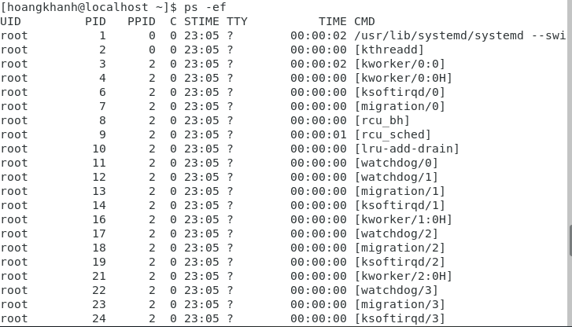
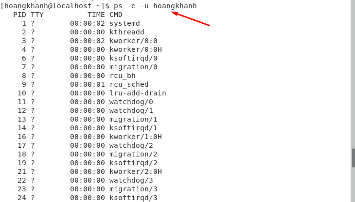
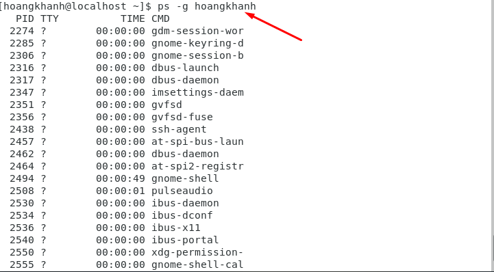
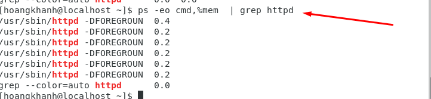

## I. Process Status là gì 
### 1. Khái niệm về Process Status
- Ps là từ viết tắt của Process Status hay là Process trong Linux đơn giản là một chương trình đang được vận hành. Mỗi phiên bản của một chương trình này là một process. Trình duyệt, trình phát nhạc hay là trình soạn thảo văn bản của bạn là tất cả các ví dụ về các process đang chạy cùng một lúc.

-  Ta có thể thấy bốn tham số được hiển thị về các process đang chạy:
    + PID: process ID.
    + TTY: Loại terminal.
    + TIME: Tổng thời gian process đã chạy.
    + CMD: tên của lệnh khởi chạy process.
## II Một số lệnh ps cơ bản
### 1. lệnh ps -ef
- `ps -ef`

- Lệnh ps hiển thị tất cả các tiến trình đang chạy với dữ liệu đầy đủ về mỗi tiến trình. Dữ liệu này bao gồm các cột hiển thị PID, loại terminal (TTY), thời gian chạy và tên lệnh.

### 2. Lệnh ps -u username
- `ps -u hoangkhanh`

- lọc kết quả và chỉ hiển thị các tiến trình thuộc sở hữu của username là hoangkhanh được chỉ địnhh

### 3. lệnh ps -g group
- `ps -g hoangkhanh`

- Để hiển thị tất cả các quy trình cho một nhóm cụ thể.

### 4. Lệnh ps -eo kết hợp với grep 
- Kiểm tra các tài nguyên Ram của http
- `ps -eo cmd,%mem | grep httpd `
