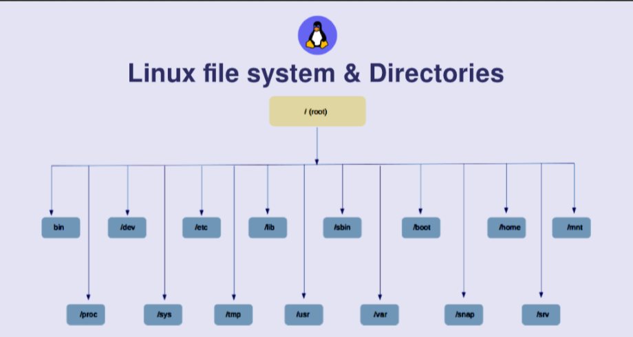

## Cấu trúc cây thư mục trong Linux

### Thưc mục gốc /root.
- Mỗi tập tin đơn và thư mục được bắt đầu từ thư mục gốc.
- Chỉ người dùng root mới có quyền ghi trong thư mục này
- Lưu ý răng thư mục /root là của nguowngi dùng root chứ không phải là thứ mục /.

### /bin Các tập thực thi của người dùng
- Chứa các tập tin thư thi
- Các lệnh thường dùng của linux mà bạn cần dùng trong chế độ người dùng đơn được lưu ở đây
- Các lệnh được sử dụng bởi tất cả người dùng trong hệ thống được lưu ở đây  VD : ls , nano, vi , grep...
### /sbin Các tập tin thư thi của hệ thống 
- Cũng chưa tập tin thư tin thực thi như /bin. Các lệnh được lưu trong thư mục này cơ bản được dùng cho quản trị viên và dùng bảo trì hệ thống.
- Vd : iptables, reboot, fsck...
### /etc Các tập cấu hình
- Chứa các tập tin cấu hình cần thiết cho tất cả các chương trình
- Chứa các đoạn mã khởi động và tắt các chương trình đơn lẻ.
- Vd : /etc/www/conf.d, /etc/ssh/sshd_config...
### /dev Các tập tin thiết bị 
- Chứa các tập tin thiết bị. Nó chứa các tập tin thiết bị đầu cuối như là USB hoặc bất kỳ thiết bị nào gắn vào hệ thống.
- VD : /dev/sda, /dev/usbmon0...
### /proc Thông tin tiến trình
- Chứa các thông tin về tiến trình của hệ thống
- Các tập tin tại đây chưa thông tin về các tiến trình đang chạy. Vd : /proc/{pid} directory chứa thông tin tiến trình với pid bạn chọn.
- Đây là các tập tin hệ thống ảo với nội dung tài nguyên hệ thống. VD /proc/cpuinfo, /cpu/uptime…
### /var Các tập tin biến đổi
- Chứa các tập tin mà dung lượng lơn dần theo thời gian sử dụng.
- Bao gồm các tập tin gthi chú về hệ thống (/var/log), các gói và các tập tin cơ sở dữ liệu(/var/lib), thư mục điện tử(/var/mail), hàng đợi in queues(/var/spool), các tập tin khóa(/var/lock), các tập tin tạm được dùng khi khởi động lại(/var/tmp).
### /tmp Thư mục chứa các tập tin tạm
- Thư mục chưa các tập tin tạm được tạo bởi hệ thống và người dùng.
- Các tập tin trong thư mục này bị xóa khi hệ thống khởi động lại.
### /usr Các chương trình của người dùng
- Chứa các tập tin thực thi, thư viện, tài liệu và mã nguồn cho các chương trình mức độ thứ hai.
- /usr/bin chứa các tập tin thư thi cho các chương trình của người dùng. Nếu bạn không thể tìm thấy trong thư mục /bin thì nằm trong /usr/bin.
- /usr/sbin chứa các tập tin thực thi cho quản trị hệ thống. Nếu bạn không tìn thấy trong /sbin thì tìm trong thư mục /usr/sbin. VD : cron, sshd...
- /usr/lib chứa các tập tin thư viện /usr/bin và /usr/sbin.
- /usr/local chứa các chương trình của người dùng mà bạn cài từ mã nguồn. VD : cài apache, cài mariaDB ...
### /home Thư mục người dùng
- Chứa các tập tin của người dùng trong hệ thống.

### /boot Các tập tin của chương trình khởi động máy
- Chứa những tập tin liên quan đến chương trình khởi động máy.
- Các tập tin vmlinux, grub được lưu trong thư mục /boot
### /lib Các tập tin thư viện của hệ thống
- Chứa các tập tin thưu viện để hỗ trợ các tập tin thực thi trong /bin và /sbin
### /opt Các ứng dụng tùy chọn hoặc thêm
- Chứa các ứng dụng thêm của các hãng khác nhau.
- Các ứng dụng thêm nên được cài trong thư mục con của thư mục /opt/
### /mnt Thư mục mount
- Thư mục mount tạm thời nơi mà người quản trị hệ thống có thể mount các tập tin hệ thống.
### /media Các tập thiết bị tháo lắp
- Thư mục chứa các mount tạm thời cho các thiết bị tháo lắp.
### /src Dữ liệu dịch vụ.
- Src là viết tắt của server
- Chứa các dữ liệu liên quan đến tới dịch vụ của máy chủ 