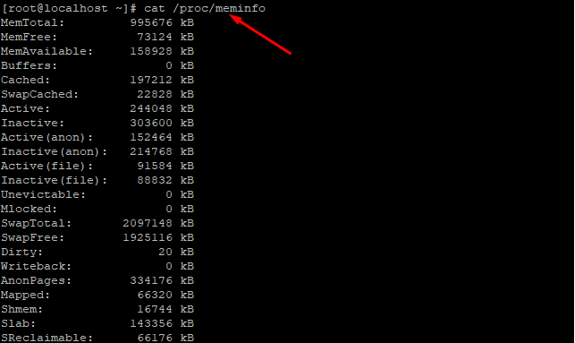

## 1. Lệnh Free
- `free -m`
- Là lệnh đơn giản và dễ sử dụng để kiểm tra việc sử dụng bộ nhớ.
- Tùy chọn m là để hiện thị dữ liệu tính theo MB.

## 2.Lệnh cat /proc/meminfo
- xem thông tin CPU hệ thống của bạn bằng cách đọc file /proc/cpuinfo với lệnh cat.
- `cat /proc/meminfo`

## 3.Lệnh top
- `top`
- Lệnh tường được sử dụng để kiểm tra bộ nhớ và sử dụng CPU cho mỗi quá trình báo cáo tổng mức sử dụng bộ nhớ và có thể được sử dụng để theo dõi tổng mức sử dụng Ram 

## 4 Lệnh ps
- Lọc ra 10 tiền trình dụng nhiều tài nguyên ram nhất 
- `ps -eo cmd,%mem--sort=-%mem | head -n 10`

- Lọc ra 10 tiền trình dụng nhiều tài nguyên CPU nhất
-  `ps -eo cmd,%cpu--sort=-%cpu | head -n 10`

