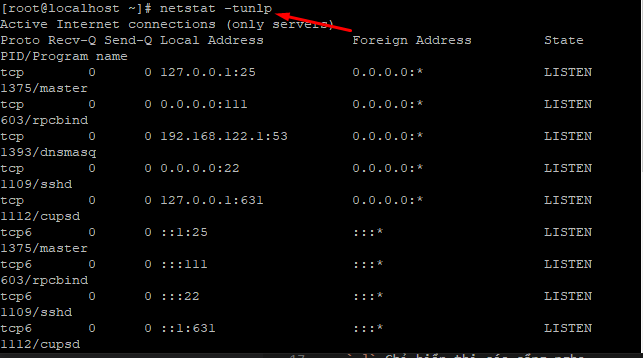
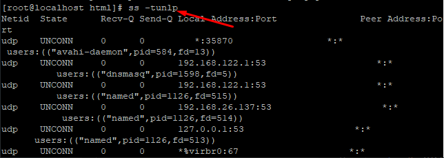
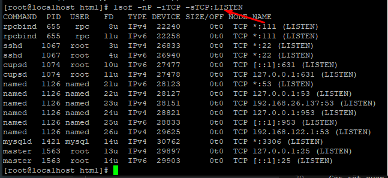

## Kiểm tra Port đang sử dụng trong Linux
### 1. Listening Port là gì
- Listen port là cổng mạng mà ứng dụng hoặc quá trình lắng nghe, đóng vai trò là điểm cuối giao tiếp.

- Mỗi port có thể được mở hoặc đóng (được lọc) bằng tường lửa. Nói chung, một port được mở là một port mạng chấp nhận các gói tin đến bên ngoài.

- Ví dụ: Nếu bạn đang chạy Apache listen trên các port 80 và 443 và bạn cố gắng cài đặt Nginx thì bạn sẽ không thể khởi động được Nginx vì các cổng HTTP và HTTPS đã được sử dụng bởi Apache.

### 2. Kiểm tra listen port với netstat
netstat là một công cụ dòng lệnh có thể cung cấp thông tin về các kết nối mạng. Để liệt kê tất cả các port TCP hoặc UDP đang được lắng nghe, bao gồm các dịch vụ sử dụng các port và trạng thái socket, hãy sử dụng lệnh sau:
- ` netstat -tunlp` hoặc `netstat -tln`

- Các tùy chọn được sử dụng trong lệnh này có ý nghĩa như sau:

- `-t` Hiển thị cổng TCP.
- `-u` Hiển thị cổng UDP.
- `-n` Hiển thị địa chỉ số.
- `-l` Chỉ hiển thị các cổng nghe.
- `-p`  Hiển thị PID và tên của quá trình lắng nghe. Thông tin này chỉ được hiển thị nếu bạn chạy lệnh dưới dạng root hoặc sudo user.
- Các cột quan trọng:
    + Proto – Giao thức được sử dụng bởi các socket.
    + Local Address – Địa chỉ IP và port mà quá trình nghe.
    + PID/Program name – PID và tên của chương trình.
- Nếu bạn muốn lọc kết quả, hãy sử dụng lệnh grep. Ví dụ: để tìm quá trình lắng nghe trên cổng TCP 80, bạn sẽ nhập:
- `netstat -tnlp | grep :80`
### 3. Kiểm tra cổng nghe với ss
- ss là netstat mới. Nó thiếu một số tính năng netstat nhưng hiểm thị nhiều trạng thái TCP hơn và nó nhanh hơn một chút. Các tùy chọn lệnh hầu hết đều giống netstat nên việc chuyển đổi từ netstat sang ss không khó khăn.

- Để có danh sách tất cả các cổng với ss, bạn dùng lệnh sau:
- ` ss -tunlp`

### 4. Kiểm tra cổng nghe với lsof
- lsof là một tiện ích dòng lệnh mạnh mẽ cung cấp thông tin về các tệp được mở bởi các quy trình. Để có danh sách tất cả các cổng TCP đang listen dùng lệnh sau :
- `lsof -nP -iTCP -sTCP:LISTEN`

- Các tùy chọn được sử dụng như sau:

    + `-n`Không chuyển đổi số cổng thành tên cổng.
    + `-p` Hiển thị địa chỉ số.
    + `-iTCP -sTCP` : LISTEN – Chỉ hiển thị các tệp mạng với trạng thái TCP LISTEN.
- Các cột quan trọng:
    + COMMAND, PID, USER – Tên, pid và người dùng đang chạy chương trình được liên kết với cổng.
    + NAME – Số cổng.
- Để tìm quá trình đang nghe trên một cổng cụ thể, ví dụ: cổng 80 bạn sẽ sử dụng:
- ` lsof -nP -iTCP:80 -sTCP:LISTEN`
