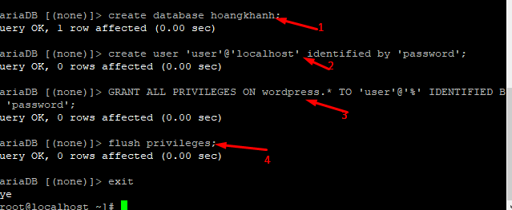
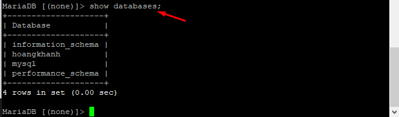
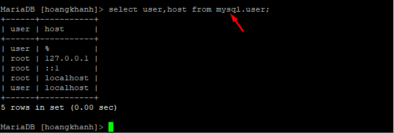
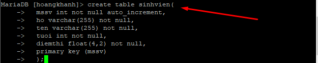
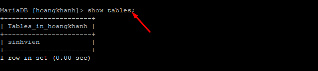
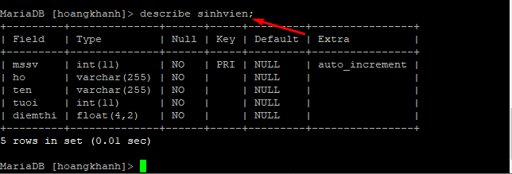

## Tìm hiểu về Query trong Sql
### 1. Khái niệm Sql
- SQL là một ngôn ngữ tiêu chuẩn để truy cập cơ sở dữ liệu (database). SQL là viết tắt của cụm từ Structured Query Language (Ngôn ngữ truy vấn cấu trúc). Cho phép bạn truy cập và thao tác với database. Ngoài ra, SQL là một tiêu chuẩn ANSI (American National Standards Institute- Viện tiêu chuẩn Quốc gia Mỹ).
#### 1.1 Sql có thể làm gì?
- SQL có thể thực hiện những truy vấn với một cơ sở dữ liệu

- SQL có thể lấy data từ một cơ sở dữ liệu.

- SQL có thể insert (nhập) record vào một cơ sở dữ liệu

- SQL có thể update (cập nhật) record vào một cơ sở dữ liệu

- SQL có thể delete (xóa) record khỏi một cơ sở dữ liệu

- SQL có thể tạo cơ sở dữ liệu mới

- SQL có thể tạo bảng mới trong một cơ sở dữ liệu

- SQL có thể tạo phương thức tích trữ trong một cơ sở dữ liệu

- SQL có thể tạo những cái nhìn trong một cơ sở dữ liệu

- SQL có thể thiết lập (set) quyền cho bảng, phương thức và cái nhìn.
#### 1.2 Hoạt động của Query 
- Sử dụng tham số có sẵn: Phần mềm mặc định có sẵn các tham số trong menu của nó. Người dùng có thể chọn, hệ thống sẽ hướng dẫn bạn cách để lấy kết quả mong muốn. Dễ thực hiện, nhưng không linh hoạt và có nhiều hạn chế về cách vận hành.
- Sử dụng cấu trúc gợi ý: Hệ thống sẽ hiển thị một bộ code cho bạn với các khoảng trống để điền vào, bạn có thể điền thêm giá trị là được.
- Ngôn ngữ Query: Bạn đã biết có nhiều ngôn ngữ query. Bạn sẽ phải viết truy vấn nếu muốn sử dụng dữ liệu. Phương pháp này đòi hỏi bạn có kiến thức về ngôn ngữ query đang được database software của bạn sử dụng. Mặc dù hơi phúc tạp nhưng nó cho bạn toàn quyền kiểm soát dữ liệu.

### 2. Các câu lệnh cơ bản trong SQL
#### 2.1 Câu lệnh Select 
- Câu lệnh SELECT được dùng để lựa chọn dữ liệu từ một cơ sở dữ liệu. Kết quả được lưu trong một bảng kết quả và gọi là bộ kết quả.
- Cú phát lựa chọn :  
    + `SELECT * FROM table_name;`

#### 2.2 Mệnh đề Where
- Mệnh đề Where dùng để chọn lọc các bản ghi.
- Mệnh đề Where cùng dùng để làm điều kiện để in ra các bản ghi.
    + ```   SELECT column_name,column_name

            FROM table_name

            WHERE column_name operator value

#### 2.3 Toán tử Sql AND và OR
- Toán tử AND & OR được dùng để lọc các bản ghi dựa vào 2 điều kiện trở lên.

- Toán tử AND thể hiện một bản ghi nếu cả điều kiện thứ nhất và điều kiện thứ 2 đều đúng.

- Toán tử OR thể hiện một bản ghi nếu điều kiện thứ nhất hoặc điều kiện thứ 2 đúng.

- Cú pháp toán tử AND :

    + ```SELECT * FROM table_name

        WHERE column_name 1 operator value

        AND column_name 2 operator value
#### 2.4 Create trong SQL
- Create dùng để tạo 1 database mới
- Cú phát
    + `create database name`

### 3. Các câu lệnh Sql cơ bản dùng trong Linux với MariaDB
### 3.1 Tạo Database và user
- Đăng nhập vào MariaDB bằng root
    + ` mysql -u root -p `
- Tạo Database
    + `create database naemdatabase;`
- Tạo User và mật khẩu
    + `create user 'user'@'localhost' identified by 'password';`
- Cấp quyền cho user 
    + `GRANT ALL PRIVILEGES ON wordpress.* TO 'user'@'%' IDENTIFIED BY 'password';`
- Cập nhật lại Sql
    + `flush privileges;`



 - Hiện thị các database đang có
    + ` show databases;`


- Truy cập vào 1 database 
    + `use  [database_name]; `


- Show các user đang có 
    + `select user,host from mysql.user; `


- Tạo bảng và dữ liệu cho databese 
    + ``` create table sinhvien(
            mssv int not null auto_increment,
            ho varchar(255) not null,
            ten varchar(255) not null,
            tuoi int not null,
            diemthi float(4,2) not null,
            primary key (mssv)
            );


- Hiện thị các bảng đang có ở database
    + ` show tables; `


- Xem nội dung của 1 bảng
    + `describe  [table_name]; `

