## I. Tạo Script Backup database
### Bước 1: Tạo 2 thư mục chưa file backup và file script
- `mkdir -p /home/Backup/DB `
- `mkdir -p /opt/scripts`
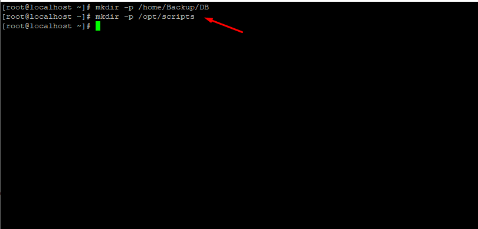

### Bước 2: Tạo file Script
- Di chuyển đến thư mục Scripts
- `cd opt/scrips`
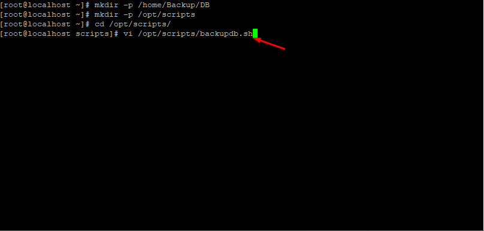


- Tạo file Script
- `vi /opt/scripts/backupdb.sh`
    + ``` 
        #!/bin/bash
        # Định nghĩa root hoặc DB admin
        DBHOST=localhost
        DBUSER=user
        DBPASS=passwd
        #Thư mục lưu backup
        BACKUPDIR=/home/Backup/DB
        # format is YYYYMMDD
        DATE=`date +%Y%m%d`
        mkdir -p "$BACKUPDIR/$DATE"
        cd "$BACKUPDIR/$DATE"

        MUTTXT=/home/Backup/DB/backupmysql.txt
        #Lấy list databases trên server
        DBS=`mysql --host=$DBHOST -p$DBPASS -u $DBUSER --skip-column-names -e "show databases;" | awk  '{ print $1 }' | grep -v "information_schema"`
        #Dumping database
        for i in $DBS
        do
        # format is dbname-YYYYMMDD.gz
        DBOUT=$i.sql.gz
        echo Backing up $i to $DBOUT

        #set umask to protect file
        umask 006

        mysqldump -u $DBUSER -h $DBHOST -p$DBPASS --add-drop-table $i | gzip -9 - > $DBOUT

        echo "Backup successfully done. Please see attached file." > $MUTTXT
        echo "" >> $MUTTXT
        echo "Backup file: $DBOUT" >> $MUTTXT
        echo "" >> $MUTTXT
        done
        # Xóa các bản backup cũ hơn 30 ngày
        echo deleting backups older than 30 days:
        find "$BACKUPDIR" -mindepth 1 -a -type d -mtime +30 -exec rm -rf {} \;

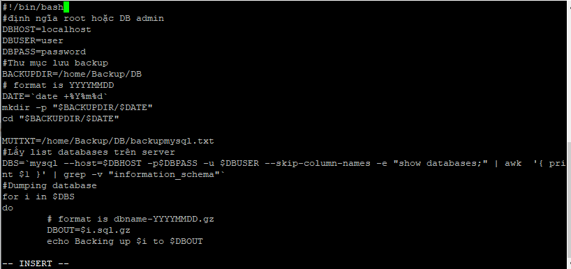

### Bước 3: Gán quyền thực thi cho file Script.
- `chmod +x /opt/scripts/backupdb.sh`
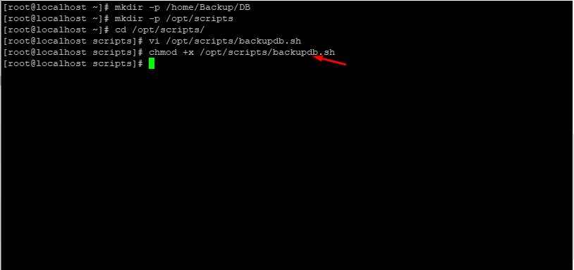

### Bược 4: Chạy Script và kiểm tra
- `sh /opt/scripts/backupdb.sh`
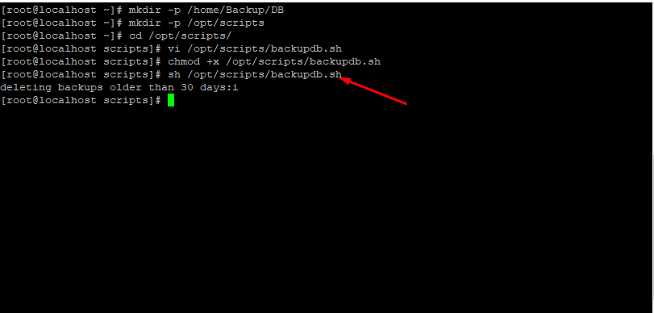
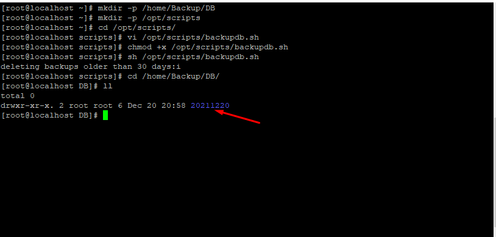

## II. Tạo Script để backup Source Code

### Bước 1: Tạo 2 thư mục để chứa file backup và file Script
- `mkdir -p /home/Backup/code`
- `mkdir -p /opt/scripts`
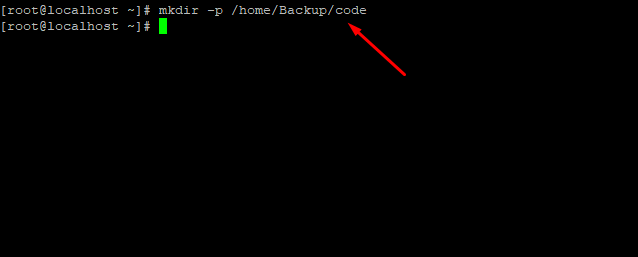

### Bước 2 Tạo file Scrips
- `vi /opt/scripts/backupcode.sh`
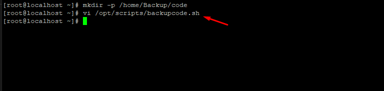

- Thêm nội dung :
    + ```
            #!/bin/bash
            SRCDIR="/var/www/html/*"
            DESTDIR="/home/Backup/code/"
            FILENAME=wpcode-$(date +%-Y%-m%-d)-$(date +%-T).tgz
            tar -P --create --gzip --file=$DESTDIR$FILENAME $SRCDIR
            # Xóa các bản backup cũ hơn 30 ngày
            echo deleting backups older than 30 days:
            find "$FILENAME" -mindepth 1 -a -type d -mtime +30 -exec rm -rf {} \;

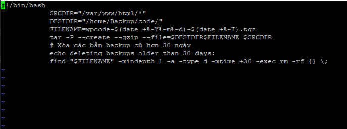

### Bước 3 : Gán quyền thực thi cho Script vừa tạo
- `chmod +x /opt/scripts/backupcode.sh`
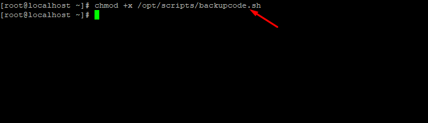

### Bước 4: Chạy Script và kiểm tra 
- `sh /opt/scripts/backupcode.sh`
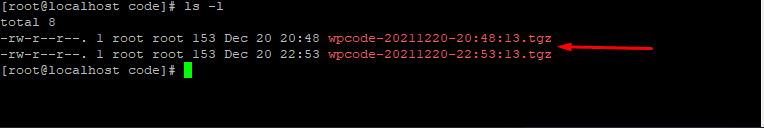

