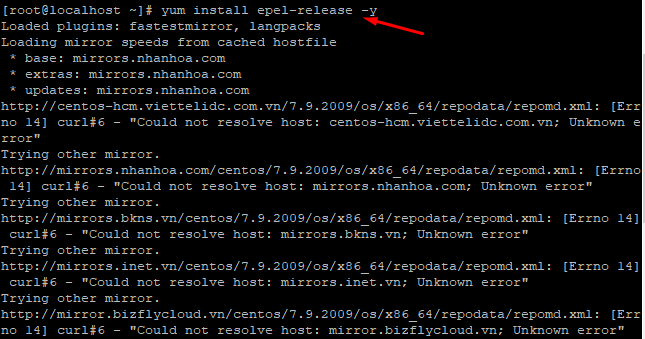
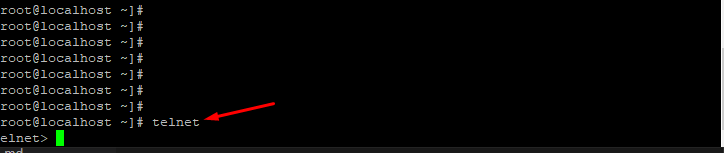

## I. Telnet 
- Telnet là một từ viết tắt ghép từ “teletype network”, “terminal network” hay “telecommunications network”, nhìn chung thì chúng nói đến và liên quan đến mạng viễn thông.

- Có rất nhiều định nghĩa nói về Telnet là gì? Có thể gọi Telnet là một giao thức dòng lệnh được sử dụng để quản lý các thiết bị khác nhau như máy chủ, PC, router, switch, camera, tường lửa từ xa…Hoặc Telnet là một giao thức máy tính cung cấp khả năng giao tiếp tương tác hai chiều cho các máy tính trên internet và mạng cục bộ LAN

- Telnet có nhiệm vụ là cung cấp kết nối từ xa, đảm nhiệm việc gửi các lệnh hoặc dữ liệu đến kết nối mạng từ xa nên chúng rất phổ biến trong hệ thống mạng. Giao thức này xuất hiện vào năm 1969 và nó đáp ứng mọi nhu cầu cơ bản về giao diện dòng lệnh trên internet. Sau khi SSH ra đời là người kế nhiệm của Telnet nên đã giải quyết những nhược điểm của Telnet.
## II. Cài đặt telnet cho CentOs 7 
### Bước 1: Cài đặt thư viện lưu trữ 
- `yum install epel-release -y`

### Bước 2: Cài đặt dịch vụ Telnet
- `yum -y install telnet-server telnet`

### Bước 3: Kiểm tra 
- `telnet`

