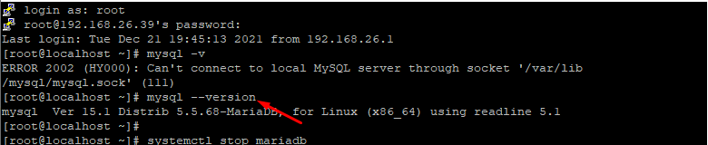
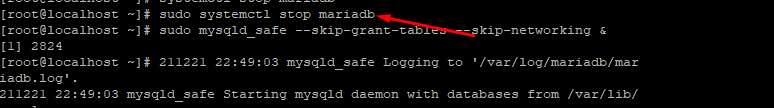
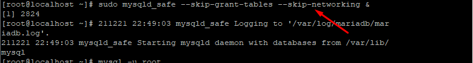
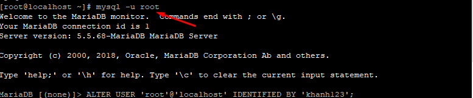
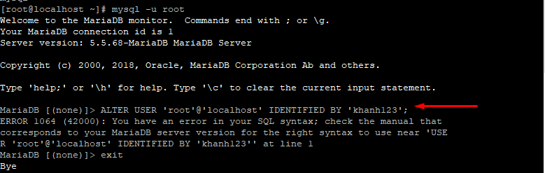
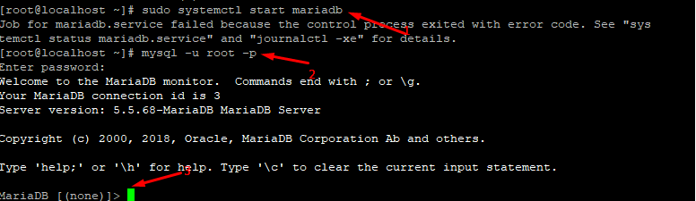

## I. Thay đổi lại mật khẩu root của Mariadb hoặc trên CentOs 7 

### Bước 1 : xác định hệ thống đang sử dụng Mysql hay MariaDB
- `mysql --version`


### Bước 2: Tiến hành ngừng dịch vụ MariaDB
- `sudo systemctl stop mariadb`



### Bước 3: khởi chạy Database server mà bỏ qua việc kiểm tra quyền hạn.
- `sudo mysqld_safe --skip-grant-tables --skip-networking &`




### Bước 4 : đăng nhập vào user root của Mysql. không cần dùng password.
- `mysql -u root`



### Bước 5: Đặt lại mật khẩu 
- `ALTER USER 'root'@'localhost' IDENTIFIED BY 'password mới';`




### Bước 6: khởi động lại MariaDB
- ```  
        sudo kill 
        '/var/run/mariadb/mariadb.pid`
- `sudo systemctl start mariadb`


### Bước 7: Đăng nhập và kiểm tra lại bằng password mới
- `mysql -u root -p`





## II. Thay đổi lại mật khẩu root của MySQLtrên CentOs 7 

### Bước 1 : xác định hệ thống đang sử dụng Mysql hay MariaDB
- `mysql --version`

### Bước 2: Tiến hành ngừng dịch vụ MariaDB
- `sudo systemctl stop mysql`

### Bước 3: khởi chạy Database server mà bỏ qua việc kiểm tra quyền hạn.
- `sudo mysqld_safe --skip-grant-tables --skip-networking &`


### Bước 4 : đăng nhập vào user root của Mysql. không cần dùng password.
- `mysql -u root`

### Bước 5: Đặt lại mật khẩu 
- `ALTER USER 'root'@'localhost' IDENTIFIED BY 'password mới';`


### Bước 6: khởi động lại MariaDB
- ``` sudo kill 
        '/var/run/mysql/mysql.pid`
- `sudo systemctl start mysql`

### Bước 7: Đăng nhập và kiểm tra lại bằng password mới
- `mysql -u root -p`


