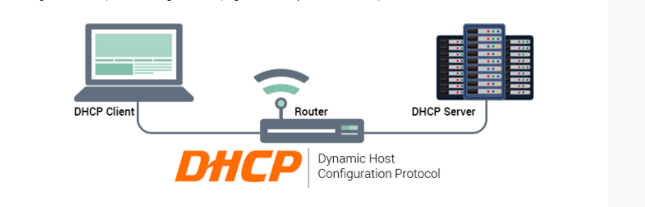
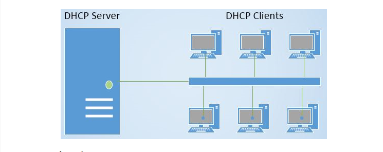

### 1. Khái niệm về DHCP
- HCP viết tắt của Dynamic Host Configuration Protocol, là giao thức tự động cấp phát địa chỉ IP đến các thiết bị trong mạng. Các địa chỉ IP được cung cấp từ giao thức DHCP sẽ cho phép chúng ta truy cập vào internet. Ngoài ra nó cũng đảm bảo không có trường hợp hai hoặc nhiều thiết bị có cùng IP và còn cung cấp các thông tin cấu hình như DNS, subnet mask, default gateway.

### 2. Cách thức hoạt động của DHCP

- Được giải thích một cách ngắn gọn nhất về cách thức hoạt động của DHCP chính là khi một thiết bị yêu cầu địa chỉ IP từ một router thì ngay sau đó router sẽ gán một địa chỉ IP khả dụng cho phép thiết bị đó có thể giao tiếp trên mạng.

- Như ở các hộ gia đình hay các doanh nghiệp nhỏ thì router sẽ hoạt động như một máy chủ DHCP nhưng ở các mạng lớn hơn thì DHCP như một máy chỉ ở vai trò là máy tính.

- Cách thức hoạt động của DHCP còn được giải thích ở một cách khác thì khi một thiết bị muốn kết nối với mạng thì nó sẽ gửi một yêu cầu tới máy chủ, yêu cầu này gọi là DHCP DISCOVER. Sau khi yêu cầu này đến máy chủ DHCP thì ngay tại đó máy chủ sẽ tìm một địa chỉ IP có thể sử dụng trên thiết bị đó tồi cung cấp cho thiết bị địa chỉ cùng với gói DHCPOFFER

Khi nhận được IP thì thiết bị tiếp tục phản hồi lại máy chủ DHCP gói mang tên DHCPREQUEST. Lúc này là lúc chấp nhận yêu cầu thì máy chủ sẽ gửi tin báo nhận (ACK) để xác định thiết bị đó đã có IP, đồng thời xác định rõ thời gian sử dụng IP vừa cấp đến khi có địa chỉ IP mới.

### 3. Ưu và nhược điểm khi sử dụng DHCP
- Ưu điểm của DHCP 
    + Máy tính hay bất cứ thiết bị nào phải cấu hình đúng cách thì mới có thể kết nối với mạng được. DHCP cho phép cấu hình tự động nên dễ dàng cho các thiết bị máy tính, điện thoại, các thiết bị thông minh khác...có thể kết nối mạng nhanh.

    + Vì DHCP thực hiện theo kiểu gán địa chỉ IP nên sẽ không xảy ra trường hợp trùng địa chỉ IP, vậy việc gán theo cách thủ công của IP tĩnh sẽ dễ dàng hơn và giúp hệ thống mạng luôn hoạt động ổn định.

    + DHCP giúp quản lý mạng mạnh hơn vì các cài đặt mặc định và thiết lập tự động lấy địa chỉ sẽ cho mọi thiết bị kết nối mạng đều có thể nhận được địa chỉ IP.

    + DHCP quản lý cả địa chỉ IP và các tham số TCP/IP trên cùng một màn hình như vậy sẽ dễ dàng theo dõi các thông số và quản lý chúng qua các trạm.

    + Khi đánh tự động nhờ máy chủ DHCP giúp cho người quản lý quản lý có khoa học hơn và không bị nhầm lẫn.

    + Ngoài ra người quản lý có thể thay đổi cấu hình và thông số của các địa chỉ IP giúp việc nâng cấp cơ sở hạ tầng được dễ dàng hơn.

    + Một ưu điểm nữa là các thiết bị có thể di chuyển tự do từ mạng này sang mạng khác và nhận địa chỉ IP tự động mới vì các thiết bị này có thể tự nhận IP.

- Nhược điểm của DHCP
    + DHCP mang lại nhiều ưu điểm, song bên cạnh đó cũng còn mặt hạn chế. Chẳng hạn  như việc ta không nên sử dụng địa chỉ IP động, địa chỉ IP thay đổi đối với các thiết bị cố định và cần truy cập liên tục. Ví dụ như không nên sử dụng IP động cho các thiết bị máy in ở các văn phòng.

    + Mặc dù có rất nhiều lợi ích khi sử dụng DHCP, vẫn có một số hạn chế mà chúng ta cần lưu ý. Không nên sử dụng địa chỉ IP động, địa chỉ IP thay đổi đối với các thiết bị cố định và cần truy cập liên tục như máy in và file server.

    + Bởi DHCP sử dụng chủ yếu với các hộ gia đình hay văn phòng. Đối với các thiết bị dùng trong văn phòng, như máy in thì việc việc gán chúng với các địa chỉ IP thay đổi không mang tính thực tiễn. Lúc đó mỗi khi kết nối với máy tính khác thì máy in đó sẽ phải thường xuyên cập nhật cài đặt để máy tính có thể kết nối với máy in.
    + Cũng giống như việc bạn điều khiến máy tính từ xa và cần có quyền truy cập thì bạn phải có địa chỉ IP. Nếu như địa chỉ IP đó động thì những gì máy tính đã ghi lại sẽ không chính xác được lâu. Vậy nên nếu trong trường hợp này thì bạn nên sử dụng IP tĩnh là phù hợp hơn cả.