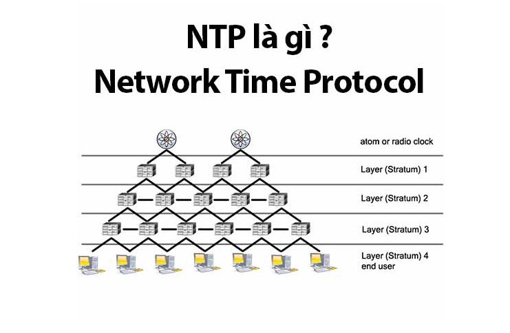
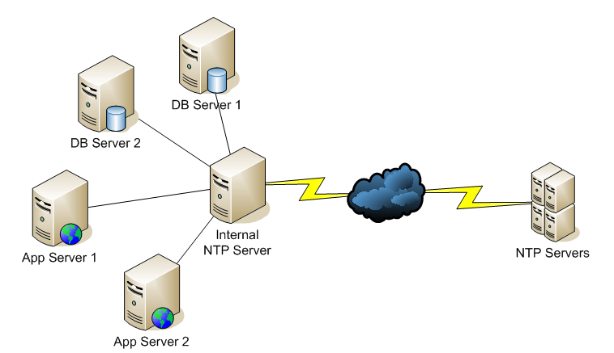
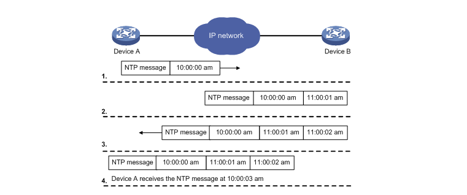

## 1. Khái Niệm về NTP

- NTP là gì ? Network Time Protocol (NTP) là một thuật toán phần mềm giữ cho các máy tính và các thiết bị công nghệ khác nhau có thể đồng bộ hóa thời gian với nhau. NTP đã đạt được thành công trong việc giữ các thiết bị đồng bộ hóa hiệu quả trong chỉ trong vài milliseconds (1/1000s), nhưng để có thể làm được điều này nó cần phải có một hệ thống thời gian đáng tin cậy để sử dụng làm điểm thời gian chính cho việc đồng bộ.
    + NTP hoạt động bằng cách sử dụng một nguồn thời gian chính duy nhất (NTP Server), nó sử dụng để đồng bộ tất cả các thiết bị trên mạng.

    + NTP là một trong những giao thức Internet lâu đời nhất vẫn còn được sử dụng (từ trước năm 1985). NTP được thiết kế đầu tiên bởi Dave Mills tại trường đại học Delaware, hiện ông vẫn còn quản lý nó cùng với một nhóm người tình nguyện.
    + NTP sử dụng thuật toán Marzullo, và nó cũng hỗ trợ các tính năng như giây nhuận. NTPv4 thông thường có thể đảm bảo độ chính xác trong khoảng 10 mili giây (1/100s) trên mạng Internet công cộng, và có thể đạt đến độ chính xác 200 micro giây (1/5000s) hay hơn nữa trong điều kiện lý tưởng của môi trường mạng cục bộ.
    + Chi tiết hoạt động của NTP được quy định trong các RFC 778, RFC 891, RFC 956, RC 958 (thay thế bởi 1305), và RFC 1305 . Chuẩn đang được triển khai là phiên bản 4 (NTPv4 ).

## 2. NTP Server

- NTP Server là gì? Máy chủ NTP hay máy chủ thời gian là các thuật ngữ cùng mô tả một khái niệm: một thiết bị được sử dụng để nhận biết yêu cầu đồng bộ thời gian và phân phối tín hiệu thông tin thời gian. Thật ra, một máy chủ NTP Server cũng chỉ sử dụng Network Time Protocol (NTP), trong vô vàn các giao thức thời gian khác nhau tồn tại thì NTP được sử dụng phổ biến tới hơn 90%.
- Các tín hiệu thời gian được sử dụng bởi hầu hết các máy chủ NTP là nguồn thời gian UTC. UTC (Coordinated Universal Time) là thời gian toàn cầu dựa trên thời gian đồng hồ nguyên tử. Bằng cách sử dụng UTC, máy chủ NTP có thể tác động, đồng bộ hóa mạng cùng thời gian với hàng triệu mạng máy tính khắp nơi trên thế giới. Nếu không có UTC, nhiều giao dịch trực tuyến sẽ không thể nào thực hiện được. Như vậy là bạn đã thấy tầm quan trọng của UTC rồi đúng không nào.

- Tín hiệu thời gian có thể được nhận bởi NTP server hoặc (time server) qua một số cách như mạng Internet toàn cầu, thời gian của các quốc gia, tần số truyền (sóng dài) hoặc mạng GPS (hệ thống định vị toàn cầu). Khi nhận được tín hiệu, time server kiểm tra tính xác thực của tín hiệu này (trừ các nguồn internet không thể xác thực), đánh giá tính chính xác của nó và phân phối nó trong mạng.

## 3. Lợi ích của NTP Server 
### 3.1 Backup dữ liệu theo lập lịch
- Backup dữ liệu rất quan trọng với bất kỳ tổ chức nào, nếu hệ thống quá sai về thời gian sẽ khiến việc sao lưu không chính xác.

### 3.2 Tăng tốc độ mạng
- Nhiều thiết bị sử dụng cache và hệ thống tập tin diện rộng có thể dựa vào tem thời gian  (timestamp) để xác định phiên bản nào của đoạn dữ liệu ứng với thời điểm hiện tại. Đồng bộ thời gian không chính xác có thể khiến hệ thống như cache server hoạt động không chính xác, sử dụng sai phiên bản dữ liệu.

### 3.3 Hệ thống quản lý mạng
- Khi có vấn đề gì đó, việc kiểm tra log hệ thống là một phần chính của debug lỗi. Nhưng nếu thời gian trong những file log này không đồng bộ/không chính xác thì có thể bạn sẽ mất khoảng thời gian dài hơn để tìm ra nguyên nhân và khắc phục lỗi hệ thống.

### 3.4 Phân tích xâm nhập
- Trong trường hợp nếu có sự xâm nhập mạng trái phép, việc tìm hiểu xem mạng của bạn bị xâm nhập như thế nào và dữ liệu nào được truy cập có thể được kiểm tra rõ ràng nếu bạn có log thời gian chính xác việc login trên router hoặc máy chủ. Hacker thường sẽ xóa log nếu có, nhưng nếu họ không xóa thì bạn cần thời gian chính xác để chuẩn đoán đó.

### 3.5 Tuân thủ các quy định
- Sarbanes Oxley, HIPAA, GLBA và các quy định khác có thể sẽ cần trong tương lai vì vậy đòi hỏi thời gian chính xác trong các giao dịch cũng như dữ liệu.

## 4. Cách thức hoạt động của NTP server

- Thời gian dưới dạng là timestamps (tạm dịch là tem thời gian), cung cấp một chuẩn duy nhất giữa tất cả các thiết bị trên mạng và cách mà một máy chủ NTP hoạt động thì khá đơn giản.
    + NTP client gửi một gói tin trong đó chứa tem thời gian được chuyển tiếp đến máy chủ ở dạng số ngày càng tăng từ một điểm thời gian cố định trước đó (unixtime): ngày 1 tháng 1 năm 1990.
    + Máy chủ NTP sử dụng tem thời gian để tính toán, nếu thời gian trên mạng không khớp sẽ được cộng trừ thêm số giây để khớp với đồng hồ/máy chủ NTP cấp cao hơn đang tham chiếu. Sau đó gửi trả lại NTP client một gói tin khác, có thẻ thời gian là thời điểm nó gửi gói tin đó đi.
    + NTP client nhận được gói tin đó, tính toán độ trễ, dựa và thẻ thời gian mà nó nhận được cùng với độ trễ đường truyền, NTP client sẽ set lại thời gian của nó.
- NTP chính xác trong khoảng 1/100s trên môi trường internet và thực hiện tốt hơn trên mạng LAN và WAN với độ chính xác là 1/5000s.

## 5. Một số câu lệnh trong NTP
- Câu lệnh date được dùng để truy cập và hiện thị ngày giờ của hệ thống :
   + `date`

- câu lệnh date và các tùy chọn
    + `%D` – Ngày hiển thị dưới dạng mm/dd/yy.

    + `%Y` – Năm.

    + `%m` – Tháng (01-12).

    + `%B` – Tên tháng viết dài (Ví dụ: November).

    + `%b` – Tên tháng viết ngắn (Ví dụ: Nov).

    + `%d` – Ngày trong tháng (ví dụ: 01).

    + `%j` – Ngày trong năm (001-366).

    + `%u` – Ngày trong tuần (1-7).

    + `%A` – Tên đầy đủ các ngày trong tuần (ví dụ: Friday)

    + `%a` – Tên ngày trong tuần viết ngắn (ví dụ: thứ Fri)

    + `%H` – Giờ (00-23)

    + `%I` – Giờ (01-12)

    + `%M` – Phút (00-59)

    + `%S` – Giây (00-60)

