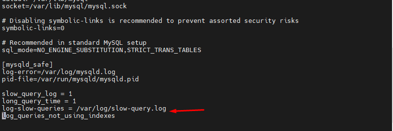

## I. Slow Query

- Enable Slow query MySQL hoặc MariaDB có thể là một công cụ hữu ích để chẩn đoán các vấn đề về hiệu suất và hiệu quả ảnh hưởng đến máy chủ.

- Bằng cách xác định các truy vấn đặc biệt chậm(slow) trong quá trình thực thi của chúng, bạn có thể giải quyết chúng bằng cách cấu trúc lại ứng dụng kích hoạt các truy vấn.

## II.Các bước thực hiện 

### Bước 1: đăng nhập SSH bằng quyền root

### Bước 2: Chỉnh sửa file cấu hình
- Ta chỉnh cấu hình tại file /etc/my.cnf để bật chế độ Slow Query
- `vi /etc/my.cnf`


- Thêm nội dung cho cấu hình :
    + ```
         slow_query_log = 1
         long_query_time = 1
         slow_query_log_file = /var/log/slow-query.log
         log_queries_not_using_indexes
- Lưu ý: Từ phiên bản MySQL 5.6 trở lên , hãy sử dụng log-slow-queries thay cho biến slow-query_log_file.


### Bước 3: tạo file log và gán quyền cho User Mysql
- Như bước 2 đã cấu hình ta cần phải tạo ra 1 file để chứa file log.
- `touch /var/log/mysql/slow-query.log`

- Gán quyền truy cập cho user mysql
- `chown mysql:mysql /var/log/slow-query.log`


### Bước 4: Khởi động lại Mysql (MariaDB)
- `sudo systemctl restart mysql`


### Bước 5: Kiểm tra log slow query
- Hiện thị tất cả các bản ghi Slow query 
- `mysqldumpslow -a /var/log/slow-query.log`


- Xem slow query log:
- `sudo tail -f /var/log/slow-query.log`
