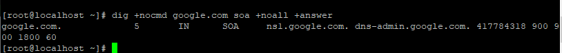

## I. Lệnh Dig
- DIG là viết tắt của Domain Information Groper, có nghĩa là công cụ tìm kiếm thông tin tên miền. Lệnh Dig có tác dụng để kiểm tra và xử lí sự cố DNS Server, tìm kiếm DNS và hiển thị nội dung được yêu cầu ra màn hình terminal. Lệnh Dig được sử dụng để thay thế cho những công cụ cũ trước đây như nslookup và host. Công cụ Dig là có sẵn trên các bản phân phối của Linux.

## II. Cài đặt Dig 
- Đối với Ubuntu 
    + `apt install dnsutils`

- Đối với CentOs 
    + `yum install bind-utils`

- Kiểm tra Dig
    + `dig -v`

## III. Cách sử dụng lệnh Dig
### 1. Thực hiện DNS tra cứu 1 tên miền 
    + VD : `dig google.com`

- Kết quả nhận được bao gồm các phần sau:
    + Dòng đầu tiên của đầu ra hiển thị version đã cài đặt và truy vấn được gọi. Dòng thứ hai hiển thị các tùy chọn(theo mặc định của câu lệnh).
   
     

    + Phần tiếp thep, dòng đầu tiên của phần này là tiêu đề, bao gồm opcode và trạng thái của hành động. Trong trường hợp này, trạng thái NOERROR có nghĩa là yêu cầu truy vấn truy vấn DNS không gặp lỗi.
    
     
    

    + Phần này được hiển thị theo mặc định chỉ trên các phiên bản mới hơn.
    
     

    + Đây là phần mà lệnh dig hiển thị truy vấn của chúng ta. Theo mặc định, dig sẽ yêu cầu bản ghi A.
    
     
    

    + Phần trả lời cung cấp cho chúng ta tên miền google.com. trỏ đến địa chỉ IP 172.217.174.206
    
     
    
- Đây là phần cuối cùng của đầu ra bao gồm số liệu thống kê về truy vấn.
    + Query time: Cho biết thời gian của kết nối tốn bao lâu.

    + SERVER: 8.8.8.8: Cho biết name resolver đang dùng.

    + WHEN: Thời gian thực hiện truy vấn DNS.

    + MSG SIZE rcvd: Kích thước gói tin trả lời truy vấn DNS.

### 2. Thực hiện truy vấn địa chỉ IP
- VD `dig amazon.com +short`
    + kết quả trả về bao gồm chỉ địa chỉ Ip của amazon.com
      

### 3. Truy vấn với name server cụ thể
- Theo mặc định nếu khi sử dụng lệnh dig mà không chỉ rõ name server nào thì server sẽ sử dụng name server được khai báo trong file /etc/resolv.conf
- Để chỉ định name server mà truy vấn sẽ thực hiện, sử dụng biểu tượng @ + địa chỉ IP/hostname
    + Ví dụ: Truy vấn name server Google có địa chỉ là 8.8.8.8 để lấy thông tin về tên miền google.com
    + `dig google.com @8.8.8.8`
     
    

### 4. Truy vấn theo bảo ghi 
- Dig cho phép bạn thực hiện bất kỳ truy vấn hợp lệ nào bằng cách nối thêm loại bản ghi vào cuối truy vấn.
#### 4.1 truy vấn bản ghi bất kỳ
- VD : để có danh sách địa cho 1 tên miền goole.com
    + `dig +nocmd google.com a +noall +answer`
    
#### 4.2 Truy vấn bản ghi CNAME
- Sử dụng tùy chọn cname 
    + `dig +nocmd mail.google.com cname +noall +answer`
    
#### 4.3 Truy vấn bản ghi TXT
- Sử dụng tùy chọn txt
    + `dig +nocmd google.com txt +noall +answer`
    
#### 4.4 Truy vấn bản ghi MX
- Sử dụng tùy chọn mx
    + `dig +nocmd google.com mx +noall +answer`
    

#### 4.5  Truy vấn bản ghi NS
- Sử dụng tùy chọn ns
    + `dig +nocmd google.com ns +noall +answer`
     
#### 4.6  Truy vấn bản ghi SOA
- Sử dụng tùy chọn soa
    + `dig +nocmd google.com soa +noall +answer`
      
#### 4.7 Truy vấn bản ghi TTL
- Sử dụng tùy chọn ttl
    + `dig +nocmd google.com ttl +noall +answer `
  
#### 4.8 Truy vấn tất cả bản ghi 
- Sử dụng tùy chọn any
    + `dig +nocmd google.com any +noall +answer`
    
#### 4.9 Tra cứu DNS ngược
- Để truy vấn tên máy chủ được liên kết với một địa chỉ IP cụ thể, hãy sử dụng tùy chọn -x.
    + Ví dụ: Tra cứu địa chỉ IP 31.13.95.36 thành tên miền
    + `dig -x 31.13.95.36 +noall +answer `
    