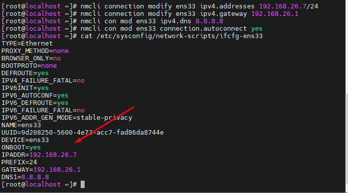

## Đổi IP Trên CentOS 7 
- Nội Dung Thực Hiện :
    + Đặt IP cho Interface ens33 Ta thấy ens33 đang nhận IP động, ta sẽ tiến hành đặt IP tĩnh. Ta sẽ đặt theo số liệu sau:
    + IP address: 192.168.26.7
    + Gateway: 192.168.26.1
    + Subnetmask: 255.255.255.0/24
    + DNS-nameserver: 8.8.8.8
#### Bước 1 : Kiểm tra mạng có sẵn 
- nmcli device 
 

#### Bước 2 : Cài địa chi IP 192.168.26.7 cho mạng ens33 
- nmcli connection modify ens33 ipv4.addresses 192.168.26.7/24
    + Với "connection" : là chế độ kết nối
    + Với "modify" : là chế độ sử đổi

 
#### Bước 3 Đặt Địa chỉ Gateway 192.168.26.1
- nmcli connection modify ens33 ipv4.gateway 192.168.26.7

#### Bước 4 Đặt địa chỉ DNS 8.8.8.8
- nmcli con mod ens33 ipv4.dns 8.8.8.8

#### Bước 5 Kiểm tra lại kết quả 

## Đổi Ip Windows server 2019
- Bước 1 : Kiểm tra Default Gateway

- Bước 2 :

- Bước 3 :

- Bước 4 : 

- Bước 5 : 

- Bước 6 : 

