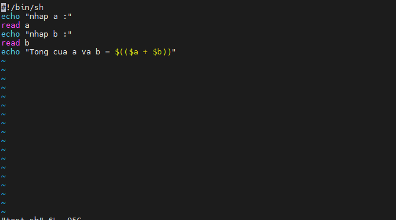
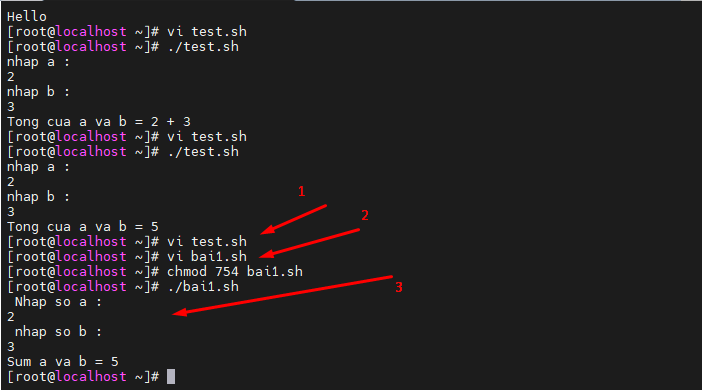
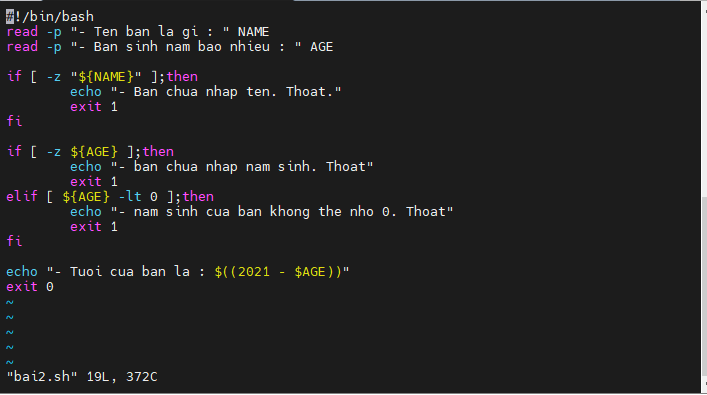

### Shell Scripts
- Shell Scrips được viết bằng các text editors (trình soạn thảo văn bản). Trên hệ thống Linux, hãy mở một chương trình editors, mở một tệp mới để bắt đầu nhập tập lệnh shell hoặc lập trình shell, sau đó cấp quyền cho shell để thực thi shell script và đặt tập lệnh của bạn tại vị trí mà shell có thể tìm thấy
#### Các bước tạo 1 shell Scrip
1. Tạo tệp bằng vi editor (hoặc bất kỳ trình chỉnh sửa văn bản nào khác). Đặt tên cho tệp script phải có đuôi là .sh
2. Bắt đầu script bằng #! /bin/sh
3. Viết một vài dòng code
4. Lưu file script dưới dạng filename.sh
5. Thực thi file script bằng lệnh bash filename.sh

#### Một Số Bài Tập Shell Scrip Cơ Bản
- Bài 1 : in ra Hello
    + 1 : Tạo 1 file test.sh Shell bằng vi 
    + 2 : Cấp quyền chạy cho file test.sh
    + 3 : Chạy file test.sh và kiểm tra  
     
 

- Bài 2 : nhập 2 số từ bàn phim tính tổng 2 số đó
    + Tạo 1 file bai1.sh bằng vi
    + Cấp quyền chạy cho file bai1.sh
    + Chạy file bai1.sh và xem kết quả

- Bài 3 : Nhập tên và năm sinh và tính tuổi ở thời điểm hiện tại
    + Tạo 1 file bai2.sh bằng vi
    + Cấp quyền chạy cho file bai2.sh
    + Chạy file bai2.sh và xem kết quả

