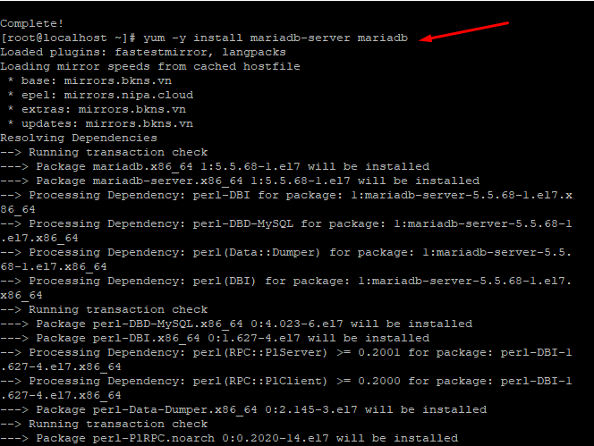
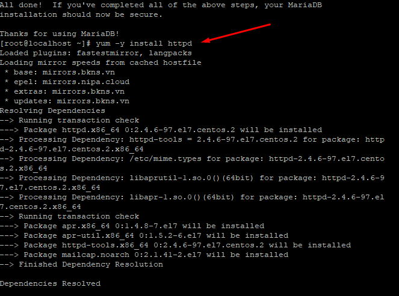
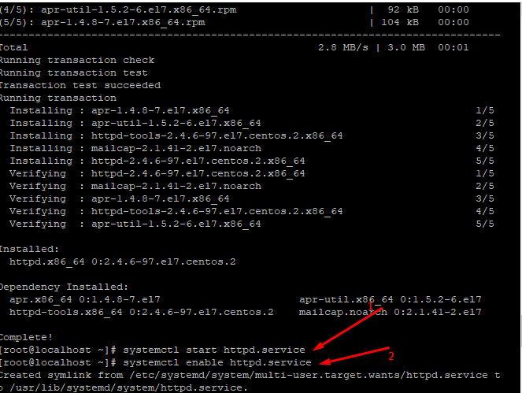

### Cài đặt gói cài đặt
- Bước 1 :
- `rpm --import /etc/pki/rpm-gpg/RPM-GPG-KEY*`
- `yum -y install epel-release`

- Bước 2 : Cài đặt MySQL / MariaDB
-  `yum -y install mariadb-server mariadb`

- Bước 3 : Cài đặt Apache 2
- `yum -y install httpd`

- Bước 4 : 

- Bước 5 : 

- Bước 6 :

