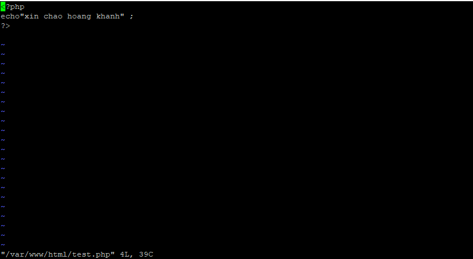

## Cài Đặt Phpmyadmin
1. Cài đặt PHP 7.3
- `sudo yum -y install http://rpms.remirepo.net/enterprise/remi-release-7.rpm`

- `sudo yum -y install epel-release yum-utils`

2. Tạo 1 file php với vi /var/www/html

3. chạy và kiểm tra
- Lưu ý mỗi khi thay đổi ta cần thức hiện restart lại http 

