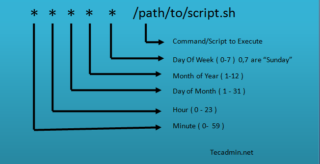
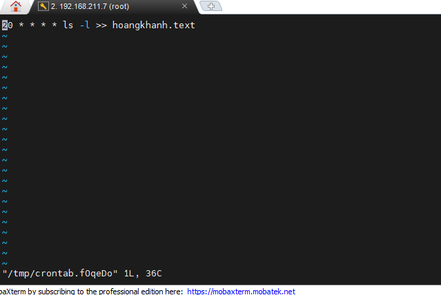
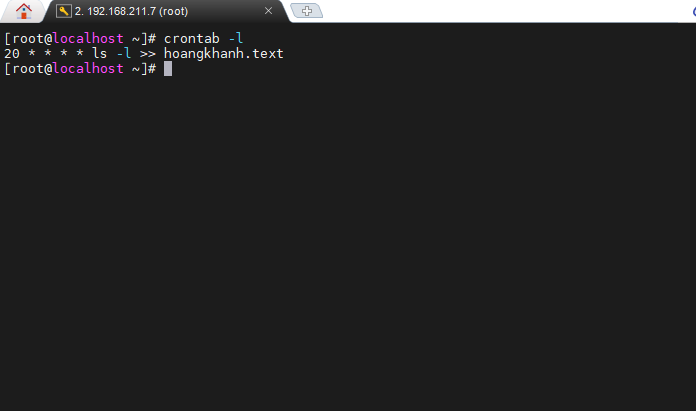
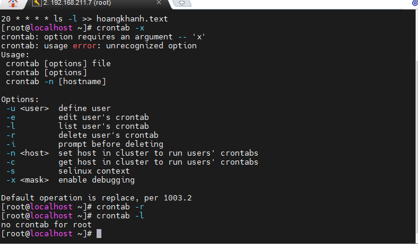
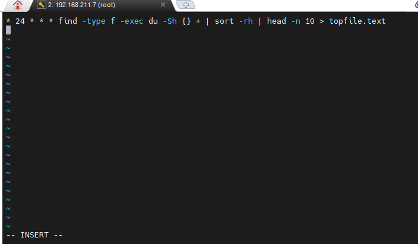
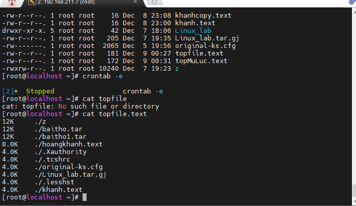
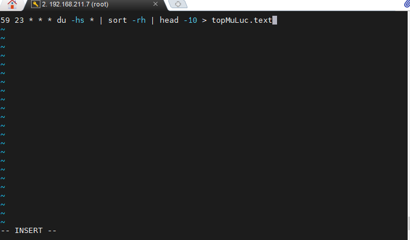
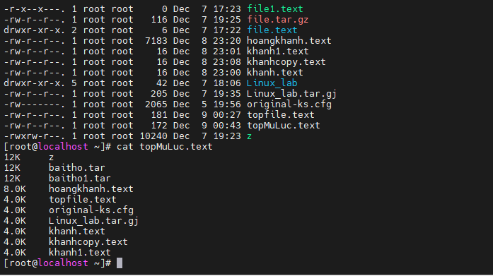

### Crontab trong Linux
- Crontab Linux là một dịch vụ giúp thực hiện các task được lên lịch sẵn, giúp cải thiện đáng kể hiệu suất làm việc.
- Cron là một cách để tạo và chạy các lệnh theo một chu kỳ xác định. Đây là tiện ích giúp lập lịch trình để chạy những dòng lệnh bên phía server nhằm thực thi một hoặc nhiều công việc nào đó theo thời gian được lập sẵn.

#### Một số lệnh crontab thường dùng :
- crontab -e : Tạo hoặc chỉnh sửa file crontab

- crontab -l : Hiện thị file crontab

- crontabl -r : Xóa file crontab

#### 1 Số Bài Tập về Crontab
1. Cứ 23h hàng ngày in ra 10 file chiếm nhiều dung lượng nhất
- find -type f -exec du -Sh {} + | sort -rh | : Tìm kiếm 10 file chiếm nhiều dung lượng nhất
- * 23 * * *  : cứ mỗi 23h hàng ngày sẽ chạy chạy
-   * 23 * * * find -type f -exec du -Sh {} + | sort -rh | >> topfile.text : cứ mỗi 23h hàng ngày in ra 10 file chiếm nhiều dung lượng nhất vào file có tên là topfile.text

- Kết Quả

2. cứ 23h59p hàng ngày in ra 10 thư mục chiếm nhiều dung lượng nhất. 
-  du -hs * | sort -rh | head -10 : Tìm kiếm 10 thư mục chiếm nhiều dung lượng nhất
- 59 23 * * *  : cứ mỗi 23h59 hàng ngày sẽ chạy chạy
-   59 23 * * * du -hs * | sort -rh | head -10 >> topThuMuc.text : cứ mỗi 23h59 hàng ngày in ra 10 thư mục chiếm nhiều dung lượng nhất vào file có tên là topThuMuc.text

- Kết Quả

