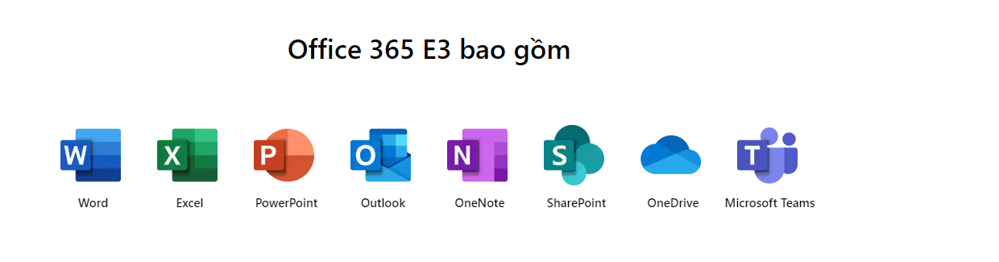
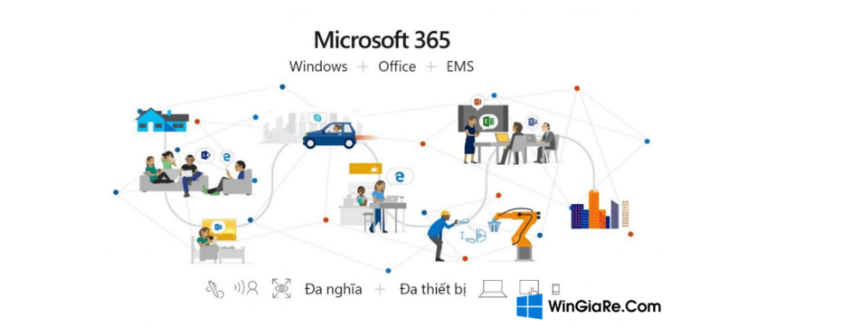

## I. Tìm hiểu về Office 365 E3

- Office 365 E3 là bộ ứng dụng và dịch vụ năng suất dựa trên nền điện toán đám mây với các chức năng tuân thủ và bảo vệ thông tin được tích hợp.

- Cài đặt các ứng dụng Office dành cho thiết bị di động trên tối đa 5 PC hoặc máy Mac, 5 máy tính bảng và 5 điện thoại cho mỗi người dùng.
- Bảo vệ thông tin bằng tính năng mã hóa thư, quản lý quyền và ngăn mất dữ liệu cho email cũng như tệp.
- Bảo vệ dữ liệu công ty bằng cách hỗ trợ truy nhập bảo mật hơn vào các tài nguyên công ty và cho phép chia sẻ an toàn thông tin nhạy cảm ở cả bên trong lẫn bên ngoài tổ chức của bạn.
- Tạo điều kiện tuân thủ pháp luật và lưu trữ email thông qua Khám phá Điện tử và giữ nội dung gốc cho hộp thư.

## II. Các lợi ích cho Office 365 E3
- Exchange Online
    + Làm việc thông minh hơn với 100 GB dung lượng lưu trữ email và khả năng lập lịch cấp doanh nghiệp.
- Microsoft OneDrive dành cho công việc
    + Truy nhập 1-5+ TB dung lượng lưu trữ trên đám mây cá nhân từ mọi nơi, trên mọi thiết bị.1&nbsp;Dễ dàng chia sẻ tài liệu với người khác cả ở bên trong lẫn bên ngoài tổ chức, cũng như kiểm soát những người có thể xem và chỉnh sửa từng tệp.

- Information Protection
    + Bảo vệ thông tin thông qua mã hóa thư Office cơ bản và Ngăn Mất Dữ liệu Office 365 cho email cũng như tệp.
- Các chức năng tuân thủ bổ sung
    + Thêm tính năng Khám phá Điện tử và kiểm tra cốt lõi vào chức năng tuân thủ của bạn.
- SharePoint Online
    + Chia sẻ cũng như quản lý nội dung, kiến thức và các ứng dụng thông qua dung lượng lưu trữ SharePoint Online. Hỗ trợ hoạt động làm việc nhóm, nhanh chóng tìm thông tin và cộng tác liền mạch trong toàn tổ chức.
- Microsoft Bookings
    + Đơn giản hóa cách khách hàng lên lịch và quản lý cuộc hẹn.

## III. Các tính năng Office 365

- Ứng dụng Office 365
    + Cài đặt các ứng dụng Office 365 như Word, Excel, PowerPoint, OneNote (chỉ trên PC) và Access (chỉ trên PC) trên tối đa 5 PC hoặc máy Mac, 5 máy tính bảng và 5 điện thoại cho mỗi người dùng.

- Office dành cho thiết bị di động
    + Sử dụng các ứng dụng Office 365 được thiết kế cho thiết bị di động và máy tính bảng.
- Outlook
    + Kết nối và luôn sắp xếp khoa học cùng email, lịch và danh bạ, tất cả đều ở cùng một nơi.
- Microsoft Teams
    + Trò chuyện, họp, chia sẻ tệp và sử dụng các ứng dụng kinh doanh trong một không gian làm việc chung.
- Nhóm Office 365
    + Sử dụng thiết bị này, cùng các công cụ Office 365 bạn đã dùng để cộng tác với đồng nghiệp khi viết tài liệu, tạo bảng tính, làm việc với kế hoạch dự án, lên lịch cuộc họp hoặc gửi email.
- Microsoft Stream
    + Tải lên, sắp xếp và chia sẻ nội dung video thông minh trong phạm vi toàn công ty.
- Power Apps for Microsoft 365
    + Xây dựng những ứng dụng kinh doanh bạn cần, cũng như mở rộng hoặc tùy chỉnh các ứng dụng bạn đã sử dụng.
- Power Automate for Microsoft 365
    + Đơn giản hóa các nhiệm vụ lặp lại bằng chức năng tự động hóa quy trình làm việc.
- Power Virtual Agents for Teams
    + Đáp ứng nhu cầu của doanh nghiệp bằng chatbot tùy chỉnh cho Teams. 
- Dataverse for Teams
    + Tự tin xây dựng trên cơ sở dữ liệu sử dụng số lượng mã tối thiểu cho Teams.
- Microsoft To Do
    + Lập kế hoạch cho ngày của bạn và quản lý cuộc sống của bạn.
- Microsoft Viva Insights (thông tin chuyên sâu cá nhân)
    + Giúp nhân viên phát triển với thông tin chuyên sâu dựa trên dữ liệu, được bảo vệ quyền riêng tư và các trải nghiệm về trạng thái tốt cá nhân.
- Microsoft Viva Connections
    + Duy trì sự gắn kết và cập nhật thông tin cho nhân viên qua trải nghiệm gắn kết hiện đại.
- Office Delve
    + Quản lý hồ sơ Office 365 bằng Delve. Ngoài ra, khám phá và sắp xếp ngay thông tin liên quan tới bạn nhất trong mọi ứng dụng Office của bạn.
- Microsoft Whiteboard
    + Cộng tác trên các ý tưởng và nội dung bằng bảng vẽ kỹ thuật số dạng tự do, giờ đã tích hợp với Microsoft Teams.
- Microsoft Kaizala Pro
    + Kết nối và điều phối công việc trên khắp tổ chức của bạn, cũng như với các nhà cung cấp, đối tác, nhà cung ứng và khách hàng bằng ứng dụng trò chuyện dựa trên số điện thoại đơn giản, bảo mật dành cho thiết bị di động này.

