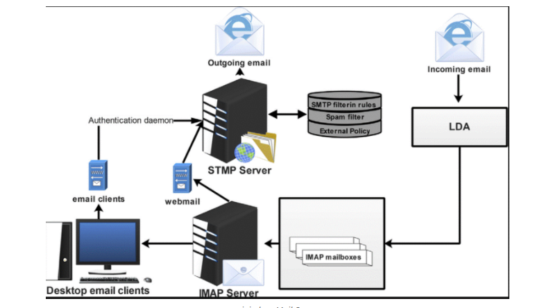

## I. Khái niệm về mail server

- Mail Server hay còn gọi là Email Server là hệ thống máy chủ được cấu hình riêng theo tên miền của doanh nghiệp dùng để gửi và nhận thư điện tử.

- Bên cạnh tính năng lưu trự và sắp xếp Email trên Internet, Mail Server là một giao thức chuyên nghiệp để giao tiếp thư tín, quản lý và truyền thông nội bộ, giao dịch thương mại... Không chỉ thao tác với tốc độ nhanh chống và ổn định, Mail Server còn đảm bảo tính án toàn với khả năng khôi phục dữ liệu cao. 

- Mail Server cơ bản là Dedicated Server (Server riêng lẻ) hay Cloud Server (Server điện toán đám mây) được cấu hình để biến thành một cỗ máy gửi và nhận thư điện tử. Nó cũng có đầy đủ các thông số như một server bình thường như RAM, CPU , Storage,... ngoài ra nó còn có các thông số khác liên quan đến yếu tố Email như số lương tài khoản Email, Email Fowarder, Mail List,...
- Giải pháp Mail Server được sử dụng rộng rãi ở mọi doanh nghiệp. Đây được xem là phương tiện liên lạc không thể thiếu đối với khách hàng đặt biệt là các công ty hay doanh nghiệp lớn nhỏ. Do tính tiện dụng và nhiều chức năng quan trọng như mức độ an toàn, chuyên nghiệp, khách hàng có thể quảng bá tên doanh nghiệp thông qua tên miền của website công ty mình. Đó cũng là lý do khiến việc xây dựng một mail server là vô cùng cần thiết nếu nhưu các thành viên của công ty muốn tạo rmail tên miền riêng để gửi và nhận thư với đối tác bên ngoài.

## II. Cách thức hoạt động của Mail Server

### Outgoing Mail Server
- Outgoing Mail Server hay mail server gửi đi sử dụng giao thức SMTP (Simple Mail Transfer Protocol). Đây là giao thức dịch chuyển mail đơn giản được dùng để liên lạc với server từ xa. Đồng thời cho phép gửi nhiều thư cùng một lúc tới các server khác nhau.

### Incoming Mail Server
#### Giao thức POP3 
- POP (Post Office Protocol ) : chuyển email tới lưu ở máy tính chứa mail Client, thường là nội bộ máy tính của người dùng thông qua một ứng dụng email như Outlook, Mac Mail, Windows Mail...

### Giao thức IMAP
- IMAP (Internet Message Access Protocol) Là phương pháp phực tạp hơn cho phép nhiều client cùng lúc kết nối tới một Mailbox. Email từ mailbox sẽ được sao chép tới máy client và bản gốc của email vẫn sẽ được lưu trên giản pháp email Server.

### III. Lợi ích khi sử dụng mail server 
- Trao đổi thông tin qua lại giữa các bộ phận trong công ty với nhau
- Cho phép người dùng khi gửi mail và nhận mail trực tiếp thông qua internet và tên miền của thể của từng công ty.
- Khả năng hạn chế được các Mail spam và Virus trược khi chuyển tiếp tới người nhận bởi nhận dạng được ip của người gửi.
- Người dùng có thể nhận và gửi mail bình thường khi đi công tác xa.
- Bảo mật được thông tin nội bộ.
- Xây dựng môi trường làm việc chuyên nghiệp.
- Người dùng có thể gửi và nhận mail thông qua mail client và web mail.
- Người quản trị mạng có thể quản trị hệ thống Mail server của công ty thông qua internet.
- Hệ thông mail có tính bảo mật cao nhờ sự cấu hình và cài đặt của người quản trị viên.
- Thiết lập dung lượng tối đa cho từng user sử dụng mail.

## III. Cách thực hoạt động của mail server
### Bước 1
- Sau khi tạo và gửi email, email của bạn sẽ kết nối với Server SMTP mang tên miền của mình. SMTP sẽ đặt tên cho tất cả mọi thứ, ví dụ: smtp.tenmien.com.

### Bước 2
- Email của bạn sẽ "giao tiếp" với SMTP server. Và cung cấp cho SMTP Server mọi thông tin như: địa chỉ mail người gửi, địa chỉ mail người nhận, nội dung email và file đính kèm.

### Bước 3
- Tại đây có 2 trường hợp xảy ra:

- Trường hợp 1: Tên miền (domain email) của người gửi và người nhận giống nhau. 

    + tenemail_1@tenmienA.com tới tenemail_2@tenmienA.com. Mail này sẽ được gửi trực tiếp đến POP3 hoặc IMAP Server có tên miền của bạn. 

- Trường hợp 2: Tên miền của người gửi và người nhận khác
    + tenemail_1@tenmienA.com tới tenemail_2@tenmienB.com. SMTP Server sẽ phải "liên lạc" với một server tên miền khác.

### Bước 4
- Để tìm ra Server của người nhận, SMTP Server của người gửi sẽ phải giao tiếp với DNS (Domain Name Server). 

- DNS sẽ lấy thông tin tên miền người nhận và dịch trang địa chỉ IP. 

- SMTP Server người gửi không thể thực hiện gửi email chính xác mà chỉ dựa trên tên miền thêm vào đó sẽ là địa chỉ IP. Địa chỉ IP (đơn nhất) sẽ giúp SMTP hoạt động chính xác và hiệu quả hơn.

### Bước 5
- Sau khi có địa chỉ IP của người nhận, tức STMP người gửi đã có thể kết nối STMP Server người nhận.

### Bước 6
- SMTP server người nhận sẽ quét (scan) thư gửi đến. Nếu nhận ra tên miền và tên người gửi, nó sẽ chuyển tiếp (forward) mail thuộc POP3 hoặc IMAP server mang tên miền của bạn. 

- Từ đây, email đã được gửi đến mục hộp thư đến của người nhận.