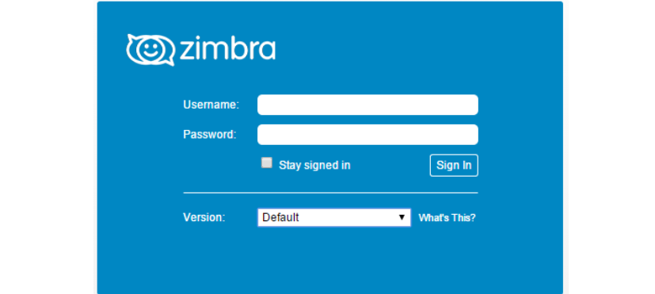
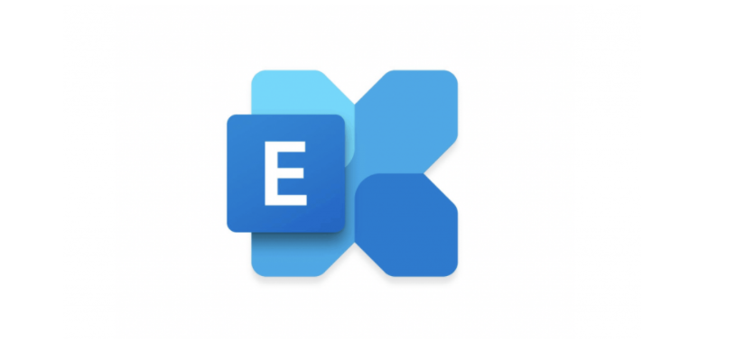
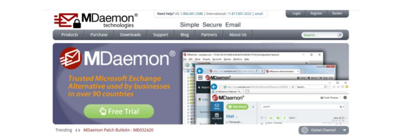

## Khái niệm mail doanh nghiệp 

- Email doanh nghiệp là một dịch vụ email mang tên miền riêng của khách hàng nhằm phụ vụ việc trao đổi và giao dịch trực tuyến cho các doanh nghiệp. Việc quản lý tập trung với tên miền riêng tạo nên sự tin cậy cho đối tác, quản lý nội dung mail, dung lượng lớn va chống spam hiểu quả.
- Dịch vụ mail doanh nghiệp sẽ cung cấp cho các doanh nghiệp các hộp thư điện tử dùng riêng có dạng tennguoidung@tencongty.com.vn  . Khi đó các địa chỉ email của các nhân viên trong công ty sẽ được gắn kèm với tên công ty.
- Email doanh nghiệp được đánh giá thể hiện sự chuyện nghiệp cao. Nhân viên sử dụng email này cũng được xem là người đại diện và bộ mặt của công ty.

## II. Lợi ích của việc sử dụng mail doanh nghiệp

- Email doanh nghiệp mang đến rất nhiều lội ích nên nó đã trở thành lựa chọn hàng đầu của các doanh nghiệp hiện nay.

### 1.Gia tăng tính nhận biết trong hệ thống nhận dạng thương hiệu của doanh nghiệp.
- So với việc sử dụng email truyền thống thì việc sử dụng email doanh nghiệp giúp nâng tầm thương hiệu của cty lên tầm cao hơn. Việc check mail có đuôi mail tên miền riêng của website công ty sẽ gây ấn tượng mạnh với đối tác, tạo được lòng tin về thương hiệu, đồng thời gia tăng tính nhận biết trong hệ thống nhận dạng thương hiệu của doanh nghiệp.

### 2. Mang tính chuyên nghiệp cao trong những giao dịch trực tuyến.
- Một email với đuôi tên miền là tên doanh nghiệp của bạn sẽ luôn tạo được sự tin cậy, chuyên nghiệp với các khách hàng, đối tác. Đây cũng là phương tiện giúp khách hàng nhớ đến doanh nghiệp.

### 3. Hạn chế tin rác, Spam
- Hầu hết hệ thống email doanh nghiệp đều được trang bị bộ lọc để chống spam, luôn giữ cho hộp thư được an toàn từ nhwunxg thư rác nguy hiểm. Bên cạnh đó, nó còn giúp bảo mật thông tin tốt. Người quản lý có thể kiểm soát số lượng cũng như nội dung thư được gửi đi nhằm hạn chế tính trạng rò rỉ thông tin nội bộ. Quan trọng nhất đó là nếu sự cố xẩy ra thfi mọi thông tin đều được khôi phục một cách đầy đủ và nhanh choáng.

### 4. Không có khoảng chờ (Dalay) trong thời gian chuyển pháp email
- Vời Email doanh nghiệp, hoạt động gửi/nhận thư, thương thảo, hợp tác với khách hàng đều sẽ diễn ra suôn sẽ hơn, nhanh hơn.

### 5. Quản lý tập trung dễ dàng quản trị
- Email doanh nghiệp được xem là một công cụ hưu ích cho doanh nghiệp trong vấn đề quản lý tập trung. Mọi giao dịch với khách hàng đều được thực hiện thông qua email doanh nghiệp. Từ đấy, giúp doanh nghiệp kiểm soát được các giao dịch trong thánh hoặc trong năm một cách dễ dàng, tiết kiệm thời gian.

## II. Các loại hình Email doanh nghiệp phổ biến
### 1. Server Mail Zimbra

- Zimbra là một trong số ít những nền tảng email doanh nghiệp mã nguồn mở hiện nay. Đây cũng là loại được nhiều doanh nghiệp Việt lựa chọn bởi khả năng mở rộng linh hoạt, hoạt động ổn định và tốc độ nhanh chóng. Nó cũng được đánh giá cao về việc bảo mật tuy nhiên không có nhiều tính năng.

### 2. Goole 

- Goole là nơi sở hưu lớn nhất về lương email cá nhân và doanh nghiệp tính đến thời điểm hiện tại. Gã khổng lồ này cung cấp dịch vụ email doanh nghiệp trả phí. Bởi ra đời từ khá lâu nên có thể nói tính năng của loại này khá hoàn thiện, giao diện cũng thân thiện và dễ sử dụng.
- Người dùng có thể gửi đi một lượng lớn email đến khách hàng của mình mà chẳng cần phải trang bị thêm phần cứng hay phần mềm. Bởi mọi tính năng đều đã được tính hợp sẵn. Loại email doanh nghiệp này thì có giá khá cao và đôi khi còn gặp phải nhiều tấn công mạng quy mô lớn.

### 3. Microsoft Exchange

- Đây là loại server email được cung cấp bởi Microsoft nên sở hưu nhiều tính năng đa dạng, độc đáo. Thế mạnh của loại này chính là Server mạnh và địa chỉ IP hoạt động khá ổn định. Tuy nhiên, mức giá của loại này cũng đặc biết cao nên đối với những doanh nghiệp có quy mô nhỏ, trung bình thì sẽ không lựa chọn loại này.

### 4. Mdaemon

- Mdaemon là dịch vụ email doanh nghiệp đang cạnh tranh với Microsoft Exchange. Đây cũng là loại khá nổi tiếng được nhiều doanh nghiệp sử dụng để thiết lập và xây dựng hệ thống email doanh nghiệp. Về phần giá thì giá của Mdaemon thấp hơn Microsoft nhưng khi sử dụng thì bạn cần phải trang bị máy chủ và IP riêng.