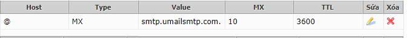
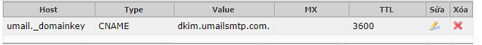
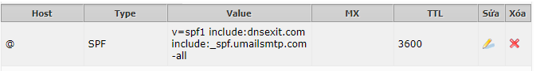
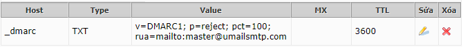

## I. Hướng dẫn trỏ bản ghi Umail.vn
### Các bản ghi cần có khi sử dụng dịch vụ Umail
1. Bản ghi MX
- Hostname:  @

- Type: MX

- Priority: 10

- Value:  smtp.umailsmtp.com.

- TTL: 3600

- Ví Dụ

2. Bản ghi Cname
- Hostname:  umail._domainkey

- Type: CNAME

- Value:  dkim.umailsmtp.com.

- TTL:  3600

- Ví dụ :

3. Bản gi FPS

- Hostname:  @

- Type: TXT

- Value:  v=spf1 include:dnsexit.com include:_spf.umailsmtp.com -all

- TTL:  3600

- Ví Dụ :

4. Bản gi DMARC
- Hostname:  _dmarc

- Type: TXT

- value: v=DMARC1; p=reject; pct=100; rua=mailto:master@umailsmtp.com

- TTL:  3600
- Ví Dụ :

### II. Thông số cấu hình
1. Cấu hình trên Outlook
- imap.umailsmtp.com

- port imap 993 SSL

- smtp.umailsmtp.com

- smtp 465 SSL

2. Cấu hình trên Umail 

