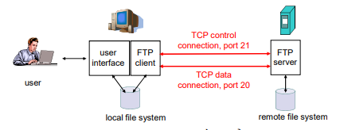

## 2.3 Truyền FILE (FILE TRANSFER) FTP
- Mô hình Client-sever
- Trao đổi file giữa các máy
- FTP là giao thức truyền file giữa các máy tính
- Người sử dụng phải đăng nhập trước khi truyền file
- Điều kiển Out-of-band :
    + Lệnh của FTP : cổng 21
    + Dữ liệu : công 20 

### 2.3.1 Các lệnh FTP 
- Một cố câu lệnh hau gặp :
    + USER username : sử dụng để gưi thông tin định danh người dùng cho server.
    + PASS password : dùng để gửi password cho server.
    + LIST : dùng để yêu cầu server gửi một danh sách các file trong thư mục hiện thời. Danh sách này được gửi thông qua một kết nối dữ liệ TCP.
    + RETR filename : dùng để lấy một file từ thư mục hiện thời.
    + STOR filename : dùng để tải một file vào thư mục hiện thời.
