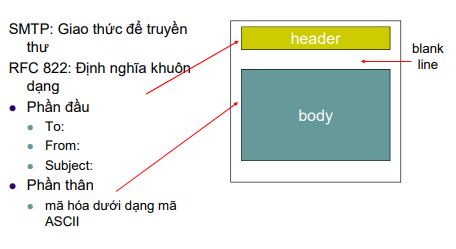

## 2.4 Thư tín điện tử
- Là một trong những ứng dụng internet thông dụng nhất.
- Máy chủ phục vụ thư là thành phần cốt lõi trong hệ thống email. Mỗi người có một hộp thư đặt trên mail server
- SMTP là giao thức gửi thư điện tử của tầng ứng dụng. SMTP sử dụng dịch vụ truyền dữ liệu tin cậy của TCP để truyền thư từ mail server của người gửi đến mail server của người nhận.
### 2.4.1 SMTP
- Là trái tim của dịch vụ gửi thư trên Internet và được đặt tả trong RFC 821. SMTP truyền các thông điệp từ mail server của người gửi đến mail server của người nhận.
- Chuyển thư từ client đến server và giữa các server với nhau.

### 2.4.2 So sánh SMTP và HTTP
- HTTP chuyển file hoặc đối tượng từ Web server tới web client còn SMTP chuyển file giữa các mail server
- HTTP là giao thức kiểu kéo - client "Kéo" thông tin từ server về. còn SMTP lại là giao thức theo kiểu đẩy - client "Đẩy" thông tin lên server.
### 2.4.3 Khuôn dạng thư và chuẩn MIME
- Khuôn dạng thư thông điệp

### 2.4.4 Giao thức truy nhập mail
- POP3 là một giao thức tầng ứng dụng, dùng để lấy thư điện tử từ server mail, thông qua kết nối TCP/IP. POP3 được sử dụng để kết nối tới server email và tải email xuống máy tính cá nhân thông qua ứng dụng email client như Outlook, Thunderbird, Windows Mail, Mac Mail…
- Mặc định, port POP3 là:
    + Port 110 – port không mã hóa
    + Port 995 – SSL/TLS port, cũng có thể được gọi là POP3S
- Nhược điểm của POP3:
    + Mỗi lần nhận mail, POP sẽ download email đó về máy local (và mặc định xóa mail trên server đi) nên bạn sẽ không thể sử dụng nhiều thiết bị để quản lý cùng một tài khoản email qua giao thức POP. Tuy nhiên, bạn có thể cấu hình email client để POP3 không xóa email trên server mà chỉ “mask as read” – đánh dấu đã đọc với những email đó.
- Ưu điểm của POP3:
    + Mail được lưu cục bộ, tức luôn có thể truy cập ngay cả khi không có kết nối Internet.
    + Kết nối Internet chỉ dùng để gửi và nhận mail.
    + Tiết kiệm không gian lưu trữ trên server.
    + Được lựa chọn để lại bản sao mail trên server.
    + Hợp nhất nhiều tài khoản email và nhiều server vào một hộp thư đến.
