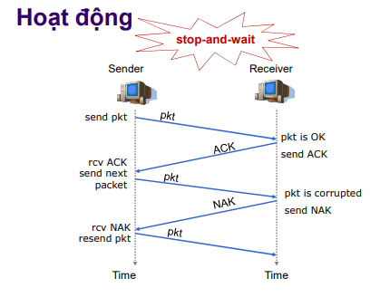
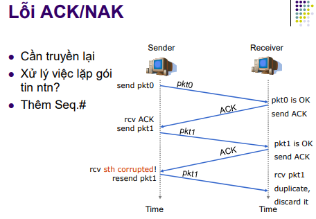
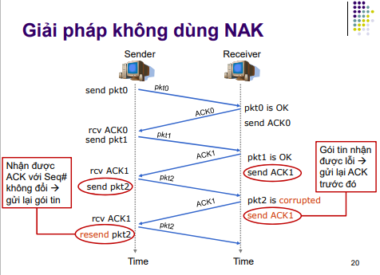
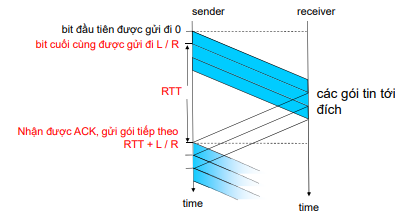
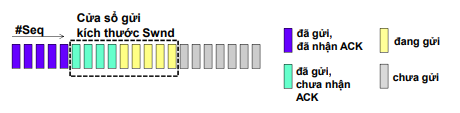

## 3.4 Các Nguyên Tắc Truyền Dữ liệu Tin Cậy

### 3.4.1 Xây dựng giao thức truyền dữ liệu tin cậy
- Các giao thức ARQ cần phải có ba khả năng sau để xử lý trong trường hợp dữ liệu có lỗi : 
    + Phát hiện lỗi : là cơ chế cho phép bên nhận phát hiện được khi nào gói dữ liệu có bit bị lỗi.
    + Phản hồi từ phía nhận : Khi phía gửi và phía nhận nằm trên các thiết bị đầu cuối khác nhau-có thể cách nhau hàng nghìn km, cách duy nhất để phía gửi biết được kết quả gửi là phía nhận gửi thông tin phản hồi thông báo tình trạng nhận cho phía gửi.
    + Truyền lại : gói dữ liệu bị lỗi sẽ được bên gửi truyền lại.
- Cách thức hoạt động

- Lỗi ACK/NAK

- Giải pháp không dùng NAK

### 3.4.2 Giao thức truyền dữ liệu tin cậy liên tục (Pipeline)
- Gửi liên tục một lượng hưu hạn các gói tin mà không cần chờ ACK.
    + Số thứ tự các gói tin phải tăng dần.
    + Dữ liệu gửi đi chờ sẵn ở bộ đệm gửi.
    + Dữ liệu tới đích chờ ở bộ đệm nhận
- Hiệu năng của Pipeline
    + Kích thước gói tin
    + Băng Thông
    + Số gói tin gừi liên tục

### 3.4.3 Go-Back-N (GBN)
- Gồm hai bên gửi và nhận :
    + Bên gửi  
        - chỉ gửi gói tin trong cửa sổ chỉ dùng 1 bộ đếm cho gối tin đầu tiên trong cửa sổ.
        - Nếu nhận được ACKi, dịch cửa sổ sang vị trí (i+1) . Đặt lại timer.
        - Nếu timeoutcho gói PKTi gửi lại tất cả gói tin trong cửa sổ
    + Bên nhận 
        - Gửi ACKi cho gói tin PKTi đã nhận được theo thứ tự nhận được theo thứ tự
        - Gói tin đến không thoe thứ tự : hủy gói tin và gửi lại ACK của gói tin gần nhất còn đúng thứ tự

